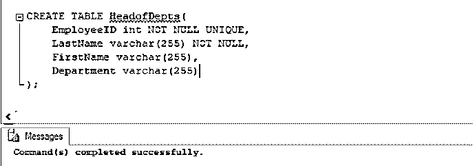
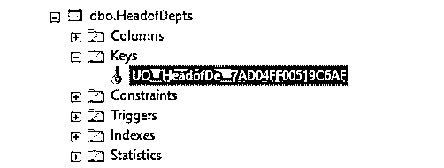
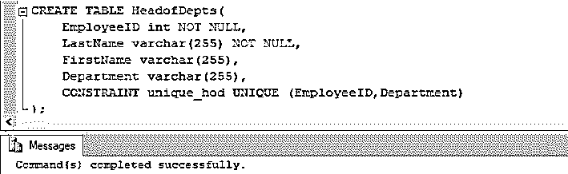
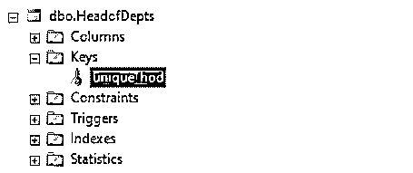
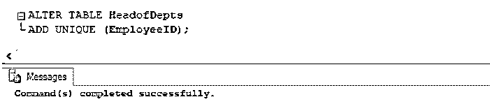
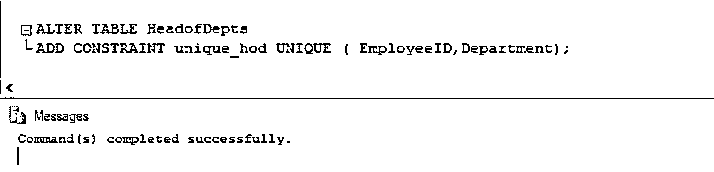
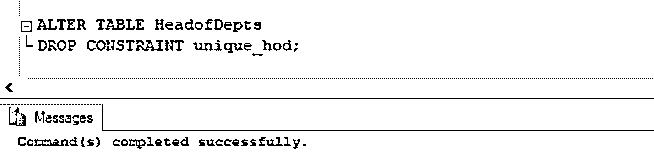
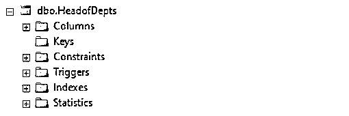

# SQL 中的唯一键

> 原文：<https://www.educba.com/unique-key-in-sql/>

## SQL 中唯一键的介绍

唯一键是 SQL 中的一个约束，它有助于唯一标识数据表中的记录。可以认为它有点类似于主键，因为它们都保证了记录的唯一性。但是与主键不同，唯一键可以接受空值，并且可以在数据表的多个列上使用。

**Note:** A unique key can accept NULL value only once and it cannot have duplicate values.

### 为什么我们需要 SQL 中的唯一键？

唯一密钥主要用于以下功能:

<small>Hadoop、数据科学、统计学&其他</small>

#### 1.为了完成一个特定的商业案例

假设我们有一个案例，其中主键惟一地标识了表中的一条记录。但是我们希望主键列以外的特定列是唯一的。这可以通过唯一的键约束来确保。例如，我们有一个“教师”表，其中教师是主键，它唯一地标识教师。但是我们也想确保每个老师教一个独特的科目。因此，这里唯一键约束来拯救我们。

#### 2.用于维护数据完整性和扩展主键

每当希望确保数据表中 N 列的唯一性时，可以使用唯一键。例如，我们有一个名为“HeadofDept”的表，其中包含 employeeID 和 department。EmployeeID 是主键，但除此之外，我们还希望确保一名员工不会管理多个部门。因此，在这种情况下，我们可以对部门使用唯一的键约束来确保唯一性。

#### 3.为了加速信息检索

我们应该理解，唯一键是唯一索引和唯一约束的组合。因此，唯一的索引有助于加快检索性能。

#### 4.为了减少连接表的开销

唯一索引确保记录的唯一性，因此可用于连接数据表。这将简化逻辑并减少人类大脑的开销。

### SQL 中唯一键的使用

SQL 中唯一键的工作方式如下所示:

#### 1.CREATE TABLE 语句的唯一键约束

**语法**

`CREATE TABLE table_name
(
Column_name1 datatype [NULL | NOT NULL] UNIQUE,
Column_name2 datatype [NULL | NOT NULL],
Column_name3 datatype [NULL | NOT NULL] );`

这是使用 CREATE TABLE 子句创建唯一键约束的基本 SQL 语法。

**参数**

这里使用的参数是:

*   **创建表:**该语句用于在数据库中创建一个新表。
*   **Column_name1，Column_name2，Column_name3:** 在表格中提及您想要创建的列的名称。
*   **数据类型:**提到表格中每一列的数据类型。
*   **【NULL | NOT NULL】:**说明是否可以保存空值
*   **UNIQUE:** 用列名编写的 UNIQUE 关键字创建唯一键约束。它确保在特定的列中没有重复的值。

上述参数中，CREATE TABLE、one column_name 和 UNIQUE 为必选参数。

##### 示例# 1-**创建表格时。**

让我们看一个如何使用 CREATE TABLE 语句在 SQL Server 中创建唯一键约束的示例。我们将创建一个名为“HeadofDepts”的表，其中包含 EmployeeID、LastName、FirstName 和 Department 等列。

在一列“雇员 ID”上

**代码:**

`CREATE TABLE HeadofDepts(
EmployeeID int NOT NULL UNIQUE,
LastName varchar(255) NOT NULL,
FirstName varchar(255),
Department varchar(255)
);`

我们可以从表属性中检查我们是否能够成功地创建一个惟一的键约束。

在多列“员工 ID”和“部门”上

**代码:**

`CREATE TABLE HeadofDepts(
EmployeeID int NOT NULL,
LastName varchar(255) NOT NULL,
FirstName varchar(255),
Department varchar(255),
CONSTRAINT unique_hod UNIQUE (EmployeeID,Department)
);`

我们可以从表属性中检查我们是否能够成功地创建唯一键“unique_hod”约束。

**Note:** I have removed the unique key constraint of EmployeeID before creating it on EmployeeId and Department.

在上面的例子中，我们创建了一个惟一的键约束，名为“unique_hod”。这个唯一键将确保 EmployeeID 和部门名称在整个数据表中保持唯一和一致

#### 2.使用 ALTER TABLE 语句的唯一键约束

**语法**

`ALTER TABLE *tablename*
ADD UNIQUE (column_name);`

**参数:**

这里使用的参数是:

*   **ALTER TABLE:** 该语句用于从现有的表中添加和删除约束。
*   **Tablename:** 要修改的现有表格的名称。
*   **ADD UNIQUE:** 用列名编写的 UNIQUE 关键字创建唯一键约束。它确保在特定的列中没有重复的值。
*   **列名:**需要唯一性的列的名称。

##### 示例 2–在修改表格时。

让我们看一个如何使用 ALTER TABLE 语句在 SQL Server 中创建唯一键约束的示例。

在一列“雇员 ID”上

`ALTER TABLE HeadofDepts
ADD UNIQUE (EmployeeID);`

我们可以从表属性中检查我们是否能够成功地修改表属性来添加唯一键约束。

在多列“员工 ID”和“部门”上

`ALTER TABLE HeadofDepts
ADD CONSTRAINT unique_hod (EmployeeID, Department);`

在上面的例子中，我们创建了一个惟一的键约束，名为“unique_hod”。这个唯一键将确保 EmployeeID 和部门名称在整个数据表中保持唯一和一致。

#### 3.DROP TABLE 语句的唯一键约束

**语法**

`ALTER TABLE table_name
DROP CONSTRAINT constraint_name;`

这里使用的参数是:

*   **ALTER TABLE:** 该语句用于从现有的表中添加和删除约束。
*   **Tablename:** 要修改的现有表格的名称。
*   **DROP CONSTRAINT:** 用列名编写的 Unique 关键字创建唯一键约束。它确保在特定的列中没有重复的值。
*   **Constraint_name:** 要删除的唯一键的名称。

##### 示例# 3–删除唯一键约束

让我们看一个使用 DROP TABLE 语句删除 SQL Server 中唯一键约束的示例。

`ALTER TABLE HeadofDepts
DROP CONSTRAINT unique_hod;`

我们可以从表属性中检查我们是否成功地删除了唯一键“unique_hod”约束。

在上面的示例中，我们已经删除了使用 alter table 和 create table 语句创建的唯一键约束“unique_hod”。

### 推荐文章

这是一个 SQL 中唯一键的指南。在这里，我们讨论了 SQL 中唯一键的介绍、需要和工作原理，并给出了相应的语法、参数和示例。您也可以浏览我们的其他相关文章，了解更多信息——

1.  [SQL 中的组合键](https://www.educba.com/composite-key-in-sql/)
2.  [SQL 中的 IF ELSE 语句](https://www.educba.com/if-else-statement-in-sql/)
3.  [像 SQL 中的查询](https://www.educba.com/like-query-in-sql/)
4.  [PostgreSQL WHERE 子句](https://www.educba.com/postgresql-where-clause/)
5.  [PostgreSQL 约束的示例](https://www.educba.com/postgresql-constraints/)
6.  [SQL 删除连接的参数和示例](https://www.educba.com/sql-delete-join/)

