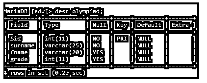
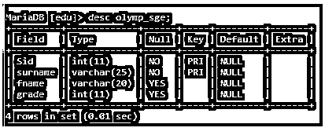
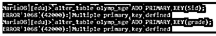

# SQL 主键

> 原文：<https://www.educba.com/sql-primary-key/>


## SQL 主键简介

以下文章提供了 SQL 主键的概述。唯一的一列或一组字段是主键。每个表只能有一个主键。表中的每个条目都由其主键唯一定义，主键是表中的一个值或几个值的组合。知道了这个值或组合，就可以很容易地定位相关记录并检索其所有剩余值。

### 关键要点

*   主键的好处包括:每个表行都由它唯一地标识。
*   它为每个主键列接收一个不同的索引，这有助于快速访问。
*   为了区分表中的各项，需要主键。

### 什么是 SQL 主键？

数据库表中的每一行或每一记录都由一个称为主键的字段唯一标识。主键中必须存在唯一值。主键列中不能有空值。主键列中不允许空值或重复值。如果我们试图这样做，将会引发一个异常。

<small>Hadoop、数据科学、统计学&其他</small>

### 为什么要用 SQL 主键？

在 SQL 中，可以唯一标识表中某一行的特定字段或一组字段或列称为主键。简单地说，它是一个允许每行都有唯一值的列。因此，每次我们使用 Put INTO 命令向表中添加新条目时，主键列的条目必须是唯一的。

### 如何创建 SQL Server 主键？

SQL Server Management Studio 可用于定义 SQL Server 中的主键。SQL Server (Transact-SQL)中的主键是专门标识某项的一列或一组值。ALTER TABLE 语句或 CREATE TABLE 语句都可以定义主键。

约束确保了个体性，并确保作为主键一部分的任何字段都不能有空值。在 SQL Server 中，主键约束是唯一定义表中每一行的一列(或一组列)。

**代码:**

```
CREATE TABLE tb_name
(
col1 datatype [ NULL | NOT NULL ],
col2 datatype [ NULL | NOT NULL ],
...
CONSTRAINT constt_name PRIMARY KEY (col1, col2, ... col_n)
);
```

### SQL 主键约束

主键是一种约束，它阻止我们输入空的或重复的条目。这种限制对于在这种情况下唯一地识别记录是必要的。以下示例显示了在创建表时如何将约束应用于主键。

要添加约束，我们可以使用:

**代码:**

```
ALTER TABLE Olympiad ADD CONSTRAINT olymp_new PRIMARY KEY (Sid, Sname);
```

### SQL 主键的示例

假设有一个名为 olympid 的表，其中包含 olympid 注册 sid、fname、surname 和 grade class 列。这些是给定类的表单。既然像这样注册的班级中的每个学生都有一个不同的 Sid，我们可以将该列作为我们的主键。

让我们用他们的 sid 作为主键来制作一个 Olympiad 注册表。

**使用 Create table 的 SQL 主键。**

**代码:**

```
create table olympiad (Sid int NOT NULL, surname varchar(25) NOT
NULL, fname varchar (20), grade int, PRIMARY KEY (Sid));
```

创建“Olympiad”表时，下面的 SQL 语句在“Sid”列上建立一个主键。

**输出:**




上面的例子是一个单列主键。为此，我们将列名包含在主键()括号中。这表明列 Sid 是我们的主键，它必须满足作为唯一标识数据的主键的所有要求。

**两个字段上的主键**

**代码:**

```
create table olymp_sge (Sid int NOT NULL, surname varchar(25) NOT NULL, fname varchar (20), grade int,CONSTRAINT olump_new PRIMARY KEY (Sid,surname));
```

**输出:**




sid 和 surname 列一起构成主键，由两列构成的新主键称为 olump_new。主键约束的名称是 olump_new，它实际上是两列的组合。需要这样的名称来标识表的主键，然后使用主键来区分不同的记录。因此，在这个上下文中，每当我们引用 olump_new 时，我们指的是由 sid 和 surname 列组合创建的主字段。

**主键使用 Alter**

要将现有表中的字段更改为主键，我们需要给出 ALTER 语句。

**代码:**

```
alter table olymp_sge ADD PRIMARY KEY(Sid);
```

下面的输出显示，当我们试图改变一个字段时，它显示一个错误，说明'多个键被定义，因为我们已经声明了主键。

**输出:**




### 常见问题解答

下面是提到的常见问题:

#### Q1。表中主键的必要性是什么？

**答:**数据集的主键有助于避免冗余或重复的值。主字段对于将多个表链接在一起至关重要。因为主字段有不同的值来分别区分每个记录，所以我们在合并两个或多个表时使用它。

#### Q2。什么类型的数据类型可以用于主键？

**答:**主字段只需要包含所有非空值。它可以是整数或字符数据类型。

#### Q3。任何 SQL 主键都有哪两个属性？

**答:**主列最大大小为 900 字节。具有主键的列不能包含空值。基本主键只有一列。那些有许多列的被称为有一个复合主键。

### 结论

本文涵盖了关于 SQL 主键的所有知识。我们已经看到了如何在不同的级别和不同的数据库中使用 CREATE TABLE 和 ALTER TABLE 命令来创建它。在本文中，我们还研究了跨各种数据库删除主键的过程。能够保持数据库完整性和有效性的键限制是主键。

### 推荐文章

这是一个 SQL 主键的指南。这里我们讨论一下简介，以及如何创建 SQL server 主键。关键约束和示例。您也可以看看以下文章，了解更多信息–

1.  [SQLAlchemy 示例](https://www.educba.com/sqlalchemy-example/)
2.  [SQLAlchemy 模型](https://www.educba.com/sqlalchemy-model/)
3.  [SQLAlchemy 类型](https://www.educba.com/sqlalchemy-types/)
4.  [SQLAlchemy 多对多](https://www.educba.com/sqlalchemy-many-to-many/)


