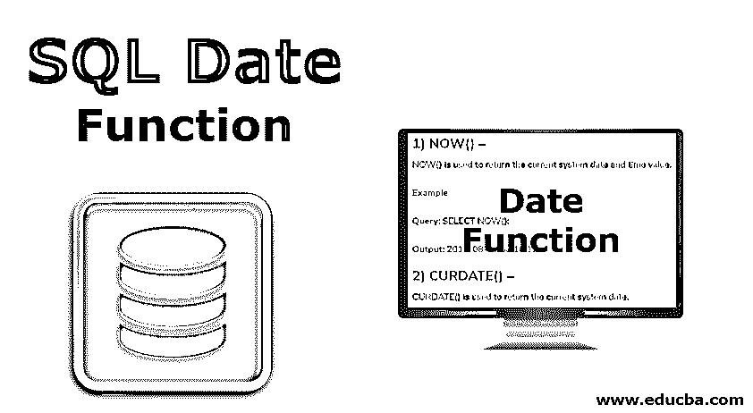

# SQL 日期函数

> 原文：<https://www.educba.com/sql-date-function/>

## SQL 日期函数简介

使用数据库并不十分困难，因为人们需要知道用于检索、更新和删除数据库中数据的基本查询和关键字。SQL 允许我们存储结构化数据(行和列形式的数据)，并提供简单的查询来处理这些数据。在本主题中，我们将讨论 SQL 日期函数。

日期是 SQL 中使用的最重要的函数之一，但对于新手来说理解它有些困难，因为有许多格式可以将日期存储在数据库中，并且用户希望根据特定的要求以不同的格式检索它。在 SQL 中，DateTime(时间也与日期一起使用)经常用于在一个列中同时存储日期和时间值。

<small>Hadoop、数据科学、统计学&其他</small>

### SQL 的日期函数

下面我们来详细了解一下 SQL 中用到的每个日期函数:

#### 1.现在()

NOW()用于返回当前系统日期和时间值。

**查询:**

`SELECT NOW();`

**输出:** 2019-08-06 08:10:12

#### 2.治愈()

CURDATE()用于返回当前系统日期。

**查询:**

`SELECT CURDATE();`

**输出:** 2019-08-06

#### 3.柯蒂梅()

CURTIME()用于返回当前系统时间。

**查询:**

`SELECT CURTIME();`

**输出:** 08:10:12

#### 4.日期(快递)

仅从具有日期时间值的列中提取日期部分。

**查询:**

`SELECT DATE(‘2019-08-06 08:10:12’);`

**输出** : 2019-08-06

#### 5.提取(单位起始日期)

EXTRACT()函数用于检索日期/时间值的特定部分。

考虑下面的“学生”表:

| **id** | **名称** | **生日** |
| One thousand and one | 安基塔 | 2019-08-06 08:10:12 |

**查询:**

`SELECT id, name, EXTRACT(DAY FRO from the student; M birthday) AS day_of_birth`

| **id** | **名称** | **出生日期** |
| One thousand and one | 安基塔 | 08 |

#### 6\. DATEADD(date, INTERVAL expr unit):​

此函数用于我们希望通过在原始值上增加一些值来显示日期的情况。6\. DATEADD(日期，间隔表达式单位)

**查询:**

`SELECT DATEADD(‘2019-06-05’, INTERVAL 5 DAY);`

**输出:** 2019-06-10

这里的单位在上面的例子中是日，可以有不同的值:

-微秒

-第二天

-小时-周

-年日

-月-日

-小时-天

-第二季度

-分钟秒

-小时秒

#### 7.DATEDIFF()

此函数返回从日期 2 到日期 1 的天数差。

**查询:**

`SELECT DATEDIFF(‘2019-06-03’ , ‘2019-06-05’);`

**输出:** 2

#### ​8.日期格式(日期，格式)

这是 SQL 中使用的重要函数之一。

该函数根据用户指定的说明符以各种格式返回日期。

| **说明符** | **描述** |
| %a | 显示缩写的工作日名称(星期日和星期六) |
| %D | 显示带有英文后缀(1 号、2 号、3 号..) |
| %d | 以数值显示一个月中的某一天(00..31) |
| %b | 显示缩写的月份名称(一月至十二月) |
| %c | 以数值显示月份(1，2，3…) |
| %h | 显示小时(01-12) |
| %H | 显示小时(00-23) |
| %m | 以数字(0-12)显示月份名称 |
| %M | 以英语显示月份名称(一月至十二月) |
| %w | 显示星期几(0-6) |
| %W | 显示工作日名称(周日至周六) |
| %s | 显示秒(00..59) |
| %S | 显示秒(00..59) |
| %y | 以两位数显示数字年份 |
| %Y | 以四位数显示数字年份 |

**查询:**

`SELECT DATE_FORMAT(‘2019-06-03 09:40:05’, %W %M %y);`

**输出**:6 月 19 日星期一

#### 9​. DAYNAME(date)

该函数返回指定日期的日期名称。​

**查询:**

`DAYNAME(‘2019-06-03’);`

**输出**:周一

#### ​10\. DAYOFMONTH(date)

该函数返回指定日期中的某一天。

**查询:**

`DAYOFMONTH(‘2019-06-03’);`

**输出:** 3

#### 11\. DAYOFWEEK(date)

该函数返回给定日期的星期索引。分配的索引是星期日=1，星期一=2，星期二=3，依此类推。

**查询:**

`DAYOFWEEK(‘2019-06-03’);`

**输出:** 2

#### 12.年某月某日

此函数返回指定日期在一年中的第几天。范围从 1 到 366。

**查询:**

`DAYOFYEAR(‘2019-06-03’);`

**输出:** 154

#### 13.DATE_SUB(日期，时间间隔表达式单位)

此函数用于从指定的日期中减去给定的日期/时间值。

**查询:**

`SELECT DATE_SUB(‘2019-06-03’, INTERVAL 4 DAY);`

**输出** : 2019-05-31

像 DATE_ADD()函数一样，可以有不同的间隔值。

#### 14.生产日期(年，天)

该函数根据用户提供的年份和日期创建日期。但是提供的年份应该是 4 位数。

**查询:**

`SELECT MAKEDATE(2019,154);`

**输出:** 2019-06-03

#### 15.生产时间(小时、分钟、秒)

该函数根据用户提供的小时、分钟和秒的值返回时间。

**查询:**

`SELECT MAKETIME(09,20,05);`

**输出** : 09:20:05

### 其他日期函数

| **S.N****o.** | **Function****名称** | **描述** | **例子** | **输出** |
| 1. | 最后一天(日期) | 采用日期或日期时间值，并返回相应月份的最后一天 | 选择最后一天(' 2019-06-09 ') | 2019-06-30 |
| 2. | 从 _ 天(n) | 将 n 天作为输入，并返回日期值 | 从 _ 天中选择(685552) | 1876-12-23 |
| 3. | 小时(时间) | 获取时间值并返回小时值 | SELECT小时(' 03:24:27 ') | 03 |
| 4. | 分钟(时间) | 将时间值作为输入，并返回分钟值 | SELECT分钟(' 03:27:24 ') | Twenty-seven |
| 5. | 月份(日期) | 将日期作为输入，并返回给定日期的对应月份 | SELECT月份(' 2019-06-09 ') | 06 |
| 6. | 系统日期() | Returns the current date and time value in the format YYYY MMDD HH:MM:SS | 选择系统日期() | 2019-06-09 11:15:08 |
| 7. | 时间到秒(时间) | 将时间作为输入，并返回对应于该时间的总秒数 | SELECT时间到秒(' 11:15:10’) | Forty thousand five hundred and ten |
| 8. | 年份(日期) | 将日期作为输入，并返回相应日期的年份 | SELECT YEAR(‘19-06-09’) | Two thousand and nineteen |
|  |  | 在 1000-9999 的范围内 |  |  |
| 9. | 时间戳(表达式) | 返回日期或日期时间表达式 | SELECT TIMESTAMP(‘2019-06-09’) | 2019-06-09 00:00:00 |
| 10. | 工作日(日期) | Take date as input and returns the weekday index corresponding to that date (0= Monday, 1= Tuesday, 2=星期三等等) | SELECT WEEKDAY(‘2019-06-09’) | Six |

### 结论

上面提到的是 SQL 中使用的一些基本的日期函数。在不同的场景中还使用了其他几个日期函数。在使用它们之前，必须记住函数中传递的语法和参数，以避免意外的结果。

### 推荐文章

这是一个 SQL 日期函数的指南。在这里我们用例子和输出详细地逐一讨论 SQL 中使用的 Date 函数。您也可以看看以下文章，了解更多信息–

1.  [SQL 中的外键](https://www.educba.com/foreign-key-in-sql/)
2.  [SQL 插入查询](https://www.educba.com/sql-insert-query/)
3.  [SQL 中的连接类型](https://www.educba.com/types-of-joins-in-sql/)
4.  [JavaScript 日期函数](https://www.educba.com/javascript-date-function/)

