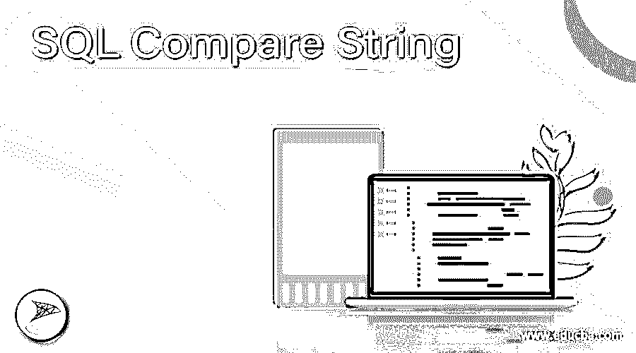
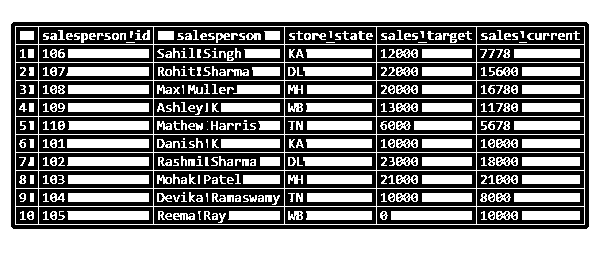
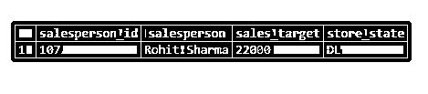
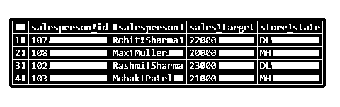
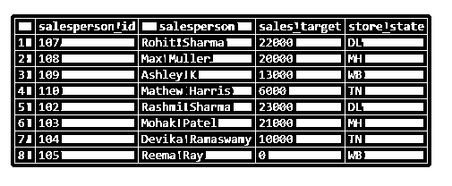
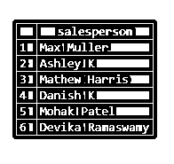
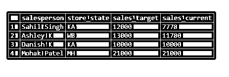

# SQL 比较字符串

> 原文：<https://www.educba.com/sql-compare-string/>

## SQL 比较字符串介绍

字符串比较是用于比较字符串、文本或字符数据类型值的函数和方法的统称。常用的字符串比较函数可以是 regex 和 like 之类的模式匹配函数，也可以是 WHERE 子句比较运算符。一些数据库，如 MYSQL 数据库，也有内置函数，如 STRCMP()用于字符串比较。

但是，我们可能会遇到在执行字符串比较之前必须执行数据类型转换的情况。

<small>Hadoop、数据科学、统计学&其他</small>

不要被这里提到的比较函数和方法弄得不知所措，我们将在接下来的章节中详细讨论它们。

**语法和参数:**

SQL 中字符串比较的基本语法如下:

`SELECT column_name1, column_name2, …
FROM table_name1
WHERE column_name1:: [varchar, text] comparison_operator [>,<,=,!=,...] comparision_expression :: [varchar, text]`

上述语法中使用的参数如下:

*   **column_name1，column_name2，…:** 这是我们要为最终结果集提取的列的名称。
*   **table_name1:** 将从中提取所述列的数据库表。
*   **column_name1:** 任何字符数据类型的字符串，必须与另一个字符串进行比较。
*   **比较 _ 表达式:**column _ name 1 将与之比较的另一个字符串值或字符串可转换值。

我们总是可以进行数据类型转换。在 PostgreSQL 中，可以按照语法所示来完成。

MYSQL 中 STRCMP()函数的语法如下:

`SELECT STRCMP(argument1, argument2);`

这里，argument1 和 argument2 是我们要比较的字符串类型数据值。

在 SQL 中使用 LIKE 通配符比较字符串的语法如下:

`SELECT column_name1, column_name2,...
FROM table_name1
WHERE column_name1 LIKE %abc%`

这里%abc%表示 abc 出现在字符串中的任何位置。% abc 表示字符串开头的 abc。同样，abc%表示字符串末尾的 abc。

### SQL 比较字符串的示例

为了说明 SQL 中的字符串比较，让我们创建一个名为“sales_details”的虚拟表。该表包含公司中每个销售人员的销售信息。

我们可以使用下面的代码片段来执行给定的任务。

**代码:**

`CREATE TABLE sales_details
(
salesperson_id integer NOT NULL,
salesperson character varying(255) NOT NULL,
store_state character varying(255) NOT NULL,
sales_target numeric NOT NULL,
sales_current numeric NOT NULL
);`

查询成功返回，sales_details 已创建。现在，让我们在其中插入一些记录来处理。

为此，我们可以使用下面的插入查询。

`INSERT INTO sales_details
(salesperson_id
,salesperson
,store_state
,sales_target
,sales_current)
VALUES
(106,'Sahil Singh','KA',12000,7778),
(107,'Rohit Sharma','DL',22000,15600),
(108,'Max Muller','MH',20000,16780),
(109,'Ashley K','WB',13000,11780),
(110,'Mathew Harris','TN',6000,5678),
(101,'Danish K','KA',10000,10000),
(102,'Rashmi Sharma','DL',23000,18000),
(103,'Mohak Patel','MH',21000,21000),
(104,'Devika Ramaswamy','TN',10000,8000),
(105,'Reema Ray','WB',0,10000);`

插入后 sales_details 表中的数据如下所示。

`SELECT * FROM sales_details;`

现在我们准备尝试几个字符串比较的例子。

#### 示例 1:查找姓名以字母 r 开头的所有销售人员。

**代码:**

`SELECT salesperson
FROM sales_details
WHERE salesperson LIKE 'R%';`

在此示例中，查询返回所有以“R”开头的名称。LIKE 是模式匹配关键字。

#### 示例 2:查找名为 Rohit Sharma 的销售人员的销售人员标识、销售目标和商店位置。

**代码:**

`SELECT salesperson_id, salesperson, sales_target, store_state
FROM sales_details
WHERE salesperson = 'Rohit Sharma';`

#### 示例#3:使用 NOT IN 比较运算符查找 sales_target 少于 20000 的销售人员的 sales _ id、sales_target 和商店位置。

**代码:**

`SELECT salesperson_id, salesperson, sales_target, store_state
FROM sales_details
WHERE salesperson NOT IN
(SELECT salesperson
FROM sales_details
WHERE sales_target < 20000);`

此查询说明了在比较字符串时 NOT IN 比较运算符的用法。它还关注子查询的使用。

#### 示例#4:查找商店位置不是 KA 或 NY 的销售人员的 sales _、sales_target 和商店位置。

**代码:**

`SELECT salesperson_id, salesperson, sales_target, store_state
FROM sales_details
WHERE store_state <> 'KA' AND store_state <> 'NY';`

#### 例 5:查找姓名在词法上小于“Rashmi”的销售人员。

**代码:**

`SELECT salesperson
FROM sales_details
WHERE salesperson < 'Rashmi';`

大于和小于比较运算符与字符串一起使用时，会在比较后返回词汇上的大于或小于字符串。在这个例子中，我们可以看到查询返回所有在词汇上小于“Rashmi”的名字。

#### 示例 6:查找姓名中不包含字母“R”的销售人员的详细信息。

**代码:**

`SELECT salesperson, store_state, sales_target, sales_current
FROM sales_details
WHERE salesperson NOT LIKE '%R%';`

### 结论

SQL 中的字符串比较包括使用内置函数(如 STRCMP()、通配符模式匹配关键字(如 like)以及作为带有比较运算符的条件子句的一部分)将字符串、文本、varchar 或任何其他字符数据类型值与其他值进行比较。我们试图在这篇文章中解释同样的问题。

### 推荐文章

这是一个 SQL 比较字符串的指南。这里我们分别讨论介绍，语法，参数，代码实现的例子。您也可以看看以下文章，了解更多信息–

1.  [SQL 删除行](https://www.educba.com/sql-delete-row/)
2.  [SQL MID](https://www.educba.com/sql-mid/)
3.  [用于循环的 SQL](https://www.educba.com/sql-for-loop/)
4.  [SQL ORDER BY CASE](https://www.educba.com/sql-order-by-case/)

