# SQL 中迄今为止的时间戳

> 原文：<https://www.educba.com/timestamp-to-date-in-sql/>

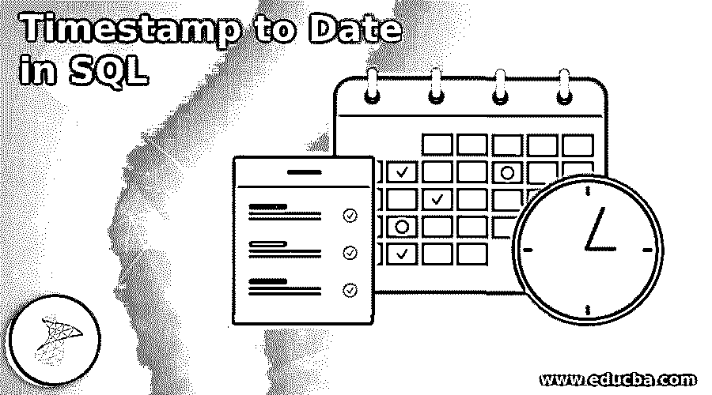

## SQL 中的时间戳简介

在 SQL 中，timestamp 是一个函数，用于在没有数据库时区偏移量的情况下检索 SQL server 的当前日期和时间。在 SQL 中，CURRENT_TIMESTAMP 用于提取当前日期和时间。它不带参数，返回日期时间值。然而，在实际情况下，需要检索、存储、比较这两个日期和时间值，并相应地做出决策。因此，根据需求将获得的时间戳转换成格式是很重要的。SQL 语言提供了各种功能，允许用户处理上述情况。

### 如何用语法在 SQL 中将时间戳转换为日期

在 SQL 中，还存在一种时间戳数据类型，它与日期和时间值无关。相反，它公开了数据库中唯一生成的二进制数，这些二进制数的值随着数据库中的任何更新/插入而不断变化。数据类型 timestamp 现在已被弃用。取而代之的是现在使用的 row 版本来处理这样的事情。

<small>Hadoop、数据科学、统计学&其他</small>

但是，在这里，CURRENT_TIMESTAMP 函数检索当前的日期和时间值。并将该时间戳转换成所需格式的日期和时间值。此外，SQL 提供了 CONVERT 和 CAST 函数，程序员可以使用这些函数来执行所需的转换任务。

#### 1.皈依者

SQL 中的 CONVERT()函数用于将任意数据类型的任意值转换成所需的数据类型(如用户在查询中提到的)。要将当前时间戳转换为所需的日期和时间值，需要将所需的数据类型、表达式和“代码”(用于定义要获得的日期和时间的所需格式)作为参数。

*   在 SQL 中，已经定义了从 0 到 141 的日期和时间格式代码，以不同的格式指定日期和时间值。
*   对于编码人员来说，学习一些在查询中经常使用的方法来轻松执行任务是有好处的。然而，所有的代码都可以很容易地在互联网上找到。

下面给出了一些代码，让您对它们所提供的格式有一个大致的了解:

| **Sr 号** | **代码** | **格式** |
| One | Zero | 年一月二日时:分上午/下午 |
| Two | Nine | 周一至周五时:分:秒:分上午/下午 |
| Three | Thirteen | 日周一年年时:分:秒:分上午/下午 |
| Four | Twenty | yyyy-mm-dd hh:mm:ss |
| Five | Twenty-one | yyyy-mm-dd hh:mm:ss:nnn |
| Six | Twenty-two | 月/日/年时:分:秒上午/下午 |
| Seven | Twenty-five | yyyy-mm-dd hh:mm:ss:nnn |
| Eight | One hundred | 年一月二日时:分上午/下午 |
| Nine | One hundred and thirteen | dd Mon yyyy hh:mm:ss:nnn |
| Ten | One hundred and twenty-six | yyyy-mm-ddThh:mm:ss:nnn |
| Eleven | Two | 年月日 |
| Twelve | Five | 年月日 |
| Thirteen | Seven | 我的 DD YY |
| Fourteen |  8 | 时:分:秒 |

如上所示，为了检索 SQL server 的当前时间戳，使用的函数是:

`CURRENT_TIMESTAMP;
(takes no arguments)`

SQL server 转换上述时间戳的 CONVERT 函数的语法:

`convert(data_type(length), expr, code) ;`

在哪里，

*   **data_type:** 输入表达式要转换成的数据类型。可以是 varchar、char、bigint、smallint、datetime、binary、text、image 等。
*   **expr:** 需要转换的表达式。在上面的查询中，表达式应该是之前检索的 CURRENT_TIMESTAMP。
*   **code:** 这是日期样式代码，我们想要的结果的格式。上表中已经提到了一些代码。

#### 2.投

CAST()函数的执行方式与 CONVERT()相同，即它也将任何数据类型的值转换为所需的数据类型。因此，我们可以利用这个函数将检索到的当前时间戳转换为日期和时间值。CONVERT 和 CAST 函数执行相同的任务，唯一的区别是 CAST()是 ANSI- SQL 的一部分，而 CONVERT()不是。但是 CONVERT()函数的一个优点是它有一个额外的参数“code ”,在这个参数中，我们可以简单地通过将样式代码作为一个参数来传递，以“n”种格式来设置日期和时间的样式。

将上述时间戳值转换为所需日期和时间格式的 CAST 函数的语法:

`cast (expr AS data_type(length);`

在哪里，

*   **data_type:** 表达式要转换成的数据类型。可以是 int、bigint、datetime、char、varchar、text、image 等。
*   **expr:** 这是一个需要强制转换的表达式。它可以是整数、varchar、字符串、任何日期等。但是在上面的查询中，为了执行所需的任务，表达式应该是在使用 CURRENT_TIMESTAMP 之前检索的 CURRENT_TIMESTAMP。

### SQL 中迄今为止的时间戳示例

下面给出了一些示例，展示了在 SQL 中将时间戳转换为日期和时间及其输出:

SQL 查询的一些示例显示了使用带有不同“代码”参数的 CONVERT 函数进行的转换:

#### 示例#1

**代码:**

`SELECT convert(varchar, CURRENT_TIMESTAMP,127) ;`

**输出:**

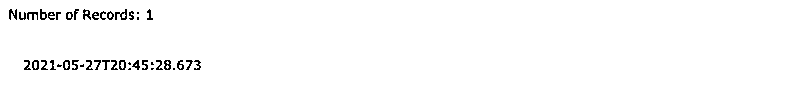

#### 实施例 2

**代码:**

`SELECT convert(varchar, CURRENT_TIMESTAMP,100) ;`

**输出:**

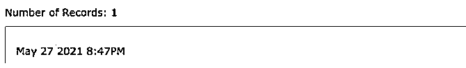

#### 实施例 3

**代码:**

`SELECT convert(varchar, CURRENT_TIMESTAMP,9) ;`

**输出:**

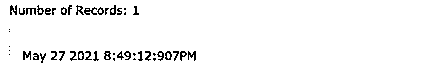

#### 实施例 4

**代码:**

`SELECT convert(varchar, CURRENT_TIMESTAMP,13) ;`

**输出:****T3】**

**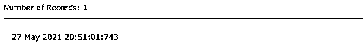

** 

#### 实施例 5

**代码:**

`SELECT convert(varchar, CURRENT_TIMESTAMP,21) ;`

**输出:**

**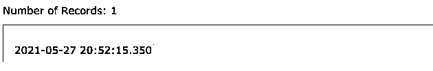

** 

SQL 查询的一些示例显示了使用 CAST 函数对 SQL server 的不同时间和日期数据类型进行的转换:

#### 实施例 6

**代码:**

`SELECT CAST(CURRENT_TIMESTAMP AS DATE);`

**输出:**

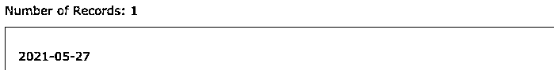

#### 实施例 7

**代码:**

`SELECT CAST(CURRENT_TIMESTAMP AS datetime2);`

**输出:**

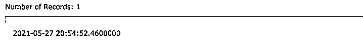

#### 实施例 8

**代码:**

`SELECT CAST(CURRENT_TIMESTAMP AS DateTime);`

**输出:**

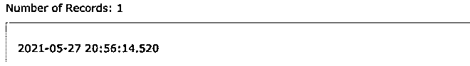

#### 实施例 9

**代码:**

`SELECT CAST(CURRENT_TIMESTAMP AS DateTimeOffset);`

**输出:**

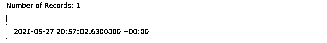

#### 实施例#10

**代码:**

`SELECT CAST(CURRENT_TIMESTAMP AS Time);`

**输出:**

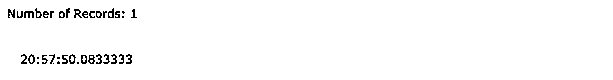

#### 实施例 11

**代码:**

`SELECT CAST(CURRENT_TIMESTAMP AS SmallDateTime);`

**输出:**

**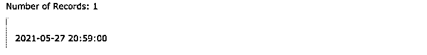

** 

### 结论

上面的描述清楚地解释了时间戳函数如何在 SQL 中工作，以及时间戳到日期的转换的实际实现。虽然对于处理 SQL 查询的 DBA 来说，当我们希望日期和时间的数据采用期望的格式时，会出现各种情况，但是我们不能每次都更改表模式来满足每个要求，所以清楚地理解转换是很重要的，以便更容易地继续进行。

### 推荐文章

这是一个关于 SQL 中时间戳的指南。在这里，我们讨论的介绍，如何转换时间戳的日期在 SQL 与语法和例子。您也可以看看以下文章，了解更多信息–

1.  [SQLite 删除](https://www.educba.com/sqlite-delete/)
2.  [SQLite 下拉表](https://www.educba.com/sqlite-drop-table/)
3.  [SQLite 显示表格](https://www.educba.com/sqlite-show-tables/)
4.  [SQLite 外键](https://www.educba.com/sqlite-foreign-key/)

