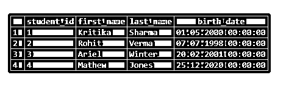

# SQL CONCAT

> 原文：<https://www.educba.com/sql-concat/>

## SQL CONCAT 简介

CONCAT()是标准查询语言(SQL)中的一个字符串函数，用于连接或组合函数中指定为参数的两个或多个字符串。但是，在连接时，空参数会被忽略。因此，该函数有助于以更易读的格式呈现数据字段。有些 SQL 数据库支持另一个版本的 CONCAT()函数，称为 CONCAT_WS()，其中除空值之外的所有指定参数都像 CONCAT()一样连接在一起，但不同之处在于第一个参数被视为分隔符。

我们甚至可以使用' || '操作符将两个或更多的字符串连接成一个。CONCAT()函数和' || '运算符的区别在于，运算符不会忽略空参数。

<small>Hadoop、数据科学、统计学&其他</small>

**语法和参数**

在 SQL 中使用 CONCAT()函数的基本语法如下:

`CONCAT(str_1, str_2, str_3, ...)`

语法中使用的参数是:

*   **str_1，str_2，str_3，… :** 这是必须连接在一起的参数列表。CONCAT()函数的参数必须是字符串可转换类型，比如 Text、VARCHAR、CHAR 等。

CONCAT_WS()函数的语法如下:

`CONCAT_WS(separator,str_1, str_2, str_3, ...);`

上述语法中使用的参数如下:

*   **分隔符:**第一个参数被视为分隔符，用于分隔后续参数。

其余的参数类似于 CONCAT()函数。

讨论了 SQL 中 CONCAT()函数的语法和参数之后，让我们深入研究并尝试一些基于它的示例。

### SQL CONCAT 示例

下面是一些说明 CONCAT()和 CONCAT_WS()函数用法的基本示例。

#### 示例#1

说明 CONCAT()函数的 SQL 查询。

**代码:**

`SELECT CONCAT ('THIS',' ','IS',' ','AN',' ', 'EXAMPLE');`

**输出:**

#### 实施例 2

SQL 查询来说明 CONCAT_WS()函数的用法。

**代码:**

`SELECT
CONCAT_WS (',','APPLE','BANANA','ORANGES','GRAPES')
AS FRUITS_BASKET;`

**输出:**

#### 实施例 3

SQL 查询来说明串联运算符||。

**代码:**

`SELECT 'Hello' || ' ' || 'There' AS concatenated_string;`

**输出:**

为了说明 CONCAT()和 CONCAT_WS()函数的用法，让我们创建一个名为“students”的虚拟表该表包含学生的名字、姓氏和出生日期等详细信息。例如，我们可以使用下面的代码片段来创建“学生”表。

`CREATE TABLE students
(
student_id integer NOT NULL GENERATED BY DEFAULT AS IDENTITY,
first_name character varying(255) NOT NULL,
last_name character varying(255) NOT NULL,
birth_date date NOT NULL,
PRIMARY KEY (student_id)
);`

我们已经成功地创建了“学生”表。现在让我们在其中插入一些记录来处理。使用下面这段代码插入值。

`INSERT INTO students(student_id, first_name, last_name, birth_date)
VALUES(1,'Kritika','Sharma', TO_DATE('May 01 2000','Mon DD YYYY'));
INSERT INTO students(student_id, first_name, last_name, birth_date)
VALUES(2,'Rohit','Verma', TO_DATE('070798','MMDDYY'));
INSERT INTO students(student_id, first_name, last_name, birth_date)
VALUES(3,'Ariel','Winter', TO_DATE('2001-02-20 13:27:18', 'YYYY-MM-DD HH24:MI:SS'));
INSERT INTO students(student_id, first_name, last_name, birth_date)
VALUES(4,'Mathew','Jones', TO_DATE('2020-52-5', 'IYYY-IW-ID'));
select * from students;`

记录插入后的最终表格如下所示:

我们现在准备尝试一些基于此表的示例。

#### 实施例 4

学生的名字以名和姓的形式存储在学生的表中。我们的任务是将学生的姓名显示为一个字段，而不是两个字段。

**代码:**

`SELECT CONCAT(first_name, ' ', last_name) as student_name
FROM students;`

**输出:**

这里我们使用 CONCAT()函数连接名、姓和空格，返回学生的全名。

#### 实施例 5

假设我们必须显示学生的全名和年龄。年龄应该以诸如“Kritika 的年龄是 20 岁”的句子的形式来声明。

**代码:**

`SELECT CONCAT(first_name,' ',last_name),
CONCAT('Age of ', first_name,' is ',
EXTRACT(Year FROM '2020-06-01' ::date)- EXTRACT(Year FROM birth_date :: date))
FROM students;`

**输出:**

在这个例子中，我们首先推断出一个学生的年龄，然后使用 CONCAT()函数将其与字符串的其余部分连接起来。

#### 实施例 6

假设我们必须显示学生的全名，其格式是名字和姓氏一起显示，但用逗号隔开。

**代码:**

`SELECT CONCAT_WS(' , ',first_name,last_name) as comma_separated
FROM students;`

**输出:**

这个例子很容易理解，因为我们在这里复制了例子 2，唯一的区别是我们用水果名作为参数，这里用名字和姓氏。

#### 实施例 7

假设我们必须找到班上年龄最大的两个学生。除此之外，我们还必须在一个句子中显示年龄最大的学生的名字，并用逗号作为分隔符。

**代码:**

`SELECT CONCAT('The eldest students are ',
CONCAT_WS(' , ', first_name,
LEAD(first_name,1) OVER
(ORDER BY birth_date ASC)))
FROM students
ORDER BY birth_date ASC
LIMIT 1;`

**输出:**

这里，我们首先分别使用 ORDER BY 和 LEAD 函数找到了最年长和次年长学生的名字。接下来，我们使用 CONCAT()和 CONCAT_WS()函数将获得的结果连接在一起。

#### 实施例 8

假设我们必须显示所有学生的全名，但是不允许使用 CONCAT()和 CONCAT_WS()函数。

**代码:**

`SELECT (first_name || ' ' || last_name) as student_name
FROM students;`

**输出:**

在这种情况下，我们可以使用连接操作符“||”将 first_name 和 last_name 字段连接在一起。

### 结论

像 CONCAT()和 CONCAT_WS()这样的函数在 SQL 中用于将两个或多个字符串可转换参数连接成一个字段。这对于以外行人易于阅读的方式显示结果非常有用。

### 推荐文章

这是一个 SQL CONCAT 的指南。在这里，我们讨论 SQL CONCAT 的示例，说明 CONCAT()和 CONCAT_WS()函数的用法。您也可以看看以下文章，了解更多信息–

1.  [MySQL REGEXP](https://www.educba.com/mysql-regexp/)
2.  [PostgreSQL 真空](https://www.educba.com/postgresql-vacuum/)
3.  [MySQL 替换](https://www.educba.com/mysql-replace/)
4.  [PostgreSQL 唯一索引](https://www.educba.com/postgresql-unique-index/)

