# SQL 最小值和最大值

> 原文：<https://www.educba.com/sql-min-and-max/>

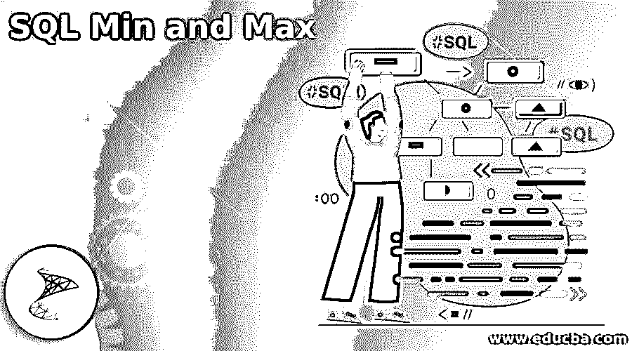


## SQL 最小值和最大值介绍

SQL min 和 max 函数用于从指定的表列中查找最小和最大值。SQL min 函数返回指定列中的最小值。同时，max 函数返回指定列中最重要的值。这是一个在所有 RDBMS 数据库系统中使用的聚合函数，用于从表列中查找最小和最大值。

### 什么是 SQL Min 和 Max？

SQL min 和 max 聚合函数将对数字数据起作用。SQL min 和 max 函数将单个参数作为输入、表达式或列。接受一个输入后，两个函数都返回一个值作为输出。

<small>Hadoop、数据科学、统计学&其他</small>

#### SQL 最小值

SQL min 函数按照我们的定义返回一个值作为输出。该函数将从一组元素中返回最小值。SQL min 函数使用起来很简单。它将记录记录集中的最小数量。SQL min 函数对于从表的列中找到最小的数字很重要，也很有帮助。

下面是 SQL min 函数的语法:

```
Select MIN (name_of_column) from table_name;
```

```
Select MIN (name_of_column) from table_name where condition;
```

```
MIN (name_of_column or expression)
```

```
Select MIN (name_of_column) from table_name group by name_of_column;
```

#### SQL Max

正如我们所定义的，SQL max 函数返回单个值作为输出。该函数将从一组元素中返回最重要的值。SQL max 函数使用起来很简单。它将记录记录集中的最大数量。SQL max 函数对于从表列中找到最重要的数字是非常重要和有帮助的。

下面是 SQL max 函数的语法:

```
Select MAX (name_of_column) from table_name;
```

```
Select MAX (name_of_column) from table_name where condition;
```

```
Select MAX (name_of_column) from table_name group by name_of_column;
```

```
MAX (name_of_column or expression)
```

#### 参数描述

*   **Select:** 我们可以从表中选择列名，从表列中找到最小值和最大值。这是从表中选择指定数据的 SQL 语句。
*   **表的名称:**这就是我们从中检索列最小值和最大值的表的名称。当使用它检索最小或最大值时，我们需要定义表名。
*   **Where 条件:**这是执行 SQL min 和 max 函数最关键的参数。sql min 和 max 函数中的 where 条件将用于检索指定的最次要的和最重要的，这是我们在 where 条件中定义的。Where 条件有利于使用 sql min 和 max 函数检索特定条件的最小值和最大值。
*   **列名:**这是与函数一起使用的表列。如果假设我们对指定的列使用了 sql min 和 max 函数，它将从指定的列中检索最小和最大的值。
*   **Min:** 这个函数从我们在查询中使用的列或表达式中找到最小值。
*   **Max:** 这个函数用于从我们在查询中使用的列或表达式中找到最重要的值。

### SQL 最小值和最大值函数

我们还可以将 group by 语句与 SQL min 和 max 函数一起使用，并将 order by 条件与 min 和 max 函数一起使用。

以下示例显示 sql min 函数不区分大小写。在第一个例子中，我们使用了大写字母的函数名。相比之下，在第二个例子中，我们两次都使用了小写字母的函数名，它将返回相同的结果，而不会发出任何错误。所以我们可以说 sql min 函数是不区分大小写的。

**代码:**

```
SELECT MIN (id) from min_max;
SELECT min (id) from min_max;
```

**输出:**

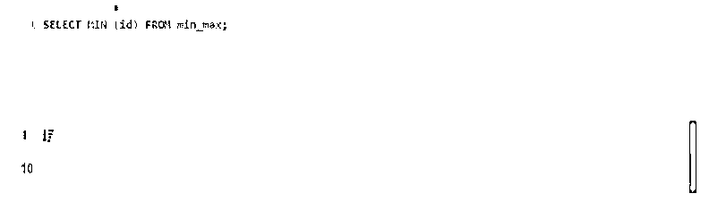


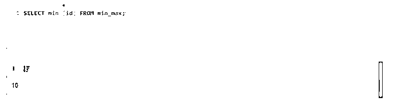


以下示例显示 sql max 函数不区分大小写。在第一个例子中，我们使用了大写字母的函数名。相比之下，在第二个例子中，我们两次都使用了小写字母的函数名，这将返回相同的结果，而不会发出任何错误。所以我们可以说 sql max 函数是不区分大小写的。

**代码:**

```
SELECT MAX (id) from min_max;
SELECT max (id) from min_max;
```

**输出:**

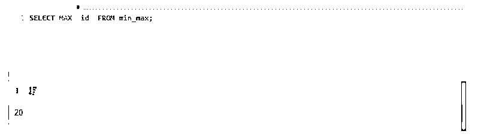


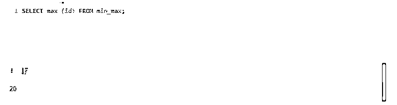


该函数不适用于文本类型的列。我们只需要数字类型的列来查找最小和最大值。

**代码:**

```
Select min (text) from min_max;
Select max (text) from min_max;
```

**输出:**

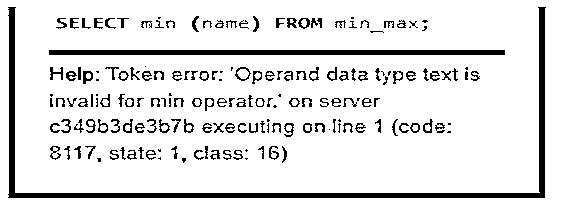


### SQL 最小值和最大值示例

下面提到了不同的例子:

#### 示例#1

在下面的例子中，我们使用 min_max 表来显示 SQL min 的实例，下面的 max 函数是 min_max 表的记录。

**代码:**

```
Select * from min_max;
```

**输出:**

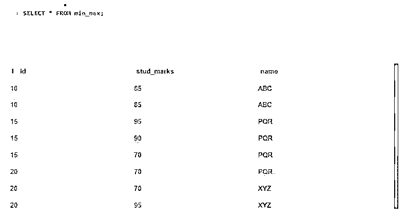


下面的示例从 stud_marks 表中查找最重要和最次要数量的记录。我们在第一个查询中使用 min 函数，在第二个查询中使用 max 函数。

**代码:**

```
Select min (stud_marks) from min_max;
Select max (stud_marks) from min_max;
```

**输出:**

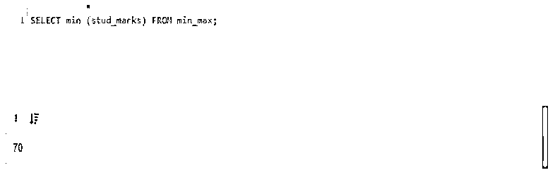


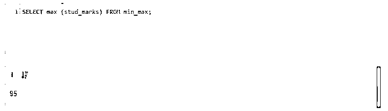


#### 实施例 2

在下面的示例中，我们使用了一个包含 min 和 max 函数以及 where 条件的单列。

**代码:**

```
Select min (stud_marks) from min_max where id = 10;
Select max (stud_marks) from min_max where id = 20;
```

**输出:**

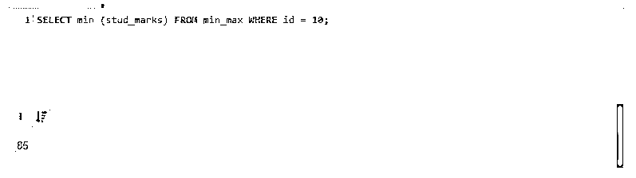


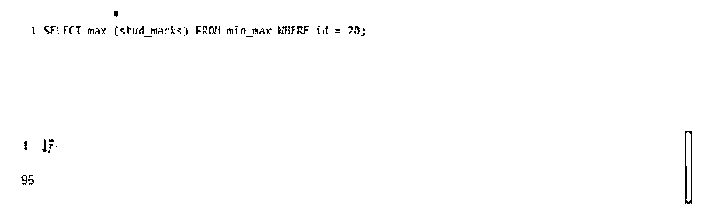


#### 实施例 3

在下面的示例中，我们使用查询中的两列和 min 和 max 函数中的 stud_marks 列来查找最小和最大的数字。

**代码:**

```
Select id, min (stud_marks) from min_max group by id;
Select id, max (stud_marks) from min_max group by id;
```

**输出:**

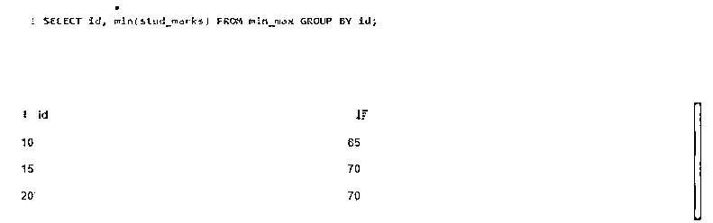


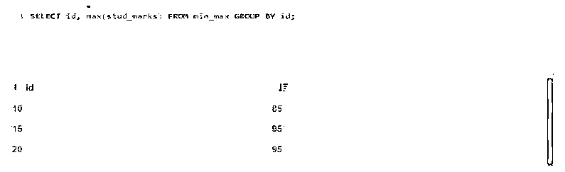


#### 实施例 4

在下面的例子中，我们在一个查询中使用了 min 和 max 函数，如下所示。

**代码:**

```
Select min (id), max (stud_marks) from min_max;
```

**输出:**

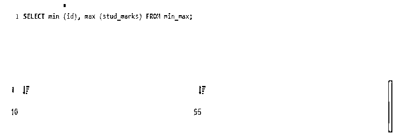


### 结论

函数使用起来很简单。它将记录记录集中的最小和最大数量。该函数从列中查找最小和最大值。例如，SQL min 函数返回指定列中的最小值。

### 推荐文章

这是一个 SQL Min 和 Max 的指南。这里我们讨论简介、SQL min 和 max 函数和示例。您也可以看看以下文章，了解更多信息–

1.  [desc 的 SQL 订单](https://www.educba.com/sql-order-by-desc/)
2.  [SQL 执行](https://www.educba.com/sql-execute/)
3.  [SQL 排除](https://www.educba.com/sql-exclude/)
4.  [MySQL InnoDB 集群](https://www.educba.com/mysql-innodb-cluster/)


