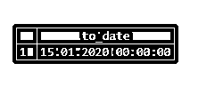
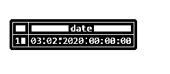
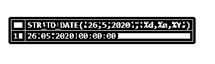
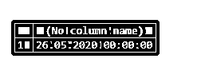
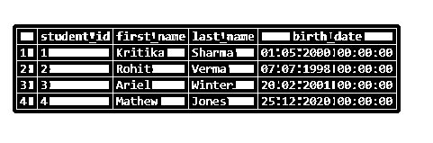

# SQL 到日期()

> 原文：<https://www.educba.com/sql-to_date/>

## SQL TO_DATE()简介

大多数 SQL 数据库管理服务器(如 PostgreSQL 和 ORACLE)中的 TO_DATE()函数用于转换字符数据类型(如 VARCHAR、NVARCHAR、CHAR 等)的数据值。转换为标准日期数据类型。该函数有两个参数，第一个是要转换的字符数据类型的值，第二个是第一个参数的日期时间格式。

一些 SQL 数据库(如 SQL Server 和 MYSQL)使用不同的函数将字符值转换为日期数据类型。在 SQL server 和 MYSQL 中，我们可以分别使用 CONVERT(datetime，'字符型日期')和 STR_TO_DATE()函数。

<small>Hadoop、数据科学、统计学&其他</small>

### 语法和参数

使用上述日期转换函数的基本语法如下:

`to_date(text, datetime format);`

SQL server 中 CONVERT()函数的语法如下:

`CONVERT(datetime, text);`

MYSQL 中 STR_TO_DATE()函数的语法如下:

`STR_TO_DATE(text, datetime format);`

**参数:**

*   Text:字符数据类型的数据值，如 char、text、varchar、nchar、varchar 等。必须转换成日期时间格式。
*   Datetime 格式:基于日期说明符的特定格式，所提到的文本就是以这种格式编写的。

### SQL TO_DATE()的示例

下面是一些例子:

#### 示例#1

**说明在 PostgreSQL 和 Oracle SQL 数据库中 to_date()函数工作的基本 SQL 查询。**

假设您要将“20200526”转换为 YYYY-MM-DD 格式(代表 4 个年份字符，后面各跟两个月和日字符。)我们可以按以下方式使用 to_date()函数。

`SELECT to_date('20200526','YYYYMMDD');`

接下来，假设我们有一些以文本格式编写的日期信息，就像这个例子中的一样。我们可以使用下面这段代码来执行这项任务。

`SELECT to_date('2020-JAN-15', 'YYYY-MON-DD');`

假设我们有一些速记格式的条目，比如‘070920’，我们想把它转换成 YYYY-MM-DD 格式。下面的查询可以帮助我们。

`SELECT TO_DATE('070920', 'MMDDYY');`

我们有时可以将日期信息与时间戳字符串混合在一起。这可以通过使用带有以下参数集的 to_date 函数来解决。

`SELECT TO_DATE('2020-05-26 13:27:18', 'YYYY-MM-DD HH24:MI:SS');`

在 PostgreSQL 中，我们可以简单地将一个以日期格式编写的字符串转换为日期数据类型，而不需要按照下面的方式使用 to_date()函数。

`SELECT '2020/02/03'::date;`

很好，我们刚刚学会了使用 to_date()函数将字符串转换为日期数据类型。由于 SQL server 和 MYSQL 没有将 to_date()作为内置函数，所以我们不能在那里使用它。因此，让我们尝试一些同样适用的例子。

`SELECT STR_TO_DATE('26,5,2020','%d,%m,%Y');`

上面提到的查询在 MYSQL 数据库中返回 YYYY-MM-DD 日期格式的输入字符串。

`SELECT CONVERT(DATETIME, '2020-05-26');`

#### 实施例 2

**SQL 查询说明在 INSERT 语句中使用 to_date()函数。**

为了说明 to_date()函数的用法，让我们创建一个虚拟的“学生”表。我们可以使用下面的代码片段来执行给定的任务。

`CREATE TABLE students (
student_id INT GENERATED BY DEFAULT AS IDENTITY,
first_name VARCHAR ( 255 ) NOT NULL,
last_name VARCHAR ( 255 ) NOT NULL,
birth_date DATE NOT NULL,
PRIMARY KEY ( student_id )
);`

现在让我们使用下面的查询尝试在“学生”表中插入数据记录。

`INSERT INTO students(first_name, last_name, birth_date)
VALUES('Kritika','Sharma', TO_DATE('May 01 2000','Mon DD YYYY'));
INSERT INTO students(first_name, last_name, birth_date)
VALUES('Rohit','Verma', TO_DATE('070798','MMDDYY'));
INSERT INTO students(first_name, last_name, birth_date)
VALUES('Ariel','Winter', TO_DATE('2001-02-20 13:27:18', 'YYYY-MM-DD HH24:MI:SS'));
INSERT INTO students(first_name, last_name, birth_date)
VALUES('Mathew','Jones', TO_DATE('2020-52-5', 'IYYY-IW-ID'));`

在这些查询中，给定的 birth_date 不是标准的 PostgreSQL 日期格式。前三个 birth _ dates 是我们熟悉的格式，因为我们已经讨论过基于它们的例子。第四个查询以年份、周数和工作日格式书写 birth_date。我们必须使用 to_date()将其转换为标准的 YYYY-MM-DD 格式，如上面给出的代码片段所示。

现在，让我们检查给定学生的出生日期是否已按要求的格式插入。我们可以使用下面的 SELECT 语句从 students 表中获取记录。

`SELECT student_id,
first_name,
last_name,
birth_date
FROM students;`

我们可以清楚地看到，已经使用 to_date()函数成功地将 birth_dates 转换为标准日期格式(YYYY-MM-DD)。

### 推荐文章

这是 SQL TO_DATE()的指南。在这里，我们还讨论了介绍和语法和参数以及不同的例子和它的代码实现。您也可以看看以下文章，了解更多信息–

1.  [MySQL 管理](https://www.educba.com/mysql-administration/)
2.  [SQL 批量插入](https://www.educba.com/sql-bulk-insert/)
3.  [PostgreSQL Like](https://www.educba.com/postgresql-like/)
4.  [SQL REGEXP](https://www.educba.com/sql-regexp/)

