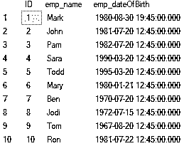
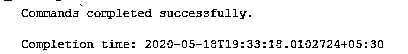
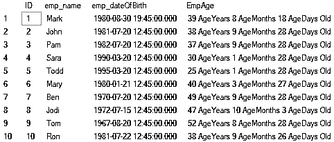
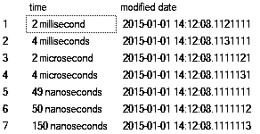
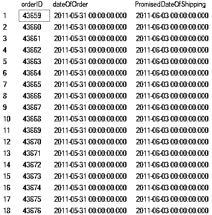
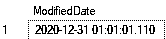
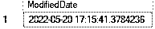

# SQL DATEADD()

> 原文：<https://www.educba.com/sql-dateadd/>

## SQL DATEADD()简介

在 SQL server 中，如果我们想要增加或减少日期或时间间隔，那么我们使用 DATEADD()返回修改后的日期值。

### 句法

下面是 SQL DATEADD()的语法

<small>Hadoop、数据科学、统计学&其他</small>

`DATEADD(interval, number, date)`

正如我们在这个函数中看到的，有三个参数，并且都是这个函数工作并返回整数结果所必需的

**1。间隔**

这也称为 datepart，它作为一个字符串提供给这个函数。该参数可以是表示时间间隔的任何值，如月、周、日、年。我们还可以指定一年中的哪个季度。

*   年，yyyy，yy =年
*   季度，qq，q =季度
*   月，mm，m =月
*   dayofyear =一年中的某一天
*   日，日，y =日
*   周，ww，wk =周
*   工作日，dw，w =工作日
*   小时，hh =小时
*   分钟，mi，n =分钟
*   秒，ss，s =秒
*   毫秒，ms =毫秒
*   微秒，mcs =微秒
*   纳秒，ns =纳秒
*   TZoffset，tz =时区偏移量

`SELECT DATEADD(month, 1,'20100720');
SELECT DATEADD(month, 1,'20100622');`

以上语句将日期增加一个月。在这种情况下，月份是日期部分。

**2。编号**

number 参数应该是一个整数，并且不能超过它的正数或负数限制。

`SELECT DATEADD(year,2147483648,'20070728');
SELECT DATEADD(year,-2147483649,'20070728');`

上述查询语句都返回错误消息“Msg 8115，级别 16，状态 2，第 7 行，将表达式转换为数据类型 int 时出现算术溢出错误”。Msg 8115，级别 16，状态 2，第 8 行将表达式转换为数据类型 int 时出现算术溢出错误。

**3。日期**

这是要添加值的实际日期。这是一个强制参数。它应该是以 date、datetime、datetimeoffset、datetime2、smalldatetime 或时间值进行解析的表达式。它可以是字符串或用户定义的变量。

该功能在 SQL server 中工作，从 2008 版本开始，Azure SQL 数据仓库，Azure SQL 数据库，并行数据仓库。

### 实现 SQL DATEADD()的示例

下面是提到的例子:

#### 1.计算年龄

**代码:**

`select ID,emp_name,emp_dateOfBirth from Employee`

**输出:**

我们有上表 Employee，其中包含出生日期，由此，我们将按照年、月和日分两步计算年龄

##### 步骤 1–创建函数

**代码:**

`CREATE FUNCTION fnEmp_ComputeAge(@Emp_DOB DATE TIME)
RETURNS NVARCHAR(50)
AS
BEGIN
DECLARE @Age_Tempdate DATETIME, @Age_Years INT, @Age_Months INT, @Age_Days INT
SELECT @Age_Tempdate= @Emp_DOB
SELECT @Age_Years=DATEDIFF(YEAR, @Age_Tempdate,GETDATE())-CASE WHEN (MONTH(@Emp_DOB)>MONTH(GETDATE()))OR(MONTH(@Emp_DOB)=MONTH(GETDATE())AND DAY(@Emp_DOB)>DAY(GETDATE()))THEN 1 ELSE 0 END
SELECT @Age_Tempdate=DATEADD(YEAR, @Age_Years, @Age_Tempdate)
SELECT @Age_Months=DATEDIFF(MONTH, @Age_Tempdate,GETDATE())-CASE WHEN DAY(@Emp_DOB)>DAY(GETDATE())THEN 1 ELSE 0 END
SELECT @Age_Tempdate=DATEADD(MONTH, @Age_Months, @Age_Tempdate)
SELECT @Age_Days=DATEDIFF(DAY, @Age_Tempdate,GETDATE())
DECLARE @Emp_Age NVARCHAR(50)
SET @Emp_Age=Cast(@Age_Years AS NVARCHAR(4))+' Age_Years '+Cast(@Age_Months AS NVARCHAR(2))+' Age_Months '+Cast(@Age_Days AS NVARCHAR(2))+' Age_Days Old'
RETURN @Emp_Age
End`

**输出:**

在上面的示例中，我们创建了一个 SQL 函数来计算 DOB 中雇员的年龄，因此该函数将@Emp_DOBas 作为参数并返回 NVARCHAR(50)。当我们运行这个函数时，我们将会看到这一点。在步骤中，我们已经创建了这个函数。

然后我们在变量中声明了@Age_Tempdate 日期时间，@Age_YearsINT，@Age_MonthsINT，@Age_DaysINT。首先，我们将@ Age _ Tempdateto 设置为@Emp_DOB。下一条语句至关重要，在这条语句中，我们使用 DATEDIFF 函数从使用 GETDATE 函数计算的 dob 和当前日期中获取年份差异，然后根据 dob 月是否大于当前月，或者如果 dob 月与当前月相同并且 dob 日大于当前日，我们减去 1 或 0，在这种情况下，我们加上 1，否则加上 0。

然后，我们使用 DATEADD 函数将计算出的年份添加到@Age_Tempdate 中。同样，我们计算了月份并加入了@Age_Tempdate，然后用它来计算天数。接下来，我们声明@Emp_Age，并将其设置为最终输出的串联。由于计算结果是 int 类型的，我们使用 Cast 函数将其转换为 nvarchar 类型。

##### 步骤 2–在查询中使用函数。

**代码:**

`select ID,emp_name,emp_dateOfBirth,dbo.fnEmp_ComputeAge(emp_dateOfBirth) as Emp_Age from Employee;`

**输出:**

正如我们所看到的，我们已经使用了 dbo.fnEmp_ComputeAge 函数并传递了 emp_dateOfBirth 来计算 Emp_Age，结果如上所示。

#### 2.小数秒的精度

在本例中，我们声明了 date 并添加了毫秒、微秒和纳秒来检查比例因子。

**代码:**

`DECLARE @datetime datetime2 ='2015-01-01 14:12:08.1111111';
SELECT '2 millisecond' as time, DATEADD(ms,1,@datetime) as [modified date] UNION ALL
SELECT '4 milliseconds', DATEADD(ms,2,@datetime)
UNION ALL
SELECT '2 microsecond', DATEADD(mcs,1,@datetime)
UNION ALL
SELECT '4 microseconds', DATEADD(mcs,2,@datetime)
UNION ALL
SELECT '49 nanoseconds', DATEADD(ns,49,@datetime)
UNION ALL
SELECT '50 nanoseconds', DATEADD(ns,50,@datetime)
UNION ALL
SELECT'150 nanoseconds', DATEADD(ns,150,@datetime);`

**输出:**

*   **毫秒:**刻度为 3 (.111)
*   **微秒:**刻度为 6 (.111111)
*   **纳秒**:刻度为 9 (.111111111)

Time、datetimeoffset 和 datetime2 的小数位数为 7 (.1111111)。因此，纳秒应该是计算中要计数的最小 100，因为这个数字 1-49 被舍入到 0，50-99 被舍入到 100。此外，该函数不允许添加时区偏移量。

#### 3.参数是表达式或列名

**代码:**

`SELECT SalesOrderID as orderID, OrderDate as dateOfOrder,
DATEADD(day,3,OrderDate) AS PromisedDateOfShipping FROM Sales.SalesOrderHeader;`

**输出:**

在本例中，我们在订单日期上增加了 3 天，以使用 DATEADD()计算预计发货日期。

#### 4.用户定义的变量

**代码:**

`DECLARE @daysToAdd int= 365,
@datetimeValue datetime='2020-01-01 01:01:01.111';
SELECT DATEADD(day, @daysToAdd, @datetimeValue) as ModifiedDate;`

**输出:**

#### 5.使用标量系统函数

**代码:**

`SELECT DATEADD(year, 2,SYSDATETIME()) as ModifiedDate;`

**输出:**

在本例中，我们将当前系统时间增加 2 年。

### 结论

希望现在您已经知道了 SQL server 中的 DATEADD()是什么，以及如何使用它来计算给定日期中时间间隔的加减。

### 推荐文章

这是一个 SQL DATEADD()的指南。这里我们讨论适当的语法和解释，并通过查询示例来更好地理解。您也可以浏览我们的其他相关文章，了解更多信息——

1.  [Sql 案例语句](https://www.educba.com/sql-case-statement/)
2.  [和 SQL 中的](https://www.educba.com/and-in-sql/)
3.  [SQL 中的通配符](https://www.educba.com/wildcard-in-sql/)
4.  [SQL 视图](https://www.educba.com/sql-views/)

