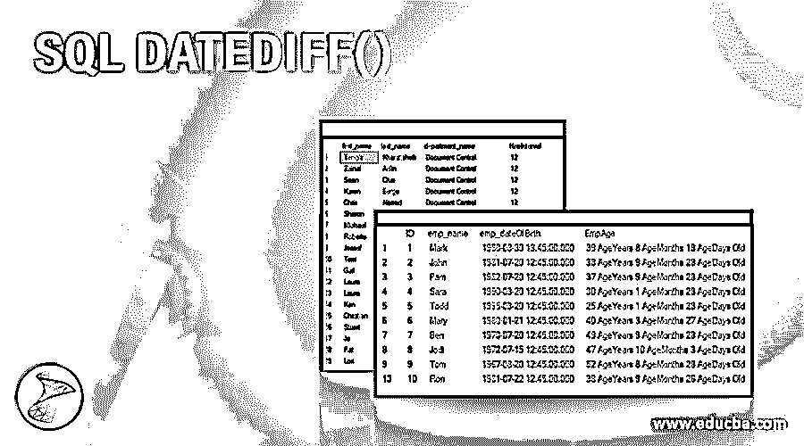
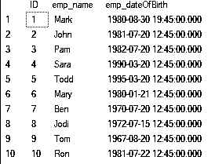
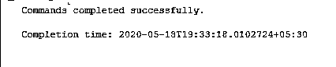
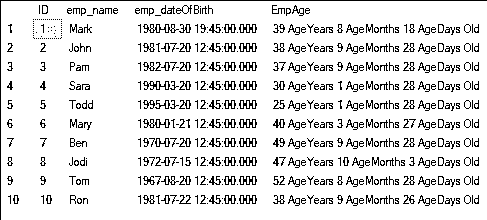
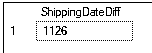
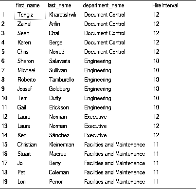

# SQL DATEDIFF()

> 原文：<https://www.educba.com/sql-datediff/>

## SQL Datediff()简介

在 SQL server 中，假设我们的数据中有日期，并且我们想知道这些日期之间的差异，那么我们可以使用 DATEDIFF 函数来知道这些日期之间的差异(以天、月或年为单位)。所以这个函数返回一个整数作为输出，为了更好地理解这个函数，让我们先了解一下它的语法。

### SQL 中 Datediff()的语法

`DATEDIFF (interval, startdate, enddate)`

<small>Hadoop、数据科学、统计学&其他</small>

正如我们在此函数中看到的，有三个参数，并且所有参数都是此函数工作并返回整数结果所必需的:

**1。interval–**这也称为 datepart，它作为一个字符串提供给这个函数。该参数可以是表示时间间隔的任何值，如月、周、日、年。我们还可以指定一年中的哪个季度。

`year, yyyy, yy = Year
SELECT DATEDIFF(year, '2010-12-31 23:59:59.9999999', '2011-01-01 00:00:00.0000000');`

`quarter, qq, q = Quarter
SELECT DATEDIFF(quarter,'2010-12-31 23:59:59.9999999', '2011-01-01 00:00:00.0000000');`

`month, mm, m = month
SELECT DATEDIFF(month, '2010-12-31 23:59:59.9999999', '2011-01-01 00:00:00.0000000');`

`dayofyear = Day of the year
SELECT DATEDIFF(dayofyear,'2010-12-31 23:59:59.9999999', '2011-01-01 00:00:00.0000000');`

`day, dy, y = Da
SELECT DATEDIFF(day,'2010-12-31 23:59:59.9999999', '2011-01-01 00:00:00.0000000');`

`week, ww, wk = Week
SELECT DATEDIFF(week,'2010-12-31 23:59:59.9999999', '2011-01-01 00:00:00.0000000');`

`hour, hh = hour
SELECT DATEDIFF(hour,'2010-12-31 23:59:59.9999999', '2011-01-01 00:00:00.0000000');`

`minute, mi, n = Minute
SELECT DATEDIFF(minute,'2010-12-31 23:59:59.9999999', '2011-01-01 00:00:00.0000000');`

`second, ss, s = Second
SELECT DATEDIFF(second,'2010-12-31 23:59:59.9999999', '2011-01-01 00:00:00.0000000');`

`millisecond, ms = Millisecond
SELECT DATEDIFF(millisecond,'2010-12-31 23:59:59.9999999', '2011-01-01 00:00:00.0000000');`

`microsecond, mcs = Microsecond
SELECT DATEDIFF(microsecond,'2010-12-31 23:59:59.9999999', '2011-01-01 00:00:00.0000000');`

**2。startdate，end date–**这些是实际日期，用于计算它们之间的差值。这是一个强制参数。

该功能在 SQL server 中工作，从 2008 版本开始，Azure SQL 数据仓库，Azure SQL 数据库，并行数据仓库。

### 返回值

*   返回值是一个整数，用日期部分或间隔边界表示，即开始日期和结束日期之间的差值。
*   如果 int 返回值的范围不在[-2，147，483，648 到+2，147，483，647]之间，DATEDIFF 函数将返回错误。开始日期和结束日期之间的最大差值为 24 天 20 小时 31 分 23.647 秒(毫秒)。最大差别是 68 年 19 天 3 小时 14 分 7 秒。
*   如果开始日期和结束日期的数据类型不同，则 DATEDIFF 会将另一个精度较低的日期的缺少部分设置为 0
*   上述查询具有相同的开始和结束值。这些是相邻的日期，它们之间的差异是一百纳秒(. 0000001 秒)。开始和结束日期跨一个日历，每个查询的结果是 1。

### 例子

以下是提到的例子

#### 示例 1–计算年龄

`select ID,emp_name,emp_dateOfBirth from Employee`

我们有上表 Employee，其中包含出生日期，从这个表中，我们将分两步计算年、月和日的年龄

**第一步:**创建函数

`CREATE FUNCTION fnEmpComputeAge(@EmpDOB DATETIME)
RETURNS NVARCHAR(50)
AS
BEGIN
DECLARE @AgeTempdate DATETIME, @AgeYears INT, @AgeMonths INT, @AgeDays INT
SELECT @AgeTempdate= @EmpDOB
SELECT @AgeYears=DATEDIFF(YEAR, @AgeTempdate,GETDATE())-CASE WHEN (MONTH(@EmpDOB)>MONTH(GETDATE()))OR(MONTH(@EmpDOB)=MONTH(GETDATE())AND DAY(@EmpDOB)>DAY(GETDATE()))THEN 1 ELSE 0 END
SELECT @AgeTempdate=DATEADD(YEAR, @AgeYears, @AgeTempdate)
SELECT @AgeMonths=DATEDIFF(MONTH, @AgeTempdate,GETDATE())-CASE WHEN DAY(@EmpDOB)>DAY(GETDATE())THEN 1 ELSE 0 END
SELECT @AgeTempdate=DATEADD(MONTH, @AgeMonths, @AgeTempdate)
SELECT @AgeDays=DATEDIFF(DAY, @AgeTempdate,GETDATE())
DECLARE @EmpAge NVARCHAR(50)
SET @EmpAge=Cast(@AgeYears AS NVARCHAR(4))+' AgeYears '+Cast(@AgeMonths AS NVARCHAR(2))+' AgeMonths '+Cast(@AgeDays AS NVARCHAR(2))+' AgeDays Old'
RETURN @EmpAge
End`

在上面的示例中，我们创建了一个 SQL 函数来计算 DOB 中雇员的年龄，因此该函数将@EmpDOBas 作为参数并返回 NVARCHAR(50)。当我们运行这个函数时，我们将会看到这一点。在步骤中，我们已经创建了这个函数。

然后我们将@AgeTempdate DATETIME、@AgeYearsINT、@AgeMonthsINT、@ AgeDaysINT 声明为变量。首先，我们将@AgeTempdateto 设置为@EmpDOB。下一条语句至关重要，在这条语句中，我们使用 DATEDIFF 函数从使用 GETDATE 函数计算的 dob 和当前日期中获取年份差异，然后根据 dob 月是否大于当前月，或者如果 dob 月与当前月相同并且 dob 日大于当前日，我们减去 1 或 0，在这种情况下，我们加上 1，否则加上 0。

然后，我们使用 DATEADD 函数在@AgeTempdate 中添加计算出的年份。

同样，我们计算了月份并添加了@AgeTempdate，然后用它来计算天数。接下来，我们声明@EmpAge，并将其设置为最终输出的串联。由于计算结果是 int 类型的，我们使用 Cast 函数将其转换为 nvarchar 类型。

**第二步:**使用查询中的函数

`select ID,emp_name,emp_dateOfBirth,dbo.fnEmpComputeAge(emp_dateOfBirth) as EmpAge from Employee`

结果如下:

正如我们所看到的，我们已经使用了 dbo.fnEmpComputeAge 函数并传递了 emp_dateOfBirth 来计算 EmpAge，结果如上所示。

#### 示例 2–对开始和结束日期使用标量函数和子查询

`SELECT DATEDIFF(day,
(SELECT MIN([ShipDate])FROM Sales.SalesOrderHeader),
(SELECT MAX([ShipDate])FROM Sales.SalesOrderHeader)) as ShippingDateDiff;`

结果如下:

在本例中，我们使用标量函数和标量子查询计算了 min 和 max 的发货日期差。

#### 示例# 3–对开始日期参数使用排名函数

`SELECT FirstName as first_name,LastName as last_name,
DATEDIFF(day,ROW_NUMBER() OVER (ORDER BY
DepartmentName),SYSDATETIME()) AS row_number
FROM dbo.DimEmployee;`

结果如下:

在这个函数中，我们使用 ROW_NUMBER()排名函数作为开始日期参数。

#### 示例# 4–使用聚合窗口函数作为开始日期参数

`SELECT FirstName as first_name,LastName as last_name,DepartmentName as department_name,
DATEDIFF(year,MAX(HireDate)
OVER (PARTITION BY DepartmentName),SYSDATETIME()) AS HireInterval
FROM dbo.DimEmployee`

### 结论

希望现在您已经知道了 SQL server 中的 DATEDIFF()是什么，以及如何使用它来根据 datepart 计算日期之间的差异。

### 推荐文章

这是一个 SQL DATEDIFF()的指南。这里我们讨论 SQL DATEDIFF()的例子，以了解如何使用它来计算结果。您也可以看看以下文章，了解更多信息–

1.  [SQL UNION ALL](https://www.educba.com/sql-union-all/)
2.  [SQL 用户](https://www.educba.com/sql-users/)
3.  [MySQL Binlog](https://www.educba.com/mysql-binlog/)
4.  PostgreSQL 中的[数组](https://www.educba.com/array-in-postgresql/)

