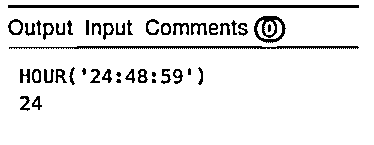
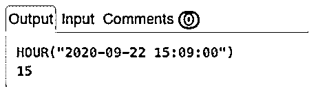
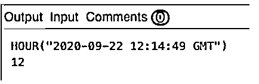
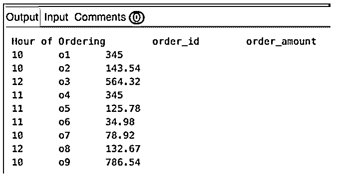
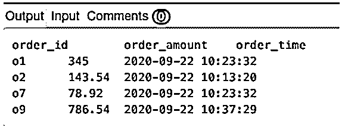
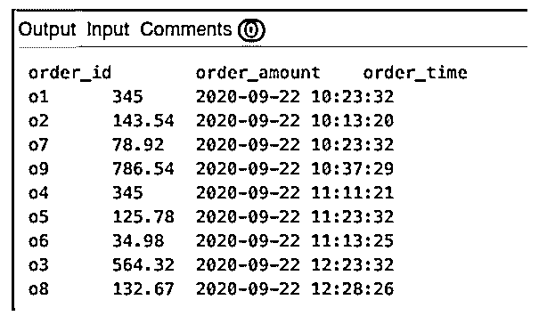
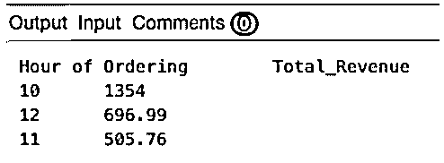

# SQL 小时()

> 原文：<https://www.educba.com/sql-hour/>

## SQL 小时简介()

HOUR()函数是标准查询语言(SQL)中的日期/时间函数，用于从给定的日期时间或时间戳数据中提取小时部分。该功能主要在 MYSQL 和 ORACLE 等数据库中得到支持。而其他流行的数据库管理服务器如 PostgreSQL 和 SQL Server 使用其他类似的函数，EXTRACT(' hour ' from ' DATE _ expression ')和 DATE _ PART(' hour ' from ' DATE _ expression ')。在本文中，我们将借助一些实际例子来讨论 HOUR()函数。首先，让我们讨论一下这个函数中使用的语法和参数。

### 语法和参数

MYSQL 和 ORACLE 数据库中 HOUR()函数的基本语法如下:

<small>Hadoop、数据科学、统计学&其他</small>

`HOUR(‘expression’)`

该函数的参数和输出如下:

*   e**expression:**expression 是输入值。它可以是日期、日期时间、时间戳或可转换为类似数据类型的字符串。
*   **Output:** 该函数以 24 小时制返回给定表达式中小时部分的值对应的整数值。

hour 函数可用作 SELECT 语句的一部分，用于选择小时部分、WHERE 或 HAVING 子句以根据筛选表达式中的小时部分进行筛选、ORDER BY 子句以根据表达式的小时部分对记录进行排序或 GROUP BY 子句以根据给定日期/时间戳列的小时部分对记录进行分组。

讨论了使用 HOUR()函数的基本语法和参数之后，让我们继续讨论几个例子，以便更详细地理解该功能。

### SQL HOUR()示例

下面是一些例子:

#### 示例#1

从给定的时间戳/日期时间/时间表达式中提取小时部分。

1\. 24:48:59

`SELECT HOUR('24:48:59');`

2\. 2020-09-22 15:09:00

`SELECT HOUR("2020-09-22 15:09:00");`

3.格林尼治时间 2020 年 9 月 22 日 12 时 14 分 49 秒

`SELECT HOUR("2020-09-22 12:14:49 GMT");`

在上面提到的例子中，您可能已经注意到了三种不同的日期时间/时间戳表达式。在第一个示例中，我们只有时间，在第二个示例中，我们有日期时间，在第三个示例中，我们有时间戳和时区。MYSQL/Oracle 的小时函数适用于所有这些数据类型。

为了说明 HOUR()函数的用法，让我们创建一个以 order_id、order_amount 和 order_time 为列的“orders”表。订单表的 CREATE 语句如下所示:

`CREATE TABLE orders(
order_id VARCHAR(10),
order_amount REAL,
order_time DATETIME
);`

创建 orders 表后，在其中插入一些要处理的记录。您可以使用下面的 INSERT 语句来实现相同的目的。

`INSERT INTO orders (order_id,order_amount,order_time)
VALUES ('o1',345,'2020-09-22 10:23:32'),
('o2',143.54,'2020-09-22 10:13:20'),
('o3',564.32,'2020-09-22 12:23:32'),
('o4',345,'2020-09-22 11:11:21'),
('o5',125.78,'2020-09-22 11:23:32'),
('o6',34.98,'2020-09-22 11:13:25'),
('o7',78.92,'2020-09-22 10:23:32'),
('o8',132.67,'2020-09-22 12:28:26'),
('o9',786.54,'2020-09-22 10:37:29');`

在 orders 表中插入给定的记录后，我们就可以在这个表的帮助下尝试几个基于 HOUR()函数的例子了。

#### 实施例 2

在结果集中查找带有订购时间、order_id 和 order_amount 的订单的订单详细信息。

`SELECT HOUR(order_time) as "Hour of Ordering", order_id, order_amount
FROM orders;`

在本例中，我们使用了 HOUR()函数作为 SELECT 语句的一部分。HOUR()函数从相应的 order_time 列中提取小时。

#### 实施例 3

查找 2020 年 9 月 22 日上午 10 点至 11 点之间下单的订单详情。

`SELECT order_id, order_amount, order_time
FROM orders
WHERE HOUR(order_time) >= 10 AND HOUR(order_time) < 11;`

这里，我们使用 HOUR()函数作为 WHERE 子句的一部分，根据排序的时间来过滤行。该函数返回与给定 order_time 列的小时部分相对应的整数值，并将其与比较表达式进行比较。

#### 实施例 4

根据订购时间，从最早到最晚对 2020 年 9 月 22 日的订单详细信息进行排序。

`SELECT order_id, order_amount, order_time
FROM orders
ORDER BY HOUR(order_time) ASC;`

在这个例子中，我们使用了 HOUR()函数来提取排序时间的小时部分，然后使用它来对提取的记录进行升序排序。

#### 实施例 5

查找 2020 年 9 月 22 日下单产生的每小时收入。

`SELECT HOUR(order_time) as "Hour of Ordering",
SUM(order_amount) as "Total_Revenue"
FROM orders
GROUP BY HOUR(order_time);`

这里，我们使用 HOUR()函数作为 GROUP BY 子句的一部分。

### 结论

在本文中，我们介绍了 SQL 中的 HOUR()函数，它用于从给定的输入日期时间/时间戳表达式中提取小时部分。该函数返回一个介于 0 和 24 之间的整数值。该函数仅在 MYSQL 和 Oracle 数据库中可用。

### 推荐文章

这是一个 SQL HOUR()的指南。在这里，我们还将讨论 sql hour()的简介、语法和参数，以及不同的示例和代码实现。您也可以看看以下文章，了解更多信息–

1.  [SQL 别名](https://www.educba.com/sql-alias/)
2.  [PostgreSQL 字符串数组](https://www.educba.com/postgresql-string-array/)
3.  [MySQL 数学函数](https://www.educba.com/mysql-math-functions/)
4.  [SQL 联合](https://www.educba.com/sql-union/)

