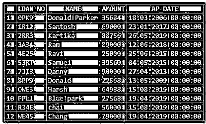
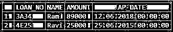
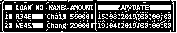
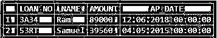
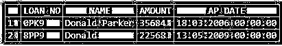

# 像 SQL 中的查询

> 原文：<https://www.educba.com/like-query-in-sql/>

## SQL 中 LIKE 查询的介绍

LIKE query 用于从表行中搜索特定的模式，并返回与该模式匹配的列。当您只知道文本值的一个片段，并且需要从表中获取细节时。然后，通过使用 SQL 中的“LIKE”查询，您可以获得与提到的模式相匹配的值。

LIKE 查询有两个通配符匹配。下面提到了它们:

<small>Hadoop、数据科学、统计学&其他</small>

*   **"%":** 匹配包含零个或多个字符的任何字符串。
*   **"_":** 匹配任意单个字符。

**SQL 中 LIKE 查询的语法:**

在这一节让我们讨论一下“喜欢”它的语法的意义。

`SELECT Col_name1, col_name2, .. , col_nameN
FROM <Table_name>
WHERE <Col_name1> LIKE <value>`

### 如何在 SQL 中使用 LIKE 查询？

让我们举一个例子，看看 LIKE 查询在 SQL 中是如何工作的。让我们考虑下面的 LOAN_034 表:

**创建贷款 _034 表:**

`CREATE TABLE LOAN_034(
LOAN_NO VARCHAR(25) PRIMARY KEY,
NAME VARCHAR(25),
AMOUNT INTEGER(10),
AP_DATE DATE
);`

**向 LOAN_034 表插入数据:**

`INSERT INTO LOAN_034 VALUES ("3A34","Ram", 89000, "2018-06-12");
INSERT INTO LOAN_034 VALUES ("4E25","Ravi", 25000, "2015-06-25");
INSERT INTO LOAN_034 VALUES ("1R12","Santosh", 69000, "2017-01-23");
INSERT INTO LOAN_034 VALUES ("53RT","Samuel", 39560,"2015-05-04");
INSERT INTO LOAN_034 VALUES ("2RR3","Kartika", 88756,"2019-05-26");
INSERT INTO LOAN_034 VALUES ("8PP9","Donald", 22568, "2009-05-13");
INSERT INTO LOAN_034 VALUES ("0PK9","Donald Parker", 35684, "2006-03-18");
INSERT INTO LOAN_034 VALUES ("7JI8","Danny", 90000, "2013-04-27");
INSERT INTO LOAN_034 VALUES ("OWE3","Harsh", 64988,"2019-08-15");
INSERT INTO LOAN_034 VALUES ("PPL1","Blue park", 27568, "2019-04-19");
INSERT INTO LOAN_034 VALUES ("R34E","chai", 56000, "2019-08-15");
INSERT INTO LOAN_034 VALUES ("WE45","Chang",79000, "2019-04-19");
select * from LOAN_034;`

**输出:**

#### 示例#1

从上表中获取姓名以“R”开头的人的所有详细信息。

**查询:**

`SELECT * FROM LOAN_034
WHERE UPPER (NAME) LIKE ‘R%’;`

**输出:**

#### 实施例 2

从上表中获取姓名以“don”开头的人的所有详细信息。

**查询:**

`SELECT * FROM LOAN_034
WHERE UPPER (NAME) LIKE ‘DON%’;`

**输出:**

#### 实施例 3

从上表中获取姓名以“cha”和“chan”开头的人的所有详细信息。

**查询:**

`SELECT * FROM LOAN_034
WHERE UPPER (NAME) LIKE UPPER (‘CHA_’) OR UPPER (NAME) LIKE UPPER (‘CHAN_’);`

**输出:**

#### 实施例 4

从上表中获取姓名中包含“park”的人的所有详细信息。

**查询:**

`SELECT * FROM LOAN_034
WHERE UPPER (NAME) LIKE ‘%PARK%’;`

**输出:**

#### 实施例 5

从上表中获取姓名包含字母“M”的人员的所有详细信息。

**查询:**

`SELECT * FROM LOAN_034
WHERE UPPER (NAME) LIKE ‘%M%’;`

**输出:**

#### 实施例 6

从上表中获取姓名中包含“Donald”的人的所有详细信息。

**查询:**

`SELECT * FROM LOAN_034
WHERE UPPER (NAME) LIKE ‘%DONALD%’;`

**输出:**

#### 实施例 7

从上表中获取姓名以“A”开头，以“K”开头，以“A”结尾的人的所有详细信息。

**查询:**

`SELECT * FROM LOAN_034
WHERE UPPER (NAME) LIKE ‘A%’ OR UPPER (NAME) LIKE ‘K%’
OR UPPER (NAME) LIKE ‘%A’;`

**输出:**

#### 实施例 8

从上表中获取姓名以“H”开头并以“H”结尾的人的所有详细信息。

**查询:**

`SELECT * FROM LOAN_034
WHERE UPPER (NAME) LIKE ‘H%H’;`

**输出:**

#### 实施例 9

从上表中获取姓名以“R”开头、以“M”结尾并且中间只有一个字母的人的所有详细信息。

**查询:**

`SELECT * FROM LOAN_034
WHERE UPPER (NAME) LIKE ‘R_M’;`

**输出:**

### 推荐文章

这是一个类似 SQL 查询的指南。在这里，我们讨论了如何在 SQL 中使用 LIKE 查询，以及一些查询的例子和实现。您也可以阅读以下文章，了解更多信息——

1.  MySQL 中的 ORDER BY 子句是如何工作的？
2.  [SQL 中的组合键示例](https://www.educba.com/composite-key-in-sql/)
3.  [SQL 中的 AND 工作示例](https://www.educba.com/and-in-sql/)
4.  [带示例的前 7 个 SQL 键](https://www.educba.com/sql-keys/)

