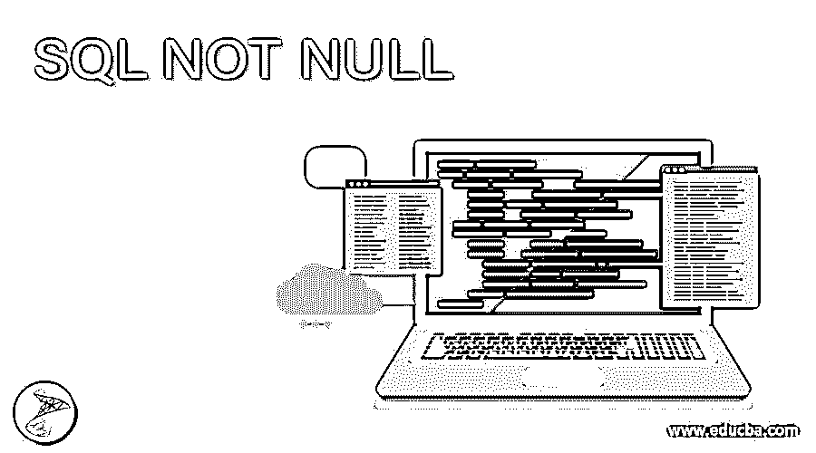
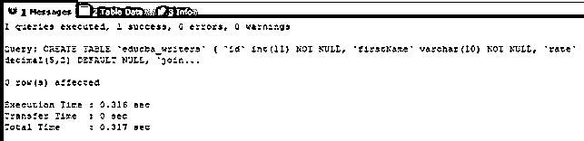
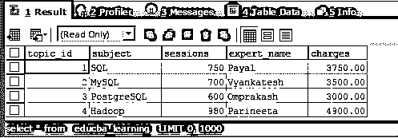
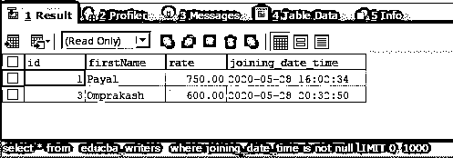
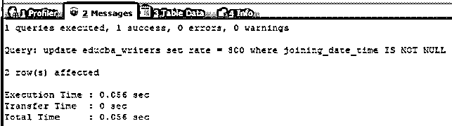
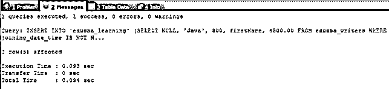
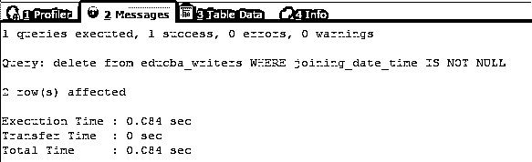
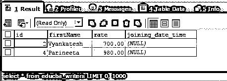

# SQL 不为空

> 原文：<https://www.educba.com/sql-not-null/>

## SQL NOT NULL 简介

SQL NOT NULL 是可以应用于任何表达式的约束或条件，表达式可以是列名、变量、文字或任何其他涉及函数并导致某个值的表达式，确定表达式的值是否为 NULL。当表达式计算为非空值时，NOT NULL 约束返回 true，否则返回 false。SQL not null 约束可以与 SQL、INSERT、UPDATE 和 DELETE 的所有 SELECT DML 语句一起使用。本文将学习 NOT NULL 约束的语法和用法，并通过示例和演示研究如何在 SQL 的不同 DML 语句中实现它。

### 语法和用法

SQL NOT NULL 约束的一般语法如下所示

<small>Hadoop、数据科学、统计学&其他</small>

`expression_or_value IS NOT NULL;`

在上面的表达式中，expression_or_value 是您希望检查的表的列名，或者是其值将被考虑进行空值检查的任何变量，或者是涉及使用其执行可能返回空值的函数的表达式的任何返回值。大多数情况下，在 SQL 中使用表时，如果我们在表中插入记录时没有指定列的值，则为该记录的该列存储 NULL 值，因为 NULL 是 SQL 中表的任何列的默认值，除非为该列指定了明确的默认值。

因此，这会导致表的记录中出现空值，当从数据库中检索数据时，我们可能需要选择或考虑那些某些列不应该拥有空值的值。在这种情况下，IS NOT NULL 约束有助于返回一个布尔值，该值有助于考虑是否应该将该特定记录添加到最终结果集中。在上述语法中，当表达式或值产生空值时，IS NOT NULL 子句将返回一个假布尔值。在其他情况下，表达式计算结果为非空，然后返回一个真布尔值。

### 例子

我们将通过在 SQL 的不同 DML 语句(如 SELECT、INSERT、UPDATE 和 DELETE)中使用 IS NOT NULL 约束来研究它的工作原理。

让我们使用下面的 create table 语句创建两个名为 educba_learning 和 educba_writers 的表。

`CREATE TABLE `educba_writers` (
`id` INT(11) NOT NULL,
`firstName` VARCHAR(10) NOT NULL,
`rate` DECIMAL(5,2) DEFAULT NULL,
`joining_date_time` DATETIME DEFAULT NULL
);`

上述查询语句的执行将产生以下输出

`CREATE TABLE `educba_learning` (
`topic_id` INT(11) NOT NULL IDENTITY,
`subject` VARCHAR(100) DEFAULT NULL,
`sessions` INT(5) DEFAULT '0',
`expert_name` VARCHAR(100) DEFAULT NULL,
`charges` DECIMAL(7,2) DEFAULT '0.00'
);`

上述查询语句的执行将产生以下输出

现在，我们将在两个表中插入一些记录

`INSERT INTO `educba_learning` (`topic_id`, `subject`, `sessions`, `expert_name`, `charges`) VALUES
(1, 'SQL', 750, 'Payal', '3750.00'),
(2, 'MySQL', 700, 'Vyankatesh', '3500.00'),
(3, 'PostgreSQL', 600, 'Omprakash', '3000.00'),
(4, 'Hadoop', 980, 'Parineeta', '4900.00');`

上述查询语句的执行将产生以下输出

`INSERT INTO `educba_writers` (`id`, `firstName`, `rate`, `joining_date_time`) VALUES
(1, 'Payal', '750.00', '2020-05-28 16:02:34'),
(2, 'Vyankatesh', '700.00', NULL),
(3, 'Omprakash', '600.00', '2020-05-28 20:32:50'),
(4, 'Parineeta', '980.00', NULL);`

上述查询语句的执行将产生以下输出

如您所见，我们在表 educba_writers 中插入了一些具有空值的记录。

**让我们检索两个表的内容—**

对 educba_learning 表执行下面提到的选择查询会产生以下输出—

`SELECT * FROM `educba_learning``

对 educba_writers 表执行 select 查询会产生以下输出

现在，我们准备在上面的表上使用 NOT NULL 约束。我们将逐一查看每个 DML 语句的示例。

**在选择查询中使用 NOT NULL 约束-**

现在，我们将只检索 educba_writers 表中那些在 joining state time 列中没有空值的记录。为此，我们将在 SELECT 语句中使用 IS NOT NULL 约束，我们的查询语句如下所示

`SELECT * FROM `educba_writers` WHERE joining_date_time IS NOT NULL;`

上述查询语句的执行将给出以下输出，其中仅包含那些在联接日期时间列中具有非空值的记录

**在更新查询中使用 NOT NULL 约束—**

在更新记录时，可能会有这样一种情况，您希望只更新那些某些列的值被设置为某个非空值的记录。假设在我们上面的表格中；对于 joining_date_time 列中没有空值的记录，我们必须更新表 educba_writers 的内容，并将 rate 列的列值设置为 800。在这种情况下，我们可以使用下面的查询语句来更新记录。

`UPDATE educba_writers
SET rate = 800
WHERE joining_date_time IS NOT NULL;`

上述查询语句的执行将产生以下输出

让我们在更新后检查表 educba_writers 的内容，看看哪些记录被更新了。

`SELECT * FROM `educba_writers` ;`

上述查询语句的执行将产生以下输出，其中包含记录 Payal 和 Omprakash 以及更新后的汇率–

**在插入查询中使用 NOT NULL 约束-**

让我们将 educba_writers 表中的记录插入到 educba_learning 表中，只插入那些在 joining date time 列中具有非空值的记录。为此，我们将使用以下查询–

`INSERT INTO `educba_learning` (SELECT
NULL, 'Java', 800, firstName, 4500.00
FROM
educba_writers
WHERE joining_date_time IS NOT NULL) ;`

上述查询语句的执行将产生以下输出

**让我们选择 educba_learning 表的内容—**

`SELECT * FROM educba_learning`

执行上述语句会产生以下输出

**T2】**

 ****在删除查询中使用 NOT NULL 约束-**

现在，我们将从表 educba_writers 中删除所有在加入日期时间列中具有空值的记录。

`DELETE FROM educba_writers WHERE joining_date_time IS NOT NULL;`

**让我们选择 educba_writers 表的内容—**

`SELECT * FROM educba_writers;`

执行上述语句会产生以下输出

### 结论–SQL 不为空

我们可以对一个或多个列应用约束，以指出该列的值不应该为 NULL。该约束可用于 SQL 中的任一 DML 语句:SELECT、INSERT、UPDATE 和 DELETE。

### 推荐文章

这是一个 SQL NOT NULL 的指南。这里我们讨论 NOT NULL 约束的用法，以及如何在 SQL 的不同 DML 语句中实现它。您也可以看看以下文章，了解更多信息–

1.  [SQL NOT 运算符](https://www.educba.com/sql-not-operator/)
2.  [MySQL 删除触发器](https://www.educba.com/mysql-delete-trigger/)
3.  [SQL 按字母顺序排序](https://www.educba.com/sql-order-by-alphabetical/)
4.  [SQL 表分区](https://www.educba.com/sql-table-partitioning/)

**