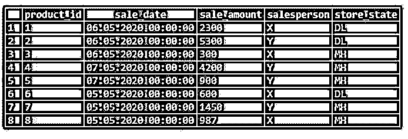
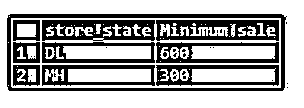
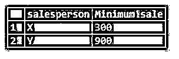
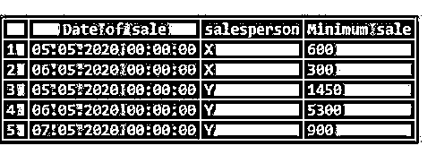
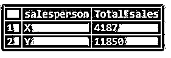
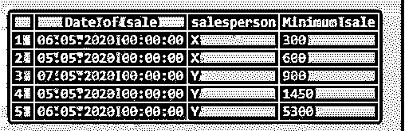

# SQL MIN()

> 原文：<https://www.educba.com/sql-min/>

锦鲤

## SQL MIN()简介

标准查询语言(SQL)中的 MIN()函数是一个聚合函数，它返回在选择查询的结果集中获得的指定列的最小值。这是一个非常通用的功能。它可以在选择查询中单独使用，也可以与 GROUP BY 和 HAVING 子句一起使用，以便在数据分析中准备汇总表。

### 语法和参数

使用 MIN()函数编写 SQL 查询的基本语法如下:

<small>Hadoop、数据科学、统计学&其他</small>

`SELECT MIN(column_name)
FROM table_name
WHERE condition;`

上述语法中使用的参数:

*   **column_name:** 要返回最小值的字段或列。
*   **table_name:** 必须从中提取 column_name 的数据库表。
*   **WHERE 条件:**如果需要，任何行的过滤子句。

在 GROUPBY 子句中编写 MIN 函数的语法:

`SELECT MIN(column_name1), column_name2
FROM table_name
GROUP BY column_name2;`

该语法中使用的大部分参数与前面的语法相似。

*   **column _ name 1:**column _ name 1 对应于要返回最小值的列。
*   **column _ name 2:**column _ name 2 对应于分组所依据的字段或列。

这里我们已经看到了使用 MIN()函数编写 SQL 查询的基本语法。我们可以用 HAVING，ORDER BY 等。，根据我们的要求。

### SQL MIN()的示例

以下是 SQL MIN()的示例:

为了说明 SQL 中 MIN()函数的工作原理，让我们创建一个名为“sales”的虚拟表。此表包含一家造纸公司不同销售人员的销售明细。

创建该表的 CREATE 语句如下:

**代码:**

`CREATE TABLE sales
(
product_id integer NOT NULL,
sale_date date NOT NULL,
sale_amount numeric NOT NULL,
salesperson character varying(255)  NOT NULL,
store_state character varying(255) NOT NULL,
CONSTRAINT product_key PRIMARY KEY (product_id)
)`

一旦成功创建了表，就在其中插入以下记录以进行操作。

**代码:**

`INSERT INTO sales(
product_id, sale_date, sale_amount, salesperson, store_state)
VALUES (1,'2020-05-06',2300,'X','DL'),
(2,'2020-05-06',5300,'Y','DL'),
(3,'2020-05-06',300,'X','MH'),
(4,'2020-05-07',4200,'Y','MH'),
(5,'2020-05-07',900,'Y','MH'),
(6,'2020-05-05',600,'X','DL'),
(7,'2020-05-05',1450,'Y','MH'),
(8,'2020-05-05',987,'X','MH');
select * from sales;`

**输出:**

The query returned successfully. Now we are all set to try a few examples based on MIN()function using the sales table.

#### 示例 1–MIN()的基本功能

找出总销售额的最小值。

**代码:**

`SELECT MIN(sale_amount)
FROM sales;`

**输出:**

在本例中，对 sale_amount 列使用了 MIN()来查找该列中的最小值。

#### 实施例 2

找出第一次销售的最早日期(根据销售表)。

**代码:**

`SELECT MIN(sale_date)
FROM sales;`

**输出:**

#### 示例 3–带有 WHERE 子句的 MIN()。

找出德里或 DL 商店的最低销售额。

**代码:**

`SELECT MIN(sale_amount) as "Minimum sale"
FROM sales
WHERE store_state = 'DL';`

**输出:**

#### 示例 4–带有 GROUP BY 子句的 MIN()。

找出按商店位置分组的总销售额的最小值。

**代码:**

`SELECT store_state, MIN(sale_amount) as "Minimum sale"
FROM sales
GROUP BY store_state;`

**输出:**

这里，SELECT 语句结果按 store_state 分组，然后使用 MIN()函数获取每组的相应最小值。

#### 实施例 5

找出销售人员汇总的最低销售额。

**代码:**

`SELECT salesperson, MIN(sale_amount) as "Minimum sale"
FROM sales
GROUP BY salesperson;`

**输出:**

#### 实施例 6

找出按销售日期和销售人员分组的总销售额的最小值。

**代码:**

`SELECT sale_date as "Date of sale",
salesperson, MIN(sale_amount) as "Minimum sale"
FROM sales
GROUP BY sale_date, salesperson;`

**输出:**

**

** 

在本例中，我们按照两个字段(即 sale_date 和 salesperson)对结果集进行分组，然后使用 MIN()对每个组进行汇总。

#### 示例 7–带有 HAVING 子句的 MIN()。

查找按销售人员分组的总销售额，其中第一次销售的最早日期为 2020 年 5 月 5 日。

**代码:**

`SELECT salesperson, SUM(sale_amount) as "Total sales"
FROM sales
GROUP BY salesperson
HAVING MIN(sale_date) = '2020-05-05';`

**输出:**

这里，让 MIN(sale_date)充当这个聚合查询的过滤子句。

#### 示例 8–带有 ORDER BY 子句的 MIN()。

查找按销售日期和销售人员分组的最低销售总额，并按最低销售总额排序。

**代码:**

`SELECT sale_date as "Date of sale",
salesperson, MIN(sale_amount) as "Minimum sale"
FROM sales
GROUP BY sale_date, salesperson
ORDER BY MIN(sale_amount);`

**输出:**

### SQL MIN()的优势

下面是提到的优点:

*   MIN()是一个统计函数，有助于在选择查询的结果集中找到特定字段的最小值。
*   MIN()，当在 GROUP BY 子句中用作汇总函数时，它有助于找到每个组中记录的最小值。
*   MIN()与 HAVING 子句一起使用时，它有助于根据最小必需值筛选记录。

### 结论

MIN()函数是一个聚合函数，用于查找选定列的最小值。

### 推荐文章

这是一个 SQL MIN()的指南。这里我们分别讨论 SQL MIN()的简介、示例以及优点。您也可以看看以下文章，了解更多信息–

1.  [SQL 升序排序](https://www.educba.com/sql-order-by-ascending/)
2.  [SQL 按字母顺序排序](https://www.educba.com/sql-order-by-alphabetical/)
3.  [SQL NOT 运算符](https://www.educba.com/sql-not-operator/)
4.  [SQL 表分区](https://www.educba.com/sql-table-partitioning/)

