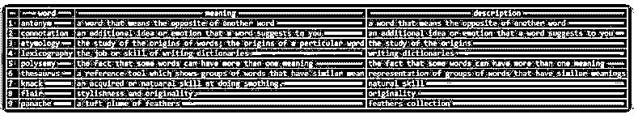

# SQL 文本搜索

> 原文：<https://www.educba.com/sql-text-search/>

## SQL 文本搜索简介

SQL 中的文本搜索可以使用 SQL 中可用的函数来完成:PATINDEX、CHARINDEX 等。全文是一种搜索工具，它允许用户搜索某些甚至没有被完全提及的关键字，并帮助以快速简单的方式检索搜索到的过滤数据。全文搜索最常用于搜索引擎，如 Google 或 bing，也用于博客文章搜索、电子商务网站搜索等。在 SQL 中，提供了全文搜索功能来搜索一个或多个列数据中的匹配文本。在本文中，我们将了解使用 LIKE 函数和全文搜索进行文本搜索的工作原理，并尽可能借助示例了解如何在 SQL 中定义全文搜索。

### 使用 PATINDEX、CHARINDEX 等函数进行文本搜索

我们可以使用 LIKE 函数来搜索以我们指定的某些字符开头、结尾或包含这些字符的单词。此外，PATINDEX、CHARINDEX 函数帮助我们检索我们试图在其他字符串或基于字符的列中搜索的字符串的位置，如果成功找到该字符串，则返回索引。

<small>Hadoop、数据科学、统计学&其他</small>

让我们通过使用包含以下记录的名为 dictionary 的表来考虑这个例子。

**代码:**

`SELECT * FROM dictionary;`

**输出:**

现在，我们必须搜索在它们的含义列值中包含“word”字符串的记录。为此，我们将使用以下包含 LIKE 函数的查询。

**代码:**

`SELECT * FROM dictionary WHERE meaning LIKE "%word%";`

上述查询语句的执行给出了以下输出，其中包含两条含义为“word”的记录，

**输出:**

现在让我们使用 CHARINDEX 函数来找出一个特定的字符串中是否有一个“hill”单词，并对其进行搜索。如果 CHARINDEX 函数返回一个非零的正值，那么我们试图搜索的键已经在从函数中检索的位置找到了；否则，搜索字符串不存在。

我们的示例使用以下查询语句在字符串中搜索“hill”一词。

**代码:**

`SELECT CHARINDEX('hill', '170, Mountain Villa, Prince Edward Parade, Cross Road, Hunters Hill');`

**输出:**

现在让我们在同一个原始字符串中搜索一些其他字符串，使用 CHARINDEX 函数说“well ”,并观察以下查询的输出。

**代码:**

`SELECT CHARINDEX('well', '170, Mountain Villa, Prince Edward Parade, Cross Road, Hunters Hill');`

上述查询语句的执行给出以下输出，其中 0 作为返回位置，这意味着在原始字符串“170，Mountain Villa，Prince Edward Parade，Cross Road，Hunters Hill”中没有找到值为“well”的单词。

**输出:**

### 全文搜索工作

*   全文搜索技术利用称为文档的数据库实体，文档中包含文本数据，如客户名称、项目、描述，然后基于关键字进行搜索。例如，当进行诸如裤子和衬衫的搜索时，检索的搜索结果集包括分别包含裤子单词的结果和分别包含衬衫单词的结果，并且还包括在内容中以任何顺序将衬衫和裤子包含在一起的结果，如衬衫和裤子或裤子和衬衫一起。
*   尽管 SQL 中提供了 PATINDEX、CHARINDEX 和 like 语句等特性，但是当列长度较长或者要对多个列内容进行搜索时，这些特性不足以进行搜索。使用全文搜索提供了许多优势，如搜索、灵活性和基于相关性的性能排名。
*   用于搜索的 PATINDEX、CHARINDEX、LIKE 和 REPLACE 的性能非常低，因为需要搜索表的所有内容。此外，PATINDEX、CHARINDEX 和 LIKE 提供的搜索灵活性并不那么有效。例如，当我们必须找到一个结果集，使它包含一件衬衫，但不包含领带时，这是不可能的。虽然全文搜索使用复杂的算法进行搜索，但它是使用从文本数据生成的全文索引和表的查找索引来完成的。

### 全文搜索的功能

*   SQL 中全文搜索的其他一些特性包括 SQL 界面、动态索引、小索引和高速搜索。
*   每当在其上创建全文索引的列的任何数据发生更改时，SQL 中的全文索引可能会更新，也可能不会更新。
*   全文搜索索引的更新是异步的，称为索引填充。
*   为执行全文搜索而创建的全文索引相对较小。

### 创建全文索引

可以在具有基于字符的数据类型(如 char、XML、varbinary(max)、nvarchar、FILESTREAM、ntext、image、varchar 或 nchar 和 text)的表的列上创建全文索引。请记住，在 SQL 中，我们只能为每个表创建一个全文索引。可以在一列或多列上定义全文索引。在为表创建全文索引之前，需要存在并创建全文目录，它可以被视为一个或多个表的全文索引的容器或集合。

我们可以通过使用以下语法在 SQL 中使用目录。

`CREATE FULLTEXT CATALOG name_of_catalogue;`

我们可以使用 SQL 中的函数 FULLTEXTCATALOGPROPERTY 来检索目录的属性。

**代码:**

`SELECT FULLTEXT CATALOG PROPERTY(name_of_catalog);`

此外，可以使用以下语法创建全文索引:

`CREATE FULLTEXT INDEX ON name_of_table
[ ( { column_name
[ TYPE COLUMN data_type ] [ LANGUAGE language_term ] [ STATISTICAL_SEMANTICS ] } [ ,...n] ) ] KEY INDEX name_of_index
[ ON <catalog_option> ] [ WITH [ ( ] <additional_options> [ ,...n] [ ) ] ] [;]`

### 结论

我们可以通过使用 SQL 中可用的函数，如 PATINDEX、CHARINDEX 等，在 SQL 中执行文本搜索。当涉及到海量数据，需要搜索时，上述功能在性能上失效。这是我们可以对文本使用全文搜索的地方。我们可以只在单个表中的一列上定义全文键。所有全文索引都以一个或多个全文目录的形式分组到同一个数据库中。可以通过执行某些命令或安排填充来请求填充全文搜索索引，甚至可以在插入记录的过程中请求填充。全文搜索大大加快了 SQL 中表内容的搜索速度，并且易于使用。

### 推荐文章

这是一个 SQL 文本搜索指南。在这里，我们将讨论简介、使用 PATINDEX、CHARINDEX 等函数的文本搜索、全文搜索的工作原理、功能以及创建全文索引。您也可以看看以下文章，了解更多信息–

1.  [SQL 按字母顺序排序](https://www.educba.com/sql-order-by-alphabetical/)
2.  [SQL 临时表](https://www.educba.com/sql-temporary-table/)
3.  [SQL 更新后触发器](https://www.educba.com/sql-after-update-trigger/)
4.  [SQL ORDER BY CASE](https://www.educba.com/sql-order-by-case/)

