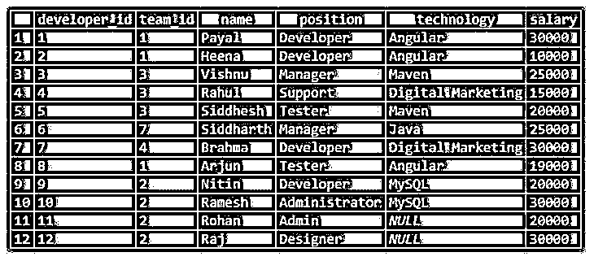
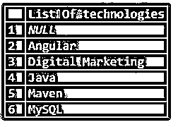
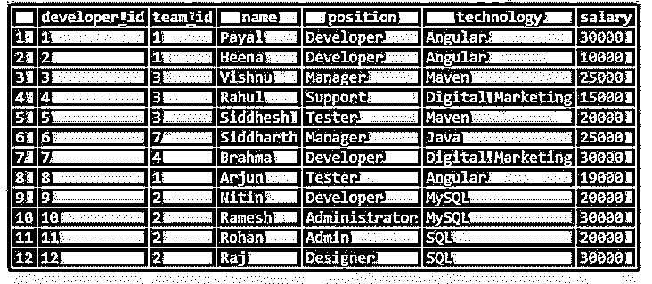

# 不同的 SQL 计数

> 原文：<https://www.educba.com/sql-count-distinct/>

## SQL 非重复计数简介

以下文章概述了 SQL COUNT DISTINCT。我们可以使用 count 函数找出 SQL 中特定查询的结果集的值的记录数。此外，可能存在冗余，这意味着特定结果集中相同值的重复。为了从特定查询语句输出的结果集中检索唯一值，我们可以在 SQL 中使用 distinct 函数。我们可以同时使用 count 和 distinct 函数来找出结果集中具有不同值的记录的数量。在实时案例场景中的许多情况下，一起使用这两个函数会很有帮助，例如检索包含不同记录的分组值的计数。

**语法:**

<small>Hadoop、数据科学、统计学&其他</small>

`COUNT ([DISTINCT] expression_or_value);`

expression_or_value 可以是涉及其他聚合函数的表达式的任何列名，因此这将导致检索许多可能包含重复值的值。

为了从记录中获得唯一的值，我们将在表达式前使用 DISTINCT 关键字，最后，为了只获得这些不同值的记录数，我们可以使用 COUNT 函数来包装内容。

### SQL 非重复计数示例

考虑一个例子；我们将借助 SQL 中的以下 CREATE TABLE 语句创建一个名为 workers 的表。

**代码:**

`CREATE TABLE `workers` (
`developer_id` INT(11) NOT NULL,
`team_id` INT(11) NOT NULL,
`name` VARCHAR(100) DEFAULT NULL,
`position` VARCHAR(100) DEFAULT NULL,
`technology` VARCHAR(100) DEFAULT NULL,
`salary` INT(11) DEFAULT NULL
)`

让我们借助下面的 INSERT query 语句在 workers 表中插入一些记录。

**代码:**

`INSERT INTO `workers` (`developer_id`, `team_id`, `name`, `position`, `technology`, `salary`) VALUES
(1, 1, 'Payal', 'Developer', 'Angular', 30000),
(2, 1, 'Heena', 'Developer', 'Angular', 10000),
(3, 3, 'Vishnu', 'Manager', 'Maven', 25000),
(4, 3, 'Rahul', 'Support', 'Digital Marketing', 15000),
(5, 3, 'Siddhesh', 'Tester', 'Maven', 20000),
(6, 7, 'Siddharth', 'Manager', 'Java', 25000),
(7, 4, 'Brahma', 'Developer', 'Digital Marketing', 30000),
(8, 1, 'Arjun', 'Tester', 'Angular', 19000),
(9, 2, 'Nitin', 'Developer', 'MySQL', 20000),
(10, 2, 'Ramesh', 'Administrator', 'MySQL', 30000),
(11, 2, 'Rohan', 'Admin', NULL, 20000),
(12, 2, 'Raj', 'Designer', NULL, 30000);`

让我们使用 select 查询语句从 worker 的表中检索记录。

**代码:**

`SELECT * FROM workers;`

**输出:**

现在，假设我们想要检索员工在餐桌上使用的所有技术。我们将使用列技术来获得所有技术的列表。但是从上面的输出可以看出，每个技术值都有许多重复的记录。因此，我们必须使用 DISTINCT()函数来获取存储在 workers 表中的独特技术的列表。

**代码:**

`SELECT DISTINCT(technology) AS 'List Of technologies' FROM workers;`

**输出:**

现在，让我们使用下面查询语句中的 COUNT()函数来计算表中技术工人的总数。

**代码:**

`SELECT COUNT(*) as technology FROM workers;`

**输出:**

因此，我们可以看到总共有 12 名技术工人。该计数将包含所有具有重复技术值的记录。现在，如果我们想要获得被考虑的具有不同值的技术的数量，那么我们可以一起使用 COUNT 和 distinct 函数，如下面的查询语句所示。

**代码:**

`SELECT COUNT(DISTINCT(technology)) FROM workers;`

**输出:**

请注意，在此计数中，空值未被考虑在技术列中。因此，检索的计数是 5。

让我们更改空技术列的值，然后再次找出技术的不同计数。

我们将使用下面的更新查询将技术中的空值替换为 SQL。

**代码:**

`UPDATE workers SET technology = 'SQL' WHERE technology IS NULL;`

让我们检索并检查该表的记录。

**代码:**

`SELECT * FROM workers;`

**输出:**

现在，我们将再次找出不同技术的数量，而不是 SQL 也将被考虑在内。

**代码:**

`SELECT COUNT(DISTINCT(technology)) FROM workers ;`

**输出:**

现在，假设我们必须找出工人表的唯一位置，那么我们将使用下面的查询语句。

**代码:**

`SELECT DISTINCT(position) AS 'List Of positions' FROM workers;`

**输出:**

现在让我们使用下面的查询语句检索 workers 表中不同技术的数量。

**代码:**

`SELECT COUNT(DISTINCT(position)) FROM workers ;`

**输出:**

### 结论

我们可以使用 COUNT 函数从特定的表中获取记录的数量。我们可以在 COUNT 函数中添加 DISTINCT 关键字，这将导致在获取 SQL 中的记录计数时只考虑唯一的记录。DISTINCT 关键字和函数帮助我们检索 SQL 中的唯一记录。

### 推荐文章

这是一个 SQL COUNT DISTINCT 指南。这里我们分别讨论 SQL COUNT DISTINCT 的介绍和例子。您也可以看看以下文章，了解更多信息–

1.  [SQL 克隆表](https://www.educba.com/sql-clone-table/)
2.  [SQL ORDER BY CASE](https://www.educba.com/sql-order-by-case/)
3.  [SQL ORDER BY DATE](https://www.educba.com/sql-order-by-date/)
4.  [SQL 临时表](https://www.educba.com/sql-temporary-table/)

