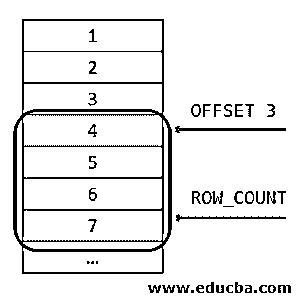
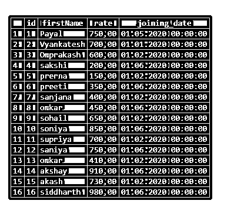
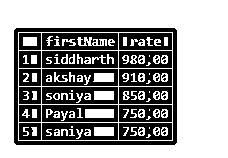

# SQL 限制排序依据

> 原文：<https://www.educba.com/sql-limit-order-by/>

## SQL 限制排序依据简介

Mysql 中的 limit 子句用于将查询结果集中检索到的行数限制在一定的数量。它还帮助我们从 MySQL 表中检索从特定偏移量开始的特定数量的记录。每当表中包含大量记录时，检索所有这些记录并显示它们就变成了一项繁重的操作，甚至非常耗时。这会影响应用程序的性能。order by 子句帮助我们定义要在使用 limit 子句指定的有限结果集中检索哪些记录。在本主题中，我们将学习 SQL 极限排序。

**语法**

<small>Hadoop、数据科学、统计学&其他</small>

limit 子句接受两个参数。其中一个是必需的，即 count_of_rows 是必需的，另一个名为 offset 的是可选的。ORDER BY 子句可以根据一个或多个列值升序或降序对数据进行排序。下面显示了 LIMIT 子句的语法、ORDER BY 子句以及它们的使用位置:

`SELECT
selected_columns_or_expressions
FROM
name_of_table
ORDER BY columns ASC/DESC
LIMIT [offset,] count_of_rows;`

count_of_rows 是一个整数值，它帮助我们指定从 name_of_table 表中检索记录的行数。偏移量是可选的整数值，默认值为 0。偏移量用于指定从名为 name_of_table 的表中获取结果集的记录位置。下图将帮助您清楚地理解 offset 和 row_count 的概念

假设上图显示了表中的记录，表中的数字代表这些记录的行号。如果偏移量指定为 3，则行数将从第四行开始，因为默认情况下偏移量从 0 开始。当 row_count 被提到为 4 时，则从定义的偏移开始，即在这种情况下，从第四行开始，当 row_count 为 4 时，将检索四个记录。如果 row_count 为 5，那么从第四条记录开始，将检索行号为 4、5、6、7 和 8 的 5 行。

每当我们不指定偏移值时，缺省值被认为是 0，并且行计数从 1 行号开始。在这种情况下，以下两个限制条款的工作方式相同:

`LIMIT 5;`

和

`LIMIT 0,5;`

它们都将从 select 查询的结果集中检索前 5 条记录。

在 ORDER BY 子句中，我们可以指定一个列列表，在该列表中我们要定义结果集的顺序，然后使用 ASC 和 DESC 来指明顺序应该是升序还是降序。默认情况下，当没有指定订单的类型时，它被认为是升序类型。

**限制的替代语法**

LIMIT 子句还提供了一个可选语法来保持与 PostgreSQL 语法的兼容性，如下所示。

`LIMIT count_of_rows OFFSET offset;`

### 将 LIMIT 子句与 ORDER BY 子句一起使用

每当我们在不使用 ORDER BY 子句的情况下检索记录时，就会以任何顺序检索结果，当 LIMIT 子句应用于这种查询时，就会需要行数有限的随机行，这通常不是我们想要的。检索行的顺序在指定要检索哪些记录时起着重要作用。将 LIMIT 子句与 ORDER BY 子句一起使用是一种很好的做法。

因此，我们可以指定 ORDER BY 子句和要进行排序的字段，同时检索记录并使用 LIMIT 子句限制要从有序数据中检索的行。下图显示了 SELECT 语句中子句的执行顺序

我们可以观察到，所有的子句都是在 LIMIT 子句之前执行的，最后，在检索结果集时，执行的最后一件事是考虑需要检索的结果集的行数和偏移量。

### 例子

让我们使用下面的查询语句创建一个名为 educba_writers 的表

`CREATE TABLE `educba_writers` (
`id` int(11) NOT NULL,
`firstName` varchar(10) COLLATE latin1_danish_ci NOT NULL,
`rate` decimal(5,2) DEFAULT NULL,
`joining_date` date DEFAULT NULL
) ENGINE=InnoDB DEFAULT CHARSET=latin1 COLLATE=latin1_danish_ci;`

让我们插入更多具有非空比率和加入日期值的行

`INSERT INTO `educba_writers` (`id`, `firstName`, `rate`, `joining_date`) VALUES
(1, 'Payal', 750, "2020-05-01"),
(2, 'Vyankatesh', 700, "2020-01-01"),
(3, 'Omprakash', 600, "2020-02-01"),
(4, 'sakshi', 200, "2020-06-01"),
(5, 'prerna', 150, "2020-02-01"),
(6, 'preeti', 350, "2020-06-01"),
(7, 'sanjana', 400, "2020-02-01"),
(8, 'omkar', 450, "2020-06-01"),
(9, 'sohail', 650, "2020-02-01"),
(10, 'soniya', 850, "2020-06-01"),
(11, 'supriya', 700, "2020-02-01"),
(12, 'saniya', 750, "2020-06-01"),
(13, 'omkar', 410, "2020-02-01"),
(14, 'akshay', 910, "2020-06-01"),
(15, 'akash', 730, "2020-02-01"),
(16, 'siddharth', 980, "2020-06-01");
select * from educba_writers;`

这给出了以下输出

现在，假设我们想从 educba_writers 表中检索评分最高的 5 位作家的列表。为此，有必要首先根据 rate 列按降序对结果集进行排序，以便它们中报酬最高的将位于第一个被检索的位置。此外，由于我们必须只检索前 5 名写入者，我们将使用 limit 子句来指定相同的内容。我们的查询如下:

`select firstName, rate
FROM
educba_writers
ORDER BY rate DESC
LIMIT 5;`

这在执行后给出了以下输出–

### 结论

我们可以通过使用 MySQL 中的 LIMIT 子句来限制从结果集中检索的记录数量。此外，可以使用 ORDER BY 子句指定要检索哪些记录，因为检索带有第一个或最后一个标准值的结果集是有意义的，这通常是用例。

### 推荐文章

这是一个 SQL 限制排序的指南。这里我们讨论 Using LIMIT 子句和 ORDER BY 子句，以及示例和输出。您也可以看看以下文章，了解更多信息–

1.  [用于循环的 SQL](https://www.educba.com/sql-for-loop/)
2.  [SQL 映射](https://www.educba.com/sql-mapping/)
3.  [SQL 克隆表](https://www.educba.com/sql-clone-table/)
4.  [PostgreSQL 或](https://www.educba.com/postgresql-or/)

