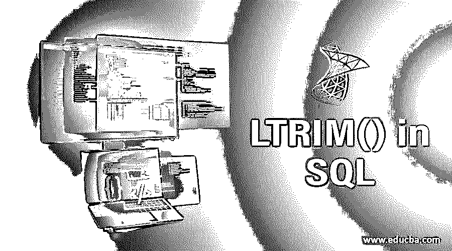
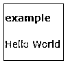
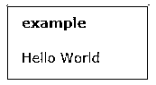
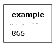
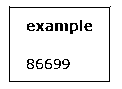
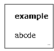
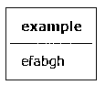
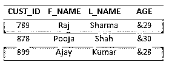
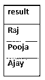
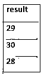

# SQL 中的 LTRIM()

> 原文：<https://www.educba.com/ltrim-in-sql/>

## SQL 中的 LTRIM()简介

结构化查询语言(SQL)具有字符串函数的特权，主要用于操作字符串，而 LTRIM()是一个 SQL 内置的字符串函数，用于从字符串的左侧删除任何前导空格或空格，并且 LTRIM()函数还可以用于从给定字符串的左侧删除指定的字符或子字符串。

**语法:**

<small>Hadoop、数据科学、统计学&其他</small>

`LTRIM(string)`

在上面的语法中,“字符串”可以是变量、列、文字字符串或字符表达式，其中的空格或字符从左边开始被修整。

### LTRIM()函数在 SQL 中是如何工作的？

让我们有一个表，其中有一列有一些前导空格，用于需要删除的列值。通常，字符串中出现前导空格的这类问题可以通过使用 [SQL 字符串函数](https://www.educba.com/sql-string-functions/)来处理。LTRIM()函数是一个内置的函数，可以帮助从字符串的左侧移除这些空格。虽然此函数用于删除所有前导空格，但我们也可以通过使用 LTRIM(string，substring)函数来删除给定字符串左侧的特定字符。

因此，这个函数不仅删除了前导空格，而且在我们想要从原始字符串的左侧删除或修整给定的子字符串时也很有用。LTRIM()函数仅删除或修剪给定字符串中的前导空格，但给定字符串中的任何其他空格都保持原样。例如，如果字符串由两个单词组成，单词之间有空格，或者有任何尾随空格，LTRIM()不会删除尾随空格或单词之间的空格。

### SQL 中的 LTRIM()示例

让我们举几个例子来看看 LTRIM()是如何工作的:

#### 示例#1

函数的作用是:删除字符串“Hello World”中的前导空格。

`SELECT LTRIM(' Hello World') as example;`

**输出:**

从上面我们可以看到，在字符串“Hello World”中很少有前导空格。LTRIM()字符串函数的使用从字符串的左侧移除了多余的空格，如结果所示。

如果除了字符串左侧的空白之外，字符串右侧或字符串之间也存在空白，则字符串之间的空白和右侧的空白不会因使用 LTRIM()函数而被删除。

#### 实施例 2

`SELECT LTRIM(' Hello World ') as example;`

上述语句不会删除输入字符串右侧的空格或中间的空格，而只会删除给定字符串左侧的空格，如下所述。

**输出:**

#### 实施例 3

如果我们想要指定要删除的字符，或者如果我们想要从原始的或给定的字符串中删除一个子串，那么我们也可以通过使用 LTRIM()来实现。

`SELECT LTRIM('99866', '9') as example;`

**输出:**

在上面的例子中，我们可以看到，由于我们在查询中指定了应该从字符串 99866 中删除所有的前导 9，所以结果是 866。

#### 实施例 4

在下面的语句中，字符串在开头和结尾都包含 9。但是使用 LTRIM()函数只会删除所有前导的 9，而不会删除右边的 9，如下面的结果所示。

`SELECT LTRIM('9986699', '9') as example;`

**输出:**

#### 实施例 5

在下面的语句中，指定的字符串或子字符串 98612 将从输入或给定的字符串中删除，这是使用 LTRIM()完成的，如下所示。

`SELECT LTRIM('99866abcde', '98612') as example;`

**输出:**

类似地，一组指定的字符也可以从输入字符串的前导位置开始修剪，如下所示。

#### 实施例 6

`SELECT LTRIM('abcdefabgh', 'abcd') as example;`

**输出:**

从上面的结果中可以注意到，子字符串' abcd '只从输入字符串的左边开始修剪。

让我们以下表中的客户为例。

让我们考虑一下，表格的某些列有前导空格。此外，列 AGE 包含添加到客户年龄值的' & '。

#### 实施例 7

在上表中，名字即 F_NAME 列可能包含一些空格。当使用下面的查询需要时，我们可以删除前导空格。

`SELECT LTRIM(F_NAME) as result FROM CUSTOMERS;`

上述查询的结果将删除 F_NAME 列值左侧的空格，如下所示。

**输出:**

#### 

#### 实施例 8

我们可以看到，AGE 列中的值添加了' & '。这可以通过使用下面的 LTRIM()函数来消除。

`SELECT LTRIM(AGE, ‘&’) as result FROM CUSTOMERS;`

上述查询的结果将删除 AGE 列中值的前导位置的所有' & '。

**输出:**

### 结论

LTRIM()是 SQL 中内置的字符串函数，它有助于删除字符串中的前导空格，还可以删除输入或给定字符串左侧的子字符串。很好的理解这个功能是非常重要的。

### 推荐文章

这是 SQL 中 LTRIM()的指南。这里我们分别讨论 LTRIM()函数的基本概念、例子以及如何在 SQL 中工作。您也可以看看以下文章，了解更多信息–

1.  [备忘单 MySQL](https://www.educba.com/cheat-sheet-mysql/)
2.  [Hive 内置函数](https://www.educba.com/hive-built-in-functions/)
3.  [甲骨文字符串函数](https://www.educba.com/oracle-string-functions/)
4.  [T-SQL 字符串函数](https://www.educba.com/t-sql-string-functions/)**T3】**

