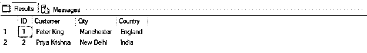
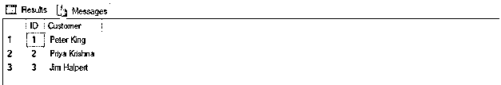
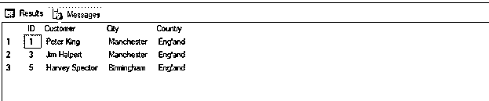
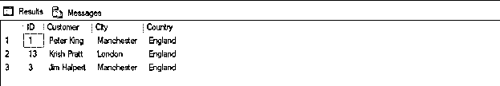
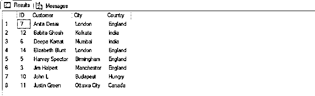

# SQL 中的 TOP

> 原文：<https://www.educba.com/top-in-sql/>

## SQL 中的 TOP 简介

TOP 是 SQL SERVER 中的一个关键字。它与 SELECT 子句一起用来限制要返回的记录数。它在数据分析过程中很方便。特别是当我们只想查看前几条记录来理解数据集时，或者当我们想从一组有序的记录中找到最高或最低的记录时。

**语法:**

<small>Hadoop、数据科学、统计学&其他</small>

接下来，让我们更详细地讨论 SQL TOP 关键字。将它与 SELECT 子句一起编写的标准语法如下:

`SELECT TOP (NUMBER) | (PERCENT)
expressions, column_name
FROM tables
[WHERE conditions] [ORDER BY expression [ ASC | DESC ]];`

**参数**

语法中使用的不同参数是:

*   **TOP (NUMBER):** 返回结果记录集中最上面的行数。例如，TOP 5 将返回结果集中的前 5 行。
*   **TOP PERCENT:** 返回结果记录集中的最大行数。例如，top 50%将从结果集中返回前 50%的行。
*   **表达:**提及聚合函数或其他函数，如 Distinct 等。例如，SELECT TOP 1 SUM(column_name)将在对 column_name 执行求和后返回结果集中的第一行。
*   **Column_name:** 提到列名，它必须在结果记录集中返回。
*   **FROM tables:** 提到要从中提取记录的表名。
*   **WHERE 条件:**用于过滤记录。WHERE 条件将只返回那些满足上述条件的记录。
*   **ORDER BY expression[ASC | desc]:**该关键字用于按升序或降序对结果记录集进行排序。如果您没有提及 ASC|DESC 中的任何内容，那么默认情况下，ORDER BY 将按升序对记录进行排序。

从上述参数来看，TOP NUMBER 或 PERCENT、Column_names 和 FROM tables 是必需的。可以根据需要使用其他关键字/参数。我们还可以使用其他 SQL 关键字，如 JOIN、having 等。在给定的语法中。

### SQL 中的 TOP 示例

为了有效地演示和解释 TOP 关键字，我们将使用下表。这是一个示例“customers”表，包含 15 条记录，记录了每个客户的 id、姓名、城市和他/她所属的国家。

**“客户”表的模式:**

记录数量:15 项

| **客户** |
| ID(主键) |
| 顾客 |
| 城市 |
| 国家 |

**表中的记录:**

| **ID** | **客户** | **城市** | **国家** |
| One | 彼得·金 | 曼彻斯特 | 英格兰 |
| Two | 普里雅·克里希纳 | 新德里 | 印度 |
| Three | 吉姆·哈尔珀特 | 曼彻斯特 | 英格兰 |
| Four | 迈克尔·斯科特 | 纽约 | 美利坚合众国 |
| Five | 哈维·斯佩克特 | 伯明翰 | 英格兰 |
| Six | 迪帕的钱 | 孟买 | 印度 |
| Seven | 安妮塔·德赛 | 伦敦 | 英格兰 |
| Eight | 雷切尔·赞 | 密歇根 | 美利坚合众国 |
| Nine | 比勒陀利亚约翰 | 堪培拉 | 澳大利亚 |
| Ten | 约翰·L | 布达佩斯 | 饥饿的 |
| Eleven | 贾斯汀·格林 | 渥太华市 | 加拿大 |
| Twelve | 哈比塔·戈什 | 加尔各答 | 印度 |
| Thirteen | 克里斯·普拉特 | 伦敦 | 英格兰 |
| Fourteen | 伊丽莎白·布朗特 | 伦敦 | 英格兰 |
| Fifteen | Nina Debrov | 阿姆斯特丹 | 荷兰 |

#### 示例#1

SQL 语法来演示 TOP 关键字的基本功能

**代码:**

`SELECT TOP 2 * FROM customers;`

**输出:**

记录数量:2

在上面的例子中，我们可以看到带有 SELECT 子句的 TOP 关键字只返回客户数据表中的前 2 条记录。

#### 实施例 2

SQL 语法，用于演示当仅选择特定列时 TOP 关键字的功能

**代码:**

`SELECT TOP 3 ID, Customer FROM customers;`

**输出:**

记录数量:3

#### 实施例 3

演示 TOP 关键字和 WHERE 子句的功能的 SQL 语法

**代码:**

`SELECT TOP 3 * FROM customers WHERE Country= ‘England’;`

**输出:**

记录数量:3

在上面的示例中，查询返回了国家为英格兰的前 3 条记录。

#### 实施例 4

演示 TOP 关键字以及 WHERE 和 ORDER BY 子句的功能的 SQL 语法。

**代码:**

`SELECT TOP 3 * FROM customers WHERE Country= ‘England’ ORDER BY Customer DESC;`

**输出:**

记录数量:3

在上面的示例中，按照客户名称对结果集进行降序排序后，查询返回前 3 条记录。

#### 实施例 5

演示 TOP 关键字以及 PERCENT 和 ORDER BY 子句的功能的 SQL 语法。

**代码:**

`SELECT TOP 50 PERCENT * FROM Customers ORDER BY Customer ASC;`

**输出:**

记录数量:8

以上示例中的查询在按客户名称升序排序后，返回了总结果记录集的前 50%。

**Note:** All databases do not support the TOP keyword. It is specifically used in the SQL Server database. However, we can use other similar keywords such as LIMIT, ROWNUM, etc to perform the same functions. LIMIT works best with MYSQL and ROWNUM with the ORACLE database.

### 结论

当从有序集合中获取少量记录时，TOP 是一个非常有用的关键字。例如，我们想要前 3 条记录或后 3 条记录，等等。分别用于升序或降序结果集。

### 推荐文章

这是一个 SQL 中的 TOP 指南。这里我们将讨论 SQL 中 TOP 的查询示例以及相应的语法和参数。您也可以浏览我们的其他相关文章，了解更多信息——

1.  [像 SQL 中的查询](https://www.educba.com/like-query-in-sql/)
2.  [MySQL 认证](https://www.educba.com/software-development/courses/mysql-certification/)
3.  [NoSQL 数据库的类型](https://www.educba.com/types-of-nosql-databases/)
4.  [MySQL 中的 ORDER BY](https://www.educba.com/order-by-in-mysql/)

