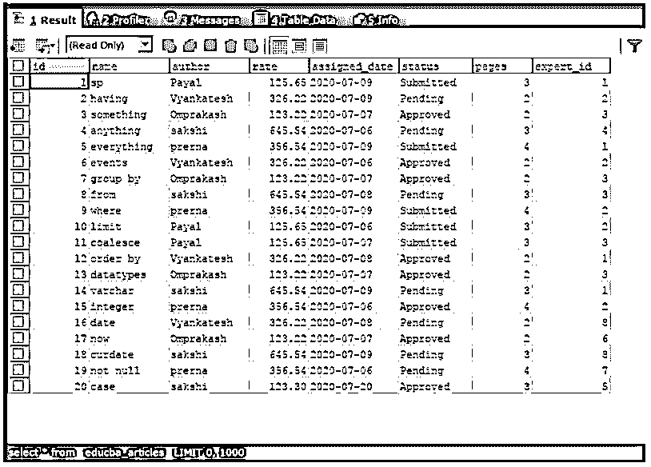
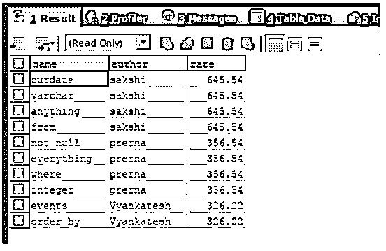
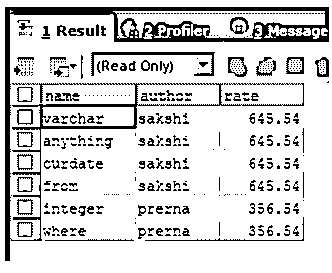
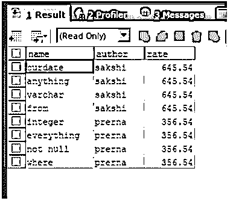
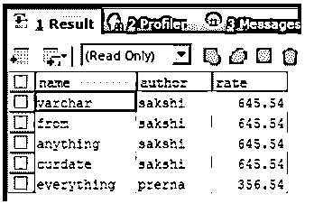

# SQL 选择顶部

> 原文：<https://www.educba.com/sql-select-top/>

## SQL Select Top 简介

我们可以通过使用 SQL 中的 top 语句指定可以从查询中检索的最大记录数来从查询中检索结果集。当处理庞大的数据库并涉及对涉及大量记录集的表的查询时，结果集也包括太多的记录，使得系统处理起来变得沉重，甚至可能导致系统长时间挂起或有时崩溃，可以从查询中检索有限数量的记录，这减少了系统上的负载。

我们可以使用 SQL 中的 top 语句来指定限制。但是，许多 DBMS 不支持使用 MySQL 和 oracle 等 top 语句。它们分别提供了类似 MySQL 和 Oracle 中的 LIMIT 子句和 ROWNUM 的替代方式。在本文中，我们将研究 SQL 中 TOP 子句的一般语法，并借助某些示例来了解它的用法和实现。

<small>Hadoop、数据科学、统计学&其他</small>

**语法:**

select top 的语法如下所示–

`SELECT TOP (numeric_expression) [PERCENT] [WITH TIES] FROM
name_of_table
ORDER BY
name_of_column;`

数值表达式可以是执行查询语句后在最终结果集中要检索的行数。PERCENT 关键字的使用是可选的，如果指定了 PERCENT 关键字，数值表达式将被视为浮点值，用于指定应检索的结果集的百分比，而不是行数。不使用 PERCENT 时，数值表达式是 BIGINT 值，它指定要从选择查询中检索的记录数。表的 name _ 是从中检索记录的表名，而列名是结果排序所基于的列名。

在 select top 中使用 ORDER BY 子句是可选的。但是，将 TOP 语句与 order by 子句一起使用是一种很好的做法，因为这将使查询检索到有序的结果集，该结果集包含顺序中第一个出现的有限数量的记录。

WITH TIES 子句也是可选的，它提到还应该检索有序结果集的所有相关记录。使用 WITH TIES 可以增加检索到的结果集计数，使其超过数值表达式指定的计数。例如，如果我们试图检索班级中得分最高的人，而您正在使用 TOP 1，那么如果您没有使用 WITH LIES，则结果集将只给出一条记录，即使存在得分最高的相同人员。当将 TOP1 与“WITH LIES”子句一起使用时，将检索到该类中得分最高的所有记录。

### SQL Select Top 示例

让我们考虑一个名为 educba 的数据库中现有的名为 educba_articles 的表。可以通过执行以下查询来检索表的内容和结构

`SELECT * FROM `educba_articles`;`

上述查询语句的执行给出了如下所示的输出。

现在，我们可以看到表 educba_articles 包含 20 条记录。我们只想检索分配了最大费率的前 10 条记录。为此，我们可以在 SQL 中使用 select top 子句，使用下面的查询语句检索文章的名称、作者和评级。

`SELECT TOP 10
NAME,
author,
rate
FROM
educba.`educba_articles`
ORDER BY rate DESC ;`

上述查询语句的执行给出了如下所示的输出。

#### WITH TIES 子句的使用

假设我们有根据它们的评级列出的文章的前六个记录，并且我们必须从中找出评级最高的文章。如果我们简单地使用上面查询语句中显示的 top 语句，我们将使用下面的查询。

`SELECT TOP 6
NAME,
author,
rate
FROM
educba.`educba_articles`
ORDER BY rate DESC ;`

上述查询语句的执行给出了如下所示的输出。

但是，我们可以观察到另外两篇文章的评分与检索记录的评分相同，其中表 educba_article。因为我们想要检索位于前六位的最高薪酬记录，所以也应该检索它们，因为它们也具有相同的分配率。这个问题可以通过在同一个查询语句中使用 WITH TIES 来解决，如下所示。

`SELECT TOP 6 WITH TIES
NAME,
author,
rate
FROM
educba.`educba_articles`
ORDER BY rate DESC ;`

上述查询语句的执行给出了如下所示的输出

这里，NOT NULL 和命名文章的检索位置是因为在 select 查询语句的 top 子句中使用了 WITH TIES。

#### 百分比的使用

假设我们只想检索查询语句结果集的 1/4。在这种情况下，我们可以使用百分比子句。任何东西的 1/4 量都相当于那个东西的 25%折扣。因此，通过在 top 子句中提到 25 %,我们可以检索原始查询结果集的 1/4 的记录。因为我们的表包含 20 条记录。20 个记录中的 25%将是 5 个记录。因此，使用下面的查询语句应该会检索到前五条记录，这些记录根据它们的比率以降序排列。

`SELECT TOP 25 PERCENT
NAME,
author,
rate
FROM
educba.`educba_articles`
ORDER BY rate DESC ;`

上述查询语句的执行给出了预期的输出，如下所示。

### 结论

在 SQL 中使用 SELECT TOP 语句有助于限制将从 SQL 的查询语句中检索的记录数。许多 DBMS(如 MySQL 和 oracle)不支持它的使用，但提供了 LIMIT 和 ROWNUM 等替代方法，可用于限制结果集。

### 推荐文章

这是一个 SQL Select Top 的指南。在这里，我们还将讨论 sql select top 的介绍和语法，以及不同的示例及其代码实现。您也可以看看以下文章，了解更多信息–

1.  [MySQL CEIL](https://www.educba.com/mysql-ceil/)
2.  [SQL 虚拟表](https://www.educba.com/sql-virtual-table/)
3.  [MySQL 同步](https://www.educba.com/mysql-sync/)
4.  [SQL 模式匹配](https://www.educba.com/sql-pattern-matching/)

