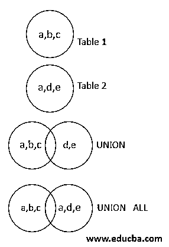
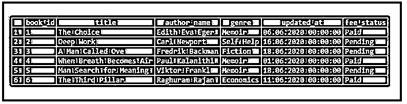
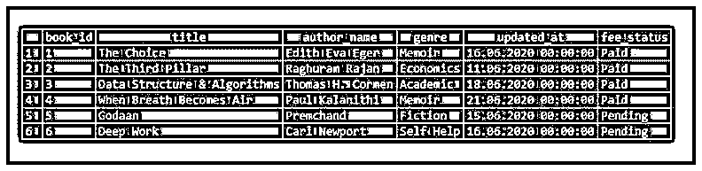
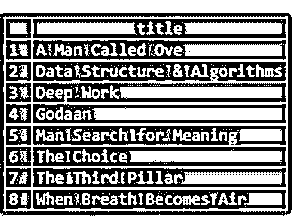
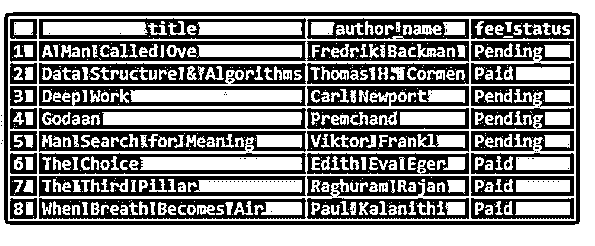

# SQL 联合

> 原文：<https://www.educba.com/sql-union/>

## SQL UNION 简介

标准查询语言(SQL)中的 UNION 运算符用于将从两个或多个 SELECT 语句获得的结果集组合成一个结果集。在组合这些查询的结果时，UNION 运算符从最终结果集中删除所有重复的值。另一个与该操作符类似的流行操作符是 UNION ALL，它也用于组合从两个或更多选择查询获得的结果，但与 UNION 操作符不同，它将所有重复的记录保存在最终结果集中。

使用 UNION 运算符时，我们应遵循以下几点:

<small>Hadoop、数据科学、统计学&其他</small>

*   从必须应用 UNION 或 UNION ALL 运算符的多个 SELECT 查询中提取的列数必须相同。

**举例:**

**代码:**

`SELECT name FROM table1
UNION
SELECT name FROM table2;`

*   必须选择的列应该具有相同的数据类型。
*   SELECT 语句中出现的列的顺序必须相同。

让我们看一下 UNION 运算符的图形描述以及它与 UNION ALL 的比较。

### SQL UNION 的语法和参数

使用 UNION 运算符编写 SELECT 查询的基本语法如下:

`SELECT column_name
FROM table_name_1
UNION
SELECT column_name
FROM table_name_2
UNION
SELECT column_name
FROM table_name_3
.
.
.
UNION
SELECT column_name
FROM table_name_n`

该语法中使用的参数如下:

*   **column_name:** column_name 对应于我们想要对其使用 UNION 操作符并想要为最终结果集获取它的列的名称。
*   **FROM table _ name _ 1:**table _ name _ 1 是必须从中提取记录的第一个表的名称。
*   **FROM table _ name _ 2:**table _ name _ 2 是必须从中提取记录的第二个表的名称。table_name_3，…，table_name_n 也是这种情况。

上面提到的论点，都是强制性的。但是，您可以根据需要将 WHERE、ORDER BY、GROUP BY 和 HAVING 子句用于此语法。

### SQL 联合的示例

以下是 SQL UNION 的示例:

让我们创建两个虚拟表，称为“借书”和“还书”。这些表格包含了图书馆每天借书和还书的详细情况。我们可以使用下面的 CREATE 语句来创建上述表。

创建借书 _ 书籍表。

**代码:**

`CREATE TABLE borrowed_books (
book_id INT NOT NULL PRIMARY KEY,
title VARCHAR(100)  NOT NULL,
author_name  VARCHAR(100),
genre VARCHAR(100),
updated_at DATE,
fee_status VARCHAR(100)
);`

创建 returned_books 表。

**代码:**

`CREATE TABLE returned_books (
book_id INT NOT NULL PRIMARY KEY,
title VARCHAR(100)  NOT NULL,
author_name  VARCHAR(100),
genre VARCHAR(100),
updated_at DATE,
fee_status VARCHAR(100)
);`

让我们使用下面的 insert 语句在其中插入一些记录。

**代码:**

`INSERT INTO public.borrowed_books(
book_id, title, author_name, genre, updated_at, fee_status)
VALUES
(1, 'The Choice','Edith Eva Eger','Memoir','2020-06-06','Paid'),
(2,'Deep Work','Carl Newport','Self Help','2020-06-16', 'Pending'),
(3, 'A Man Called Ove','Fredrik Backman','Fiction','2020-06-18','Pending'),
(4,'When Breath Becomes Air','Paul Kalanithi','Memoir','2020-06-01','Paid'),
(5,'Man Search for Meaning','Viktor Frankl','Memoir','2020-06-18', 'Pending'),
(6,'The Third Pillar','Raghuram Rajan','Economics','2020-06-11', 'Paid');
select * from borrowed_books;`

**输出:**

**代码:**

`INSERT INTO public.returned_books(
book_id, title, author_name, genre, updated_at, fee_status)
VALUES
(1,'The Choice','Edith Eva Eger','Memoir','2020-06-16','Paid'),
(2,'The Third Pillar','Raghuram Rajan','Economics','2020-06-11', 'Paid'),
(3,'Data Structure & Algorithms','Thomas H. Cormen','Academic','2020-06-18','Paid'),
(4,'When Breath Becomes Air','Paul Kalanithi','Memoir','2020-06-21','Paid'),
(5,'Godaan','Premchand','Fiction','2020-06-15', 'Pending'),
(6,'Deep Work','Carl Newport','Self Help','2020-06-16', 'Pending');
select * from returned_books;`

**输出:**

#### 示例#1

找出图书馆里所有书籍的名称。

**代码:**

`SELECT title
FROM borrowed_books
UNION
SELECT title
FROM returned_books;`

**输出:**

在这个例子中，我们可以看到所有的书只被取了一次。重复的记录已被丢弃。让我们将这个查询与下一个使用 UNION ALL 而不是 UNION operator 的查询进行比较。

**代码:**

`SELECT title
FROM borrowed_books
UNION ALL
SELECT title
FROM returned_books;`

**输出:**

我们观察到了什么？我们观察到 UNION ALL 操作符获取所有记录，并且不像 UNION 操作符那样丢弃重复的记录。

#### 实施例 2

在图书馆数据库中查找所有书籍的名称及其作者和当前费用状态。

**代码:**

`SELECT title, author_name, fee_status
FROM borrowed_books
UNION
SELECT title, author_name, fee_status
FROM returned_books;`

**输出:**

#### 实施例 3

在图书馆数据库中查找所有图书的名称及其 id、作者和当前费用状态，这些图书的图书馆费用仍未支付。

**代码:**

`SELECT book_id, title, author_name, fee_status
FROM borrowed_books
WHERE fee_status = 'Pending'
UNION
SELECT book_id, title, author_name, fee_status
FROM returned_books
WHERE fee_status = 'Pending';`

**输出:**

### 结论

SQL 中的 UNION 运算符用于合并两个或多个表的结果。当合并两个表的结果时，UNION 运算符只保留最终结果集中的唯一值。

### 推荐文章

这是一个 SQL 联合的指南。在这里，我们讨论 SQL UNION 的介绍以及适当的语法、参数和查询示例。您也可以看看以下文章，了解更多信息–

1.  [MySQL 中的自然连接](https://www.educba.com/natural-join-in-mysql/)
2.  [SQL 中的替换键](https://www.educba.com/alternate-key-in-sql/)
3.  [用 SQL 解释](https://www.educba.com/explain-in-sql/)
4.  [SQL 减](https://www.educba.com/sql-minus/)

