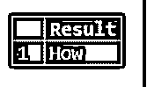
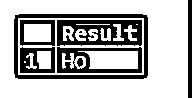
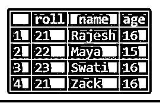
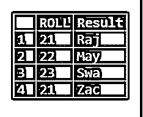
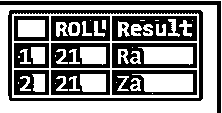
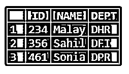
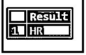

# SQL Server Substring

> 原文：<https://www.educba.com/sql-server-substring/>

## SQL Server 子字符串介绍

SQL Server 中的子字符串可以通过使用 substring()函数从给定的或输入的字符串中提取，在该函数中指定了子字符串的起始位置及其长度，并根据指定的位置和长度提取子字符串，我们还将看到 SUBSTRING()如何在表的列以及嵌套查询中与文字字符串一起使用。

### 解释所有 SQL Server 子字符串

子串可以定义为字符串中相邻字符的序列。如果给定的字符串是“你好吗？”那么这个字符串中的子串可以是‘How’或‘ar’或‘you’或‘ou’等。即字符串中存在的任何相邻字符序列。这些子字符串可以从字符串“你好吗？”通过在 SQL Server 中使用 SUBSTRING()。

<small>Hadoop、数据科学、统计学&其他</small>

从给定字符串中提取子字符串的语法如下:

**语法** **:**

`SUBSTRING(input string, start, length);`

在上面的语法中，

*   **输入字符串:**可以是要从中提取子串的字符或文本。
*   **start:** 这是要提取的子串的起始位置，或者表示提取的子串开始的位置或地点。此外，要注意的是，字符串中的起始位置是 1。
*   **length:**‘length’指定要返回的子串的字符数，length 是一个正整数。当 start + length 的值大于输入字符串的长度时，子字符串从起始处开始，起始处还包含输入字符串的剩余字符。但是当长度为负数时，SUBSTRING()会抛出错误。

### SQL Server 子字符串的示例

让我们通过一些例子来理解 SQL Server 中 SUBSTRING()的工作方式，以及如何在查询中使用它们。

#### 示例#1

在下面的示例中，可以看到 SUBSTRING()函数与文字字符串一起使用。下面的查询将提取从给定输入字符串“你好吗？”的第一个字符开始的子字符串子串的长度将是 3。

`SELECT SUBSTRING('How are you?', 1, 3) AS Result;`

因此，提取的子字符串是“How”。子串从第一个字符“H”开始，长度为 3，因此提取的子串是 How。

#### 实施例 2

同样，在下面的查询中，可以看到 substring 是从第一个字符“H”中提取的，长度为 2。

`SELECT SUBSTRING('How are you?', 1, 2) AS Result;`

当提取的子串是' Ho '时，上面语句的结果如下所示。

类似地，我们可以通过相应地使用 substring()函数提取任何所需的子串，即通过指定子串的起始位置和长度。

让我们考虑下面的表“学生”,以了解 SUBSTRING()函数如何用于表的列。

#### 实施例 3

在下面的查询中，SUBSTRING()与“STUDENTS”表中的“NAME”列一起使用，其中要提取的子字符串从学生姓名的第一个字符开始，长度为 3。

`SELECT ROLL, SUBSTRING(NAME, 1, 3) AS Result FROM STUDENTS;`

上面查询的结果如下所示，可以看到输出包含学生名单和从 Name 列提取的子字符串。提取的子串长度为 3，从学生各自名字的第一个字符开始。因此，对于学生“Rajesh ”,提取的子字符串是“Raj ”,从“R”开始，包含 3 个字符的长度。同样，结果也显示给其他学生。

#### 实施例 4

在下面的查询中，SUBSTRING()与查询中的“WHERE”子句一起使用。提取的子字符串将从字符串“Rajesh”的第一个字符开始，长度为 2。

`SELECT ROLL, SUBSTRING(NAME, 1, 2) AS Result FROM STUDENTS WHERE ROLL=21 ;`

上述查询的结果如下所示，我们可以看到，对于 Roll '21 '即在' where '子句中指定的条件，子字符串被提取为' Ra '。

#### 实施例 5

SUBSTRING()也可以在嵌套查询中使用。让我们考虑下表“雇员”。在此表中,“DEPT”列包含员工工作的各个部门，部门代码以“D”开头。

如果我们只想从部门代码中提取部门名称，如“HR”、“FI”和“PR”，可以使用如下所示的嵌套查询来完成。查询中使用的 charindex()将在字符串中搜索子字符串，并将返回位置。如果没有找到子串，charindex()返回 0。len()将返回字符串的长度。这里，我们希望从结果中的部门代码中删除“D ”,因此使用 charindex()和 len()将有助于获得所需的结果。

`SELECT SUBSTRING(DEPT, charindex('D', DEPT)+ 1, len(DEPT) - charindex('D', DEPT)) AS Result FROM EMPLOYEE WHERE ID=234;`

在下面的结果中，可以看到部门代码“DHR”中的“D”被删除，因为对于 ID 为 234 的员工，只显示“人力资源”。

### 结论

SQL Server 中的 SUBSTRING()函数在根据需要从输入字符串中提取子字符串方面起着至关重要的作用，这些子字符串可以与 WHERE 子句一起用于嵌套查询。开发人员必须很好地理解这个功能。

### **推荐文章**

这是一个 SQL Server 子字符串指南。这里我们讨论 SQL Server 子字符串的例子以及所有子字符串的解释。您也可以看看以下文章，了解更多信息–

1.  [SQL 字符串运算符](https://www.educba.com/sql-string-operators/)
2.  [PostgreSQL 中的游标](https://www.educba.com/cursors-in-postgresql/)
3.  [PostgreSQL 约束](https://www.educba.com/postgresql-constraints/)
4.  [SQL Server 数据类型](https://www.educba.com/sql-server-data-types/)

