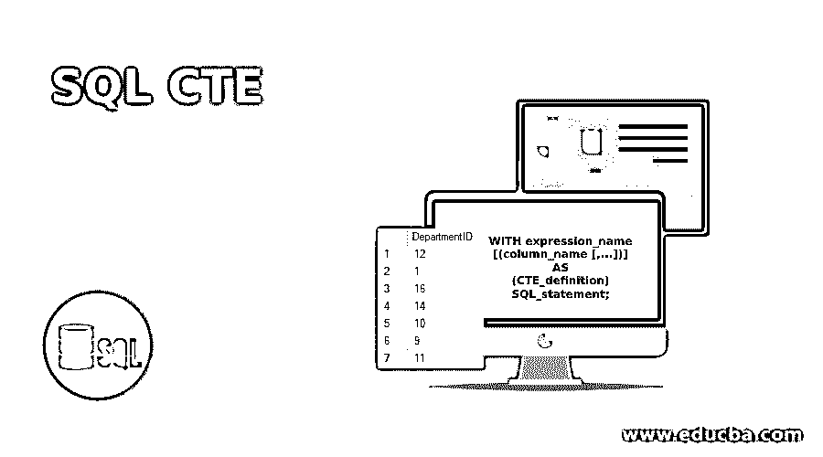
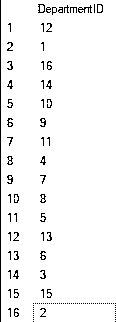
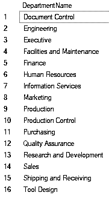
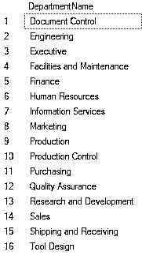

# SQL CTE

> 原文：<https://www.educba.com/sql-cte/>

## SQL CTE 简介

通用表表达式(CTE)是在 SQL server 2005 中引入的，它是一个临时命名的结果集。它的特点是一个简单的查询，并在单个 SELECT、INSERT、UPDATE、DELETE 或 MERGE 语句的执行范围内定义。我们还可以将 CTE 用于 CREATE VIEW 语句，它是 SELECT 语句的子集。典型的 CTE 发音可以包含对自身的引用。

下面显示了 SQL Server 中 CTE 的常见语法:

<small>Hadoop、数据科学、统计学&其他</small>

`WITH expression_name[(column_name [,...])] AS
(CTE_definition)
SQL_statement;`

在上面的表达式中:

*   第一步，我们需要指定(expression_name)表达式的名称，稍后查询将使用该名称。当我们创建一个表时，表达式名类似于表名。
*   接下来，在 expression_name 之后，我们确定一个由逗号和定义分隔的列名纲要。expression_name 中的列数和 CTE_definition 中定义的列数必须相等。
*   之后，我们在 CTE 定义前使用关键字“AS ”,如果只给出表达式名称，那么将添加 CTE 定义中的所有列。
*   随后，定义一个 SELECT 语句，该语句的结果集被传递给 CTE。
*   最后，在插入、选择、删除、更新或合并等查询中引用 CTE。

### 创建和使用 CTE 的指南

*   声明 CTE 后，应该有一个 SELECT、UPDATE、INSERT 或 DELETE 语句，也可以将其指定为 CREATE VIEW 语句的一部分。
*   非递归 CTE 可以用多个 CTE 定义查询定义，并且结果应该由以下运算符之一合并:UNION ALL、UNION、INTERSECT 或 EXCEPT。
*   在同一个 WITH 子句中可以引用 CTE。
*   不允许在 CTE 中指示多个 WITH condition。例如，如果 CTE 查询定义包含子查询，则该子查询不能包含表征另一个 CTE 的 settled WITH 语句。您不能在 CTE 定义中使用以下子句
    *   以...排序
    *   到…里面
    *   选择权
    *   用于浏览
*   万一 CTE 是一个批处理的一部分，那么在末尾应该有一个分号
*   游标可以通过引用 CTE 来定义。
*   CTE 可以从远程服务器引用表。

### 创建和使用递归 CTE 的指南

*   递归 CTE 的定义必须至少包含两个 CTE 查询定义、一个定位点成员和一个递归成员。定位点成员查询必须在递归成员之前。
*   定位点和递归成员必须具有相同的列数。

### SQL 示例中的公共表表达式

从使用通用表表达式的一些基本示例开始:

#### 示例 1–SQL Server 中的简单 CTE 示例

此查询使用 CTE 返回部门 id

**代码:**

`WITH cte_dept
AS (
select * from HumanResources.Department
)
select DepartmentID from cte_dept`

**输出:**

**说明:**这是一个最基本的例子，其中第一步是定义 cte_dept 为常用表表达式的名称。这个 CTE 返回的结果包含查询定义中 Department 表的所有列，因为我们没有指定任何列。

其次，我们创建了一个查询，该查询给出了 Department 表中的所有列。第三步是在外部查询中使用 CTE，并且只从 CTE 中选择 DepartmentIDfrom。

#### 示例 2–包含列名的简单 SQL Server CTE 示例

**代码:**

`WITH cte_deptName(DepartmentName,DepartmentGroupName)
AS (
select Name,GroupName from HumanResources.Department
)
select DepartmentName from cte_deptName`

**输出:**

**解释:**首先，我们将 cte_deptName 定义为 cte 的名称。这个 CTE 返回的结果由查询定义中 Department 表的所有列组成，我们已经指定了列名。

其次，我们创建了一个查询，该查询给出了 Department 表中的 Name、GroupName 列。第三步是在外部查询中使用 CTE，并且只从 CTE 中选择 DepartmentName。

#### 示例 3–在单个查询中使用多个 SQL Server CTE

**代码:**

`WITH cte_deptName(DepartmentID,DepartmentName)
AS (
select DepartmentID,Name from HumanResources.Department
),
cte_deptGroup(DepartmentID,DepartmentGroupName)
AS (
Select DepartmentID,GroupName from HumanResources.Department
)
Select DepartmentName from cte_deptNamed N INNERJOIN cte_deptGroup dG ON dN.DepartmentID=dG.DepartmentID`

**输出:**

**说明:**首先，我们将 cte_deptName 定义为常用表表达式的名称。这个 CTE 返回的结果由查询定义中 Department 表的所有列组成，我们指定了列名，然后类似地将 cte _ deptGroupwhich 定义为逗号分隔的

其次，我们创建了一个查询，该查询给出了部门表中第一个 CTE 的部门 ID，名称列和第二个 CTE 的部门 ID，组名列

第三步是在外部查询中使用 CTE，并使用 DepartmentID 从 CTE 的内部连接中仅选择 department name。

### 你为什么需要 CTE？

还有其他几种方法可以达到同样的效果，比如创建视图、临时表或派生表，那么我们为什么要使用 CTE 呢？有几个原因，其中一些如下:

*   可读性: CTE 增强了可读性，因为我们不是将查询的所有逻辑都集中在一个庞大的查询中，而是创建几个 CTE，然后将它们组合在一个语句中。因此，所有的数据块都可以合并到最终的 select 语句中。
*   **替换视图:**视图可以替换 CTE。这可能有多种原因，例如，您没有创建视图的权限，或者您只需使用一次，不想保存它以备后用。
*   **递归:** CTE 可以用来执行递归查询。这些是调用自身的查询，可用于分层数据，如组织结构图。
*   **限制:**由于 SELECT 语句不能引用自身，也不能使用 CTE 克服的非确定性函数进行分组。

### 推荐文章

这是一个 SQL CTE 的指南。在这里，我们还讨论了创建和使用 cte 的介绍和指南，以及不同的示例和代码实现。您也可以看看以下文章，了解更多信息–

1.  [SQL 批量插入](https://www.educba.com/sql-bulk-insert/)
2.  [PostgreSQL Like](https://www.educba.com/postgresql-like/)
3.  [SQL 中的 JSON](https://www.educba.com/json-in-sql/)
4.  [SQL While 循环](https://www.educba.com/sql-while-loop/)

