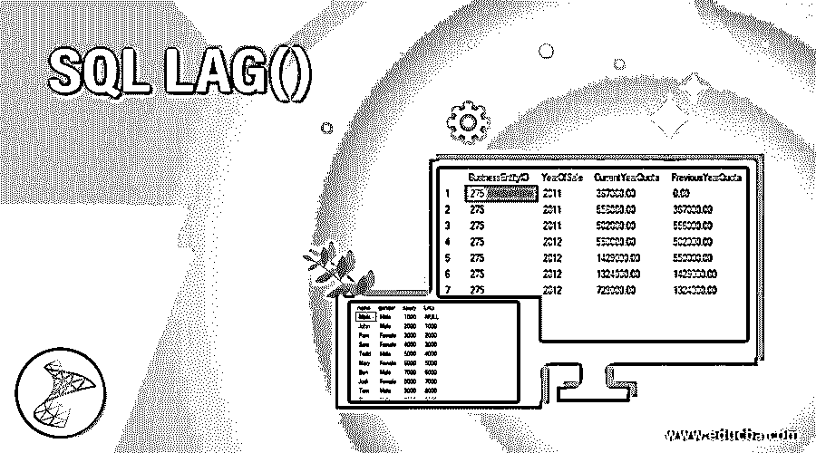
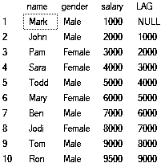
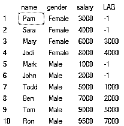
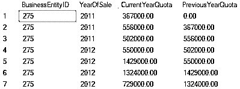
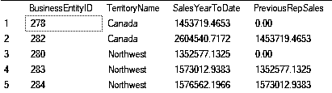
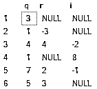

# SQL 延迟()

> 原文：<https://www.educba.com/sql-lag/>

## SQL LAG 介绍()

在 SQL server 2012 中引入的 LAG()函数用于访问当前行之前特定偏移量处的行。您可以在当前行中访问前面行的数据。所以，如果你想做一些计算或者你需要一个先前值的参考，它会很有用。它基本上是一个分析函数，我们可以用它来比较当前行和前一行的值。

**语法**

<small>Hadoop、数据科学、统计学&其他</small>

下面显示了 SQL Server 中 LAG()的常见语法:

`LAG(return_value ,offset [,default])
OVER (
[PARTITION BY partition_expression, ... ] ORDER BY sort_expression [ASC or DESC], ...
)`

在上面的表达式中:

**步骤 1:** 我们使用 LAG()函数作为 SELECT 语句的一部分。LAG()函数有 3 个参数:

*   **Return_value:** 根据指定的偏移量，返回值。它可以是任何返回标量值的表达式，甚至可以只是列的名称。确保它不是一个分析函数。这是一个必需参数
*   **Offset:** 这决定了获取数据时要滞后的行数。这是一个可选参数，默认情况下，它将滞后一行。它可以是子查询、列或任何计算结果为正整数的表达式，也可以转换为 bigint。只要确保不使用分析函数或负值作为偏移量即可。
*   **Default:** 如果偏移量超出分区范围或者超出范围，则返回默认值。它可以是任何返回标量值的表达式，甚至可以只是列的名称。确保它不是一个分析函数。这是一个可选参数，默认情况下，如果没有找到数据，将返回 NULL 值。

**步骤 2:** 该函数的第二部分，我们在其中指定如何使用 OVER 子句呈现前面的行数据，它有两个部分:

*   PARTITION BY 子句是可选的，用于对使用 FROM 子句获得的数据进行分组。如果未指定，则将整个结果集视为一个组
*   ORDER BY 子句是必需的，它使用 ASC 或 DESC 格式的 sort_expression 对数据进行排序。如果指定了 partition _ expressionis，则 ORDER BY 子句确定数据在分区中的顺序。

**第三步:**表达式的返回类型是指定 return_value 的数据类型。如果默认值设置为 NULL 并且表达式可为 NULL，则返回 NULL。

*   LAG()函数是不确定的，与确定性函数相反，确定性函数在被调用时随时返回相同的结果。即使数据库状态保持不变，此函数也可能在不同的时间返回不同的结果。

### 实现 SQL LAG()的示例

下面是实现 SQL LAG()的示例:

#### 1.带有 LAG()函数的简单示例

**代码:**

`SELECT name, gender, salary,
LAG(salary)OVER (ORDER BY salary)
FROM Employee`

**输出:**

**解释:**这是一个最基本的例子，我们从 Employee 表中选择姓名、性别和薪水，并使用 LAG 函数获得 LAG 列中前一个人的薪水。如您所见，Mark 得到 NULL，因为没有以前的薪金，而且我们没有指定任何默认值，offset 为 1，因此我们得到了上一个值。

#### 2.带有 LAG()函数的有点复杂的例子

**代码:**

`SELECT name, gender, salary,
LAG(salary, 2,-1)OVER (PARTITION BY gender ORDERBY salary)AS LAG
FROM Employee`

**输出:**

**解释:**在本例中，我们从 Employee 表中选择姓名、性别和薪金，并使用 LAG 函数获得 LAG 列中前一个人的薪金，与上例一样，而且我们还使用性别列对数据进行分区。因此，LAG 函数在分区的范围内工作。我们所做的是将偏移量设置为 2，默认值设置为-1。正如我们在 Pam 和 Sara 的示例中看到的，我们无法获取前几行的值，这落后了 2 行，因此我们获得了默认值-1，类似地，在 Male 分区中我们也获得了结果。

#### 3.不同年份的数值比较

**代码:**

`SELECT BusinessEntityID,YEAR(QuotaDate)AS YearOfSale,SalesQuota AS CurrentYearQuota,
LAG(SalesQuota, 1,0)OVER (ORDERBY YEAR (QuotaDate)) AS PreviousYearQuota
FROM Sales.SalesPersonQuotaHistory
WHERE BusinessEntityID = 275 and YEAR(QuotaDate)IN('2011','2012');`

**输出:**

**解释:**正如我们在这个例子中看到的，LAG 函数用于比较一个雇员在本年度和上一年度的销售额，如果没有滞后，那么我们返回 0.00。

#### 4.分区内值的比较

**代码:**

`SELECT BusinessEntityID,TerritoryName,SalesYTD as SalesYearToDate,
LAG(SalesYTD, 1,0)OVER (PARTITION BY TerritoryName ORDER BY YEAR(SalesYTD))AS PreviousRepSales
FROM Sales.vSalesPerson
WHERE TerritoryName IN(N'Northwest',N'Canada')
ORDER BY TerritoryName;`

**输出:**

**解释:**在本例中，我们使用 PARTITION BY 子句比较雇员之间的年初至今销售额，该子句用于将结果集除以 TerritoryName。每个分区的计算是分别进行的，然后使用 ORDER BY 子句对每个分区中的行进行排序。SELECT 语句中的 ORDER BY 子句对整个结果集进行排序。

#### 5.使用任意表达式

**代码:**

`CREATE TABLE A(p int, q int, r int);
GO
INSERT INTO A VALUES (2, 1,-3),(3, 4, 4),(1, 3,NULL),(5, 7, 2),(4, 1,NULL),(6, 5, 3);
SELECT q, r,
LAG(2*r, q*(SELECT MIN(q)FROM A),-r/2.0)OVER (ORDER BY p)AS i
FROM A;`

**输出:**

**说明:**在上面的例子中，我们已经用 LAG 函数演示了多种任意表达式。因此，我们创建了一个表并插入了值，还使用了 SELECT 和 LAG 函数。正如您所看到的，返回值、偏移量和默认值都使用了表达式，而不仅仅是列名或标量值。

### 结论

希望现在您已经知道 SQL server 中的 LAG 函数是什么，以及如何使用物理偏移量来分析查询中前面的行，从而为我们提供有用的见解。

### 推荐文章

这是 SQL LAG()的指南。在这里，我们讨论一个介绍，语法，参数和例子，以实现适当的输出。您也可以浏览我们的其他相关文章，了解更多信息——

1.  [第一范式](https://www.educba.com/first-normal-form/)
2.  [SQL Server 数据类型](https://www.educba.com/sql-server-data-types/)
3.  [SQL 管理](https://www.educba.com/sql-administration/)
4.  [备忘单 SQL](https://www.educba.com/cheat-sheet-sql/)

