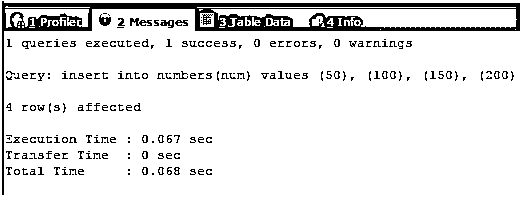
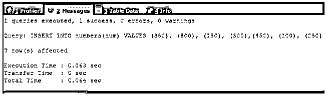
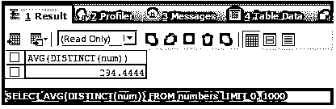
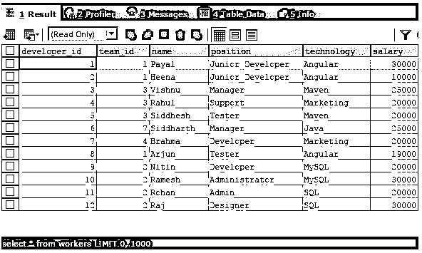

# SQL 平均值()

> 原文：<https://www.educba.com/sql-avg/>

## SQL avg()简介

SQL avg()是 SQL 中可用的聚合函数之一，它帮助我们获取记录的列值中指定的多个值的平均值，该表达式由提到的列组成。大多数情况下，当使用查询来检索与报告相关并包含 group by 语句的数据时，avg()函数用于根据分组函数获取特定一列或多列的平均值。在这篇文章中，我们将学习 SQL avg()函数的语法和用法，然后在涉及文字值、列值、带有分组语句的列值等各种示例中实现该函数，以清楚地了解其用法。

### 语法和用法

SQL 中 NOT IN 语句的语法如下所示

<small>Hadoop、数据科学、统计学&其他</small>

`SELECT AVG(expression)
FROM table_name
[WHERE restriction];`

其中，表达式可以是表中列的任何名称，也可以是使用列名和静态文字值或变量构建的公式。table_name 是要从中检索记录并计算其中一列的平均值的表的名称。需要使用 FROM table name 子句。一个可选的事情是使用 where 子句来提及表的记录应该满足的条件和限制，以考虑该记录的列值来计算平均值。

当使用 where 子句时，AVG()函数的平均值计算只考虑筛选出的数据。AVG()函数收集其中提到的表达式的所有值，并将它们相加，然后除以相加的值或表达式的数量，得出最终的平均值。例如，假设我们必须找出 50、100、150 和 200 的平均值。然后，average 函数将在内部计算 50 + 100 + 150 + 200，得出 500，然后将总和除以 4，因为 4 个数字相加，最终得出平均值 125。

### 例子

我们将在下面的例子中研究 AVG()函数的实现。

#### 示例# 1–使用单个色谱柱

让我们首先考虑一个简单的例子，我们用上面来解释 AVG()函数的工作。我们将使用 AVG()函数计算 SQL 数字的平均值。让我们创建一个名为 numbers 的简单表，并在其中存储 num 列值。我们将使用以下查询语句来创建我们的表

`CREATE TABLE numbers (num INT) ;`

上述查询语句的执行将产生以下输出

现在，我们将在表中插入上述记录。我们的查询语句如下

`INSERT INTO numbers(num) VALUES (50), (100), (150), (200);`

上述查询语句的执行将产生以下输出

现在让我们检索一次记录——

`SELECT * FROM numbers ;`

上述查询语句的执行将产生以下输出

现在，我们将使用以下查询语句，使用 AVG()函数来计算 numbers 表中 num 列的平均值

`SELECT AVG(num) FROM numbers ;`

上述查询语句的执行将产生以下输出

#### 示例 2–使用独特的功能

我们可以使用 AVG()函数中的 distinct 函数在计算平均值时只考虑一次表中该列的重复值。假设，我们使用下面的查询语句在 numbers 表中插入更多的记录

`INSERT INTO numbers(num) VALUES (350), (800), (150), (300),(450), (100), (250);`

上述查询语句的执行将产生以下输出

如果我们使用，从数字中选择 AVG(num );语句来计算 num 列的平均值，然后在计算平均值时将考虑每个值。如果我们使用以下语句–

`SELECT AVG(DISTINCT(num)) FROM numbers ;`

输出将与没有 distinct 函数的第一个查询的输出不同，因为在内部，AVG()函数对平均值的计算将只考虑重复一次的列值，如 100 和 150。以上两个查询的输出如下所示

#### 示例 3–使用公式

我们可以使用 AVG()函数中的表达式来考虑通过计算每个包含列值的公式或表达式值来计算平均值所求得的值。让我们考虑一个例子，我们将计算所有列乘以 10 再加 1 后的平均值。我们的查询语句如下

`SELECT AVG((num * 10) + 1) FROM numbers ;`

上述查询语句的执行将产生以下输出

我们甚至可以在 AVG()函数中使用现有的函数，如 SUM()和 COUNT()。

#### 示例# 4–使用分组依据

当我们有复杂的表和多个表之间的关系时，我们必须使用连接来查询这些表，以检索通常用于报告目的的包含汇总数据的数据。甚至在某些场景中，需要操作单个表中的数据来获得汇总数据。假设我们有一个名为 workers 的表，其中包含以下记录，通过对该表执行简单的 select 查询可以检索到这些记录

`SELECT * FROM workers;`

上述查询语句的执行将产生以下输出

现在，情况是这样的，我们必须计算每个团队工人的平均工资。输出应该包括团队 id 和该团队的平均工资。为此，我们必须使用 group by 语句，根据团队 id 对记录进行分组，并使用 AVG()函数计算平均工资。

我们的查询语句如下

`SELECT
team_id,
AVG(salary)
FROM
workers
GROUP BY team_id ;`

上述查询语句的执行将给出以下输出以及团队 id 和他们各自的平均工资——

### 结论–SQL 平均值()

我们可以使用 SQL 中的 AVG()函数来计算表中各列的平均值或涉及列值的表达式的平均值，甚至可以使用 GROUP BY 语句以分组的方式计算各列的平均值。

### 推荐文章

这是一个 SQL avg()的指南。为了更好地理解，我们在这里讨论 SQL AVG()函数的实现以及查询示例。您也可以看看以下文章，了解更多信息–

1.  [MySQL Substring](https://www.educba.com/mysql-substring/)
2.  [PostgreSQL 平均值](https://www.educba.com/postgresql-average/)
3.  [MySQL DML](https://www.educba.com/mysql-dml/)
4.  [MySQL 撤销](https://www.educba.com/mysql-revoke/)

