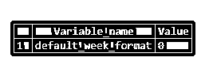
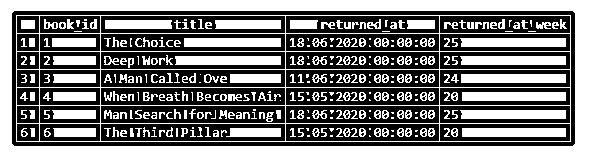

# SQL 周

> 原文：<https://www.educba.com/sql-week/>

## SQL 周简介

WEEK()是 MYSQL 中的一个内置函数，用于找出对应于给定日期参数的一年中的第几周。一个地球年由 365 天组成，如果我们把它分成每个星期 7 天，我们一年有 52-53 周。这正是 WEEK()函数所做的，它检查给定日期属于这 52-53 周中的哪一周。WEEK()函数还允许我们指定一周的第一天，如星期日、星期一等。从这一周开始计数。

不过要注意的是，WEEK()函数只针对 MYSQL 数据库，其他 SQL 数据库如 PostgreSQL、SQL Server、Oracle 等。不支持。这些数据库支持 DATEPART()和 EXTRACT()函数来提取 week。在本文中，我们将举例说明一周()。首先，让我们学习用于编写 WEEK()函数的语法和参数。

<small>Hadoop、数据科学、统计学&其他</small>

**语法和参数:**

在 MYSQL 中编写 WEEK()函数的基本语法如下:

`WEEK(date,mode)`

该语法中使用的参数如下:

*   **Date:**Date/datetime/timestamp 数据类型的日期值，我们要获取其对应的一年中的某周。
*   **模式:**此参数用于指定一周的第一天。例如，如果一周从星期日、星期一、星期六等开始。基于此，将返回周数。Mode 是可选参数。默认情况下，该函数从“default_week_format”系统变量中选择模式。

### SQL 周示例

这里有几个基本的例子来说明 WEEK()函数的工作原理。

#### 例 1:找出 2020 年 6 月 18 日对应的一周

`SELECT WEEK('2020-06-18')`

你一定想知道，这个结果对应的一周的第一天是什么。这可以从使用“default_week_format”字符串的变量中看出。

`SHOW VARIABLES LIKE 'default_week_format';`

周格式的 0 对应于星期日。

#### 例 2:考虑到一周的第一天是从星期一开始的，找出 2020 年 6 月 18 日对应的一周

`SELECT WEEK('2020-06-18',1);`

为了说明 WEEK()函数的可用性，让我们创建一个名为“books_audit_table”的虚拟表，该表记录了一本书最后一次被借阅的时间和归还的时间。我们可以使用下面的代码片段来创建上述表格。

`CREATE TABLE books_audit_table (
book_id INT NOT NULL,
title VARCHAR(100) NOT NULL,
author_name VARCHAR(100),
genre VARCHAR(100),
borrowed_at DATETIME,
returned_at DATETIME
);`

创建了 books_audit_table 之后，让我们在其中插入一些记录来进行操作。我们可以使用下面的 INSERT 语句。

`INSERT INTO books_audit_table
(book_id
,title
,author_name
,genre
,borrowed_at
,returned_at)
VALUES
(1,'The Choice','Edith Eva Eger','Memoir','2020-05-12','2020-06-18'),
(2,'Deep Work','Carl Newport','Self Help','2020-01-01','2020-06-18'),
(3,'A Man Called Ove','Fredrik Backman','Fiction','2020-03-11','2020-06-11'),
(4,'When Breath Becomes Air','Paul Kalanithi','Memoir','2019-06-18','2020-05-15'),
(5,'Man Search for Meaning','Viktor Frankl','Memoir','2020-03-11','2020-06-18'),
(6,'The Third Pillar','Raghuram Rajan','Economics','2020-01-01','2020-05-15') ;
select * from books_audit_table;`

查询成功返回。现在，我们准备在 books_audit_table 上使用 WEEK()函数尝试几个例子。

#### 示例 3:查找数据库中所有书籍的详细信息，如 book_id、书名和借阅日期，以及它们的借阅周

`SELECT book_id, title, borrowed_at, WEEK(borrowed_at,1) as borrowed_at_week
FROM books_audit_table;`

在这个例子中，我们使用了 WEEK()函数来查找一本书被借阅的那一周。该函数的模式参数已设置为 1，即一周的第一天从星期一开始。

#### 示例 4:查找 book_id、title 等详细信息，并返回数据库中所有图书的日期，以及它们被归还的星期

`SELECT book_id, title, returned_at, WEEK(returned_at,1) as returned_at_week
FROM books_audit_table;`

与前面的示例类似，这里的查询返回与每个 returned_at 字段对应的一年中的第几周。

#### 例 5:查找给定图书的详细信息，如 book_id、书名和借阅周数

`SELECT book_id, title, CONCAT('The Book was returned in ', (WEEK(returned_at,1) -WEEK(borrowed_at)), ' weeks')
FROM books_audit_table;`

这里，我们探讨了两个给定日期之间的差异计算，即经过的周数。该查询返回数据库中的每本书返回的周数。

#### 例 6:找出给定一周内归还的图书数量

`SELECT WEEK(returned_at,1) as week_returned_in ,
CONCAT(count(book_id),' books were returned during this week')
FROM books_audit_table
GROUP BY WEEK(returned_at,1);`

在这个例子中，我们试图对给定一周内归还的图书数量进行分组。

### 结论

WEEK()函数返回给定日期参数的周部分。它给出从 0-53 的周数，对应于任何给定年份的总周数。当我们想要估计发送或履行一个电子商务订单所用的周数时，该函数非常有用。

### 推荐文章

这是一个 SQL 周指南。这里我们分别讨论介绍、语法、参数以及代码实现的例子。您也可以看看以下文章，了解更多信息–

1.  [SQL 按月分组](https://www.educba.com/sql-group-by-month/)
2.  [SQL ORDER BY DATE](https://www.educba.com/sql-order-by-date/)
3.  [SQL 升序排序](https://www.educba.com/sql-order-by-ascending/)
4.  [SQL 克隆表](https://www.educba.com/sql-clone-table/)

