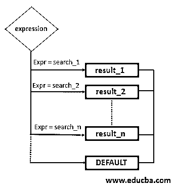
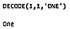
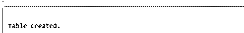
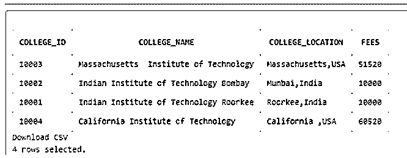
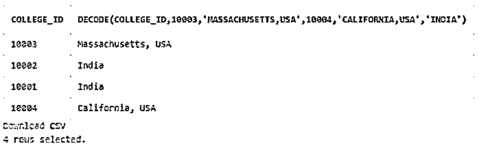
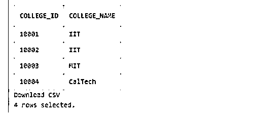
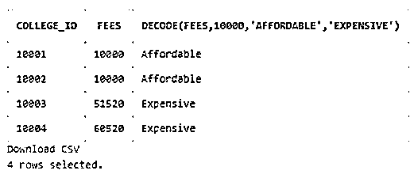

# SQL 解码()

> 原文：<https://www.educba.com/sql-decode/>

## SQL DECODE()简介

标准查询语言(SQL)中的 DECODE 函数用于向查询中添加类似 IF–THEN–ELSE 的过程性语句。它将给定的表达式与每个搜索值逐一进行比较，并根据比较结果返回结果。decode 函数主要执行 CASE 语句的任务。但是，我们应该记住，DECODE 是 ORACLE SQL 数据库中的内置函数，因此仅在 ORACLE/ PL SQL 的 ORACLE 9i 和更高版本中受支持。其他数据库管理服务器(如 PostgreSQL、SQL Server、MySQL 等)不支持它。因此，现在我们可以使用 CASE 语句在这些数据库中执行 IF-THEN-ELSE 逻辑。

**语法和参数:**

<small>Hadoop、数据科学、统计学&其他</small>

用 SQL 编写 DECODE 函数的基本语法如下:

`DECODE (expression , search_1, result_1[, search_2, result_2], ...,[,search_n,result_n] [, default]);`

上述语法中使用的参数是:

*   **表达式:**表达式参数是要搜索和比较的值。
*   **搜 _1，搜 _2，…。search_n:** 这些是要搜索的值，然后与表达式参数进行比较。
*   **result_1，result_2，…，result_n:** 这些参数保存给定比较返回 true 时要返回的结果。例如，如果 expression = search_1，那么结果将是 result_1。
*   **默认值:**默认参数保存默认值。这或多或少类似于 IF-THEN-ELSE 中的 ELSE 语句。

我们可以使用 DECODE 函数作为 SELECT 语句、ORDER BY 等的一部分。

### DECODE()函数在 SQL 中是如何工作的？

第一步是比较 expression 和 search_1，如果 expression = search_1 为真，则返回 result_1。如果为 FALSE，则返回默认值。DECODE 函数自动将表达式转换或强制转换为第一个搜索参数或 search_1 的数据类型。最后，它将结果的数据类型转换回表达式的数据类型。

ORACLE 中的解码功能，流程如下。

**举例:**

**代码:**

`SELECT
DECODE(1, 1, 'One')
FROM dual;`

**输出:**

上述解码功能的简单说明如下:

**代码:**

`IF 1 = 1
THEN result = 'One'
ENDIF;`

### SQL DECODE()的示例

下面是提到的例子:

出于演示目的，让我们首先创建一个“college_details”表，其中包含学院 id、学院名称、位置和费用。

我们可以使用下面的 SQL CREATE TABLE 语句来执行任务。

**代码:**

`CREATE TABLE college_details(
college_id integer NOT NULL,
college_name character varying(255) NOT NULL,
college_location character varying(255) NOT NULL,
fees numeric NOT NULL
);`

**输出:**

创建完表格后，现在让我们在其中输入一些随机数据，以便在后续练习中使用。我们可以使用下面的 insert 语句。

**代码:**

`INSERT INTO college_details VALUES (10001, 'Indian Institute of Technology Roorkee', 'Roorkee,India', 10000);
INSERT INTO college_details VALUES (10002, 'Indian Institute of Technology Bombay', 'Mumbai,India', 10000);
INSERT INTO college_details VALUES (10004, 'California Institute of Technology', 'California ,USA', 60520);
INSERT INTO college_details VALUES (10003, 'Massachusetts  Institute of Technology', 'Massachusetts,India', 51520);`

`select * from college_details;`

执行上述插入操作后,“college_details”表中的数据如下所示:

**输出:**

#### 示例#1

简单的 SQL 查询来说明解码函数的使用。

**代码:**

`SELECT college_id,
DECODE (college_id,   10003,'Massachusetts, USA',
10004, 'California, USA',
'India')
FROM college_details;`

**输出:**

在这个例子中，我们执行了一个简单的 SQL 任务，根据学院的位置对它们进行分类。

上述解码功能的简单说明如下:

**代码:**

`IF college_id = 10003
THEN result = 'Massachusetts'
ELSE IF college_id = 10004
THEN result = 'California'
ELSE
result = 'India'
ENDIF;`

#### 实施例 2

使用 DECODE 函数基于可用数据说明大学名称缩写的 SQL 查询。

**代码:**

`SELECT college_id, DECODE(college_name,'Massachusetts  Institute of Technology',
'MIT','California Institute of Technology','CalTech','IIT') as college_name
FROM college_details
ORDER BY college_id;`

**输出:**

在上面的示例中，我们执行了以下 IF-THEN-ELSE 逻辑语句，然后按 college_id 对整个结果集进行了排序。

**代码:**

`IF college_name = 'Massachusetts  Institute of Technology'
THEN result = 'MIT'
ELSE IF college_name = 'California Institute of Technology'
THEN result = 'Caltech'
ELSE
result = 'IIT'
ENDIF;`

#### 实施例 3

对一名印度学生来说，将大学费用分为负担得起和昂贵两类的 SQL 查询，认为超过 10000 美元的一切都是昂贵的。

**代码:**

`SELECT college_id,fees,
DECODE(fees,10000,'Affordable','Expensive')
FROM college_details
ORDER BY college_id;`

**输出:**

在上面的示例中，我们使用 DECODE 函数执行了以下任务，然后按 college_id 对结果集进行了排序。

**代码:**

`IF fees = '10000'
THEN result = 'Affordable'
ELSE
result = 'Expensive'
ENDIF;`

### 结论

DECODE 函数用于执行 SQL 中的过程性 IF-THEN-ELSE 逻辑。该函数是 CASE 语句的近亲。它是 ORACLE / PL SQL 数据库管理服务器中的内置功能。

### 推荐文章

这是 SQL DECODE()的指南。这里我们讨论 DECODE()函数如何在 SQL 中工作，并通过查询示例来更好地理解。您也可以看看以下文章，了解更多信息–

1.  [SQL 批量插入](https://www.educba.com/sql-bulk-insert/)
2.  [SQL REGEXP](https://www.educba.com/sql-regexp/)
3.  [SQL 案例语句](https://www.educba.com/sql-case-statement/)
4.  [SQL 中的元数据](https://www.educba.com/metadata-in-sql/)

