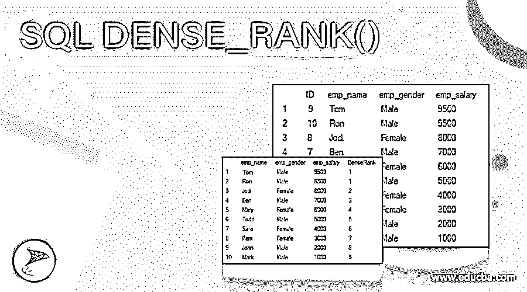
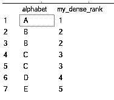
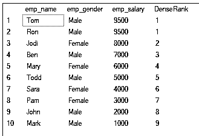
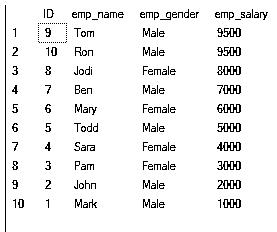
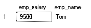
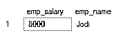
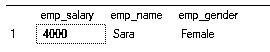

# SQL DENSE_RANK()

> 原文：<https://www.educba.com/sql-dense_rank/>

## SQL DENSE_RANK()简介

DENSE_RANK()是在 SQL Server 2005 中引入的，它根据行的顺序返回从 1 开始的排名，并且排名值之间没有间隔。所以 DENSE_RANK()返回特定行的等级，即 1 加上在该特定行之前出现的不同等级值。DENSE_RANK()是一个窗口函数，它根据结果中的当前分区为行分配等级。如果两行的值相同，则它们将获得与 rank()类似的相同等级，这意味着如果有两行处于等级 1，并且总共有四个这样的行，则 DENSE_RANK()将返回 1，1，2，3，而 RANK()将返回 1，1，3，4。

下面显示了 SQL Server 中 DENSE_RANK()的常见语法:

<small>Hadoop、数据科学、统计学&其他</small>

`DENSE_RANK() OVER (
[PARTITION BY partition_expression, ... ] ORDER BY sort_expression [ASC | DESC], ...
)`

行的划分和顺序由窗口中的 OVER 子句定义，因此它们被称为窗口函数，并且在该子句中使用了以下参数:

*   ORDER BY–它定义了行的逻辑顺序
*   PARTITION BY–它将结果分成单独的分区，窗口函数单独应用于每个分区。

这个函数的返回类型是 bigint。DENSE_RANK()函数是不确定的，而确定性函数在任何时候都返回相同的结果。当调用此函数时，即使数据库状态保持不变，它也可能在不同的时间返回不同的结果。

### SQL DENSE_RANK()的示例

让我们讨论一下 SQL DENSE_RANK()的例子。

#### 示例 1–创建表格插入行并使用 DENSE_RANK()

`CREATE TABLE dense_rank_tutorial(
alphabet VARCHAR(10)
);
INSERT INTO dense_rank_tutorial(alphabet) VALUES('A'),('B'),('B'),('C'),('C'),('D'),('E');
SELECT alphabet,
DENSE_RANK() OVER (ORDER BY alphabet) my_dense_rank
FROM dense_rank_tutorial;`

结果集如下所示:

我们已经创建了一个表并插入了值，然后使用 DENSE_RANK()来获得字母表的排名。我们已经按字母表顺序排列了。因为 B 和 C 是重复的，所以它们具有相同的秩，并且因为我们使用密集秩函数，所以秩不会被跳过，并且我们使用 B 或 C 之前的不同秩值，然后加上 1 来获得秩。

#### 示例 2–DENSE _ RANK()的简单示例

`SELECT emp_name,emp_gender,emp_salary,
DENSE_RANK() OVER (ORDER BY emp_salary desc) AS DenseRank
FROM Employee;`

结果集如下所示:

这是一个基本示例，我们从雇员表中选择姓名、性别和薪水，并使用 DENSE_RANKfunction 获得每个雇员的薪水等级。如你所见，汤姆和罗恩的平均分数都是 9500，所以排名是 1。随后，为剩余的条目计算等级。请注意，Jodi 的秩是 2，而不是 3，因为我们使用了密集秩。如果我们使用正常的排名函数，那么它将跳过排名 2，并为 Jodi 提供排名 3。

#### 示例 3–使用 DENSE_RANK()查找第 n 个最高工资

`SELECT * FROM Employee ORDER BY emp_salary DESC`

结果集如下所示:

这将按降序给出所有员工的工资

`WITH SalaryResult AS
(
SELECT emp_gender,emp_salary,emp_name,
DENSE_RANK() OVER (ORDER BY emp_salary desc) AS SalaryDenseRank
FROM Employee
)
SELECT TOP 1 emp_salary,emp_name FROM SalaryResult WHERE SalaryDenseRank = 1`

结果集如下所示:

这里我们使用了 DENSE_RANK()来计算每个员工的工资排名。但是我们已经将它包装在 CTE(公共表表达式)SalaryResult 中，这样我们就可以在下一个查询中使用它。

下面显示了 SQL Server 中 CTE 的常用语法，如果您不熟悉的话:

`WITH expression_name[(column_name [,...])] AS
(CTE_definition)
SQL_statement;`

因此，在随后的查询中，我们使用了 SalaryResult CTE，并返回了密集排名为 1 的员工的薪金和姓名。

`WITH SalaryResult AS
(
SELECT emp_gender,emp_salary,emp_name,
DENSE_RANK() OVER (ORDER BY emp_salary desc) AS SalaryDenseRank
FROM Employee
)
SELECT TOP 1 emp_salary,emp_name FROM SalaryResult WHERE SalaryDenseRank = 2`

结果集如下所示:

在本例中，我们编写了一个类似的查询，但是在本例中，我们使用了 second rank，并使用 DENSE_RANK()获得了结果。相反，如果我们使用 rank()，那么结果集将为空，因为在完整的结果集中没有第二个 RANK，我们可以看到 TOM 和 RON 的工资相同。

#### 示例# 4–在 PARTITION BY 子句中使用 DENSE_RANK()

`SELECT emp_gender,emp_salary,emp_name,
DENSE_RANK() OVER (PARTITION BY emp_gender ORDER BY emp_salary desc) AS SalaryDenseRank
FROM Employee;`

结果集如下所示:

在这里，我们使用了 DENSE_RANK()并使用 gender 对数据进行了分区，所以现在这个函数在分区的窗口内工作。现在我们可以在下一个查询中利用这一点

`WITH SalaryResult AS
(
SELECT emp_gender,emp_salary,emp_name,
DENSE_RANK() OVER (PARTITION BY emp_gender ORDER BY emp_salary desc) AS SalaryDenseRank
FROM Employee
)
SELECT TOP 1 emp_salary,emp_name,emp_gender FROM SalaryResult WHERE SalaryDenseRank= 3 and emp_gender ='Female'`

结果集如下所示:

在这个查询中，我们从 DENSE_RANK()中获得排名，并使用 SQL CTE 获得一个密集排名为 3 的女员工的结果，她的名字是 Sara。这是通过根据性别划分数据以分别获得男性和女性雇员的排名来实现的。

### 结论

希望现在您已经知道了 SQL server 中的 DENSE_RANK()是什么，以及如何使用它从给定列中指定的值获得等级。

### 推荐文章

这是 SQL DENSE_RANK()的指南。这里我们讨论介绍、语法、参数和代码实现的例子。您也可以浏览我们的其他相关文章，了解更多信息——

1.  [MySQL 创建函数](https://www.educba.com/mysql-create-function/)
2.  [MySQL encode()](https://www.educba.com/mysql-encode/)
3.  [MySQL 存在](https://www.educba.com/mysql-exists/)
4.  [MySQL 删除触发器](https://www.educba.com/mysql-delete-trigger/)

