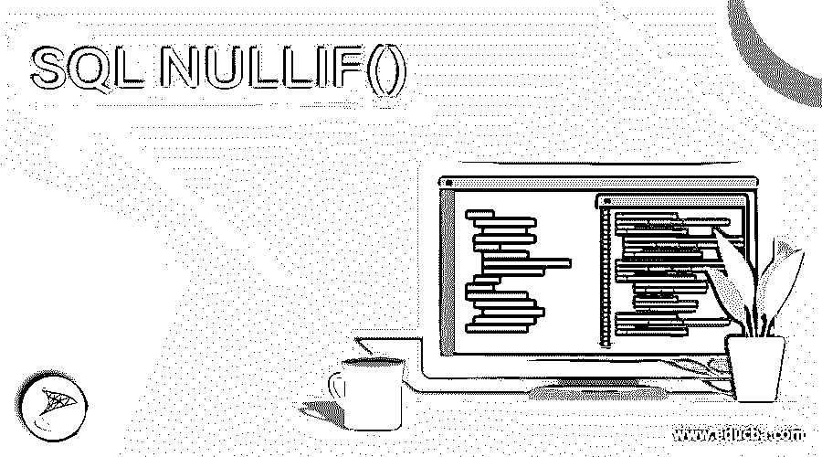
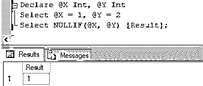
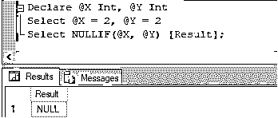
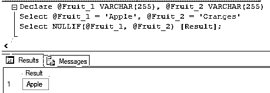
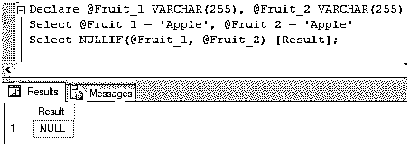
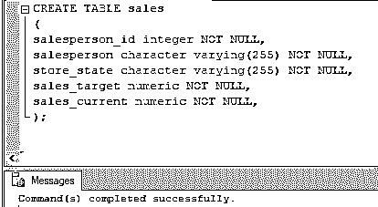
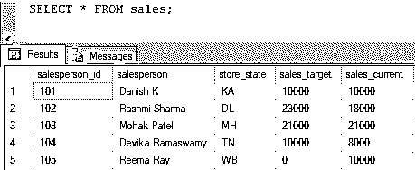
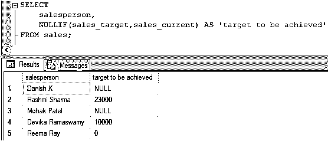
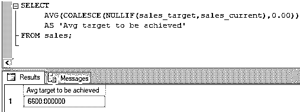
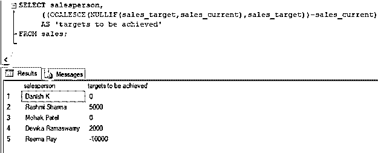

# SQL NULLIF()

> 原文：<https://www.educba.com/sql-nullif/>

## SQL NULLIF()简介

NULLIF()是标准查询语言(SQL)中的一个比较函数，它将两个表达式作为参数，如果两个表达式相等，则返回 NULL。返回的空值的数据类型与第一个表达式相同。如果表达式不相等，NULLIF()返回第一个表达式。此函数可视为 case 语句的一种特殊情况，如果两个给定的表达式相等，则该语句返回 NULL，否则返回第一个表达式。

需要注意的是，并非所有 SQL 数据库都支持 NULLIF()函数。目前仅在 SQL Server、Azure SQL server 和并行数据库中支持它。

<small>Hadoop、数据科学、统计学&其他</small>

**语法和参数:**

在 SQL 中使用 NULLIF()函数的基本语法如下:

`NULLIF(first_expression,second_expression);`

上述语法中使用的参数如下:

*   First_expression:任何有效的标量表达式
*   Second_expression:任何有效标量表达式

因为我们已经提到了 NULLIF()函数是 case 语句的一个特例，所以这里有一个 NULLIF 作为 CASE 语句的例子。

`CASE WHEN first_expression = second_expression
THEN NULL
ELSE
first_expression
END;`

讨论了语法之后，让我们尝试一些使用 NULLIF()的例子来更详细地理解它。

### SQL NULLIF()的示例

让我们讨论 SQL NULLIF()的例子。

#### 示例 1:使用两个整数类型参数演示 NULLIF()功能的简单 SQL 查询。

`Declare @X Int, @Y Int
Select @X = 1, @Y = 2
Select NULLIF(@X, @Y) [Result];`

等价于上述 NULLIF()函数的 case 语句如下:

`CASE WHEN X = Y
THEN NULL
ELSE
X
END;`

在上面的代码片段中，我们将 X =1 和 Y = 2 作为参数传递给了 NULLIF()函数。因为它们不相等，所以函数返回第一个表达式，即 X 的值。接下来，让我们尝试传递相等的 X 和 y 的值。

`Declare @X Int, @Y Int
Select @X = 2, @Y = 2
Select NULLIF(@X, @Y) [Result];`

当我们传递相等的参数时，NULLIF()函数返回 NULL。

#### 示例 2:使用两个 VARCHAR 类型参数演示 NULLIF()功能的简单 SQL 查询。

`Declare @Fruit_1 VARCHAR(255), @Fruit_2 VARCHAR(255)
Select @Fruit_1 = 'Apple', @Fruit_2 = 'Oranges'
Select NULLIF(@Fruit_1, @Fruit_2) [Result];`

等价于上述 NULLIF()函数的 case 语句如下:

`CASE WHEN Fruit_1 = Fruit_2
THEN NULL
ELSE
Fruit_1
END;`

在代码片段中，由于参数的值不同，该函数返回第一个表达式 fruit_1。

`Declare @Fruit_1 VARCHAR(255), @Fruit_2 VARCHAR(255)
Select @Fruit_1 = 'Apple', @Fruit_2 = 'Apple'
Select NULLIF(@Fruit_1, @Fruit_2) [Result];`

当我们传递相等的参数时，NULLIF()函数返回 NULL。

到目前为止，我们已经对 NULLIF()函数有了相当好的理解。但是为了将这种理解应用到一些用法中，这里有更多的例子来说明 NULLIF()函数在实际业务问题中的使用。

让我们首先创建一个名为“sales”的表，其中包含销售人员的销售明细。我们将使用它进行说明。您可以使用下面的代码片段来创建上述表格。

`CREATE TABLE sales
(
salesperson_id integer NOT NULL,
salesperson character varying(255) NOT NULL,
store_state character varying(255) NOT NULL,
sales_target numeric NOT NULL,
sales_current numeric NOT NULL,
);`

成功地创建了表之后，现在让我们在其中插入一些随机记录，以便在示例中使用。您可以使用下面的代码片段来执行该任务。

`INSERT INTO sales
([salesperson_id] ,[salesperson] ,[store_state] ,[sales_target] ,[sales_current])
VALUES
(101,'Danish K','KA',10000,10000),
(102,'Rashmi Sharma','DL',23000,18000),
(103,'Mohak Patel','MH',21000,21000),
(104,'Devika Ramaswamy','TN',10000,8000),
(105,'Reema Ray','WB',0,10000);`

经过几次插入操作后，sales 表中的数据如下所示:

`SELECT * FROM sales;`

#### 示例#3: SQL 查询返回未完成销售目标的销售人员的销售目标。

`SELECT
salesperson,
NULLIF(sales_target,sales_current) AS 'target to be achieved'
FROM sales;`

在这个例子中，如果销售人员已经完成了他或她的目标，我们使用 NULLIF 返回一个空值，并为尚未完成目标的销售人员返回 sales_target。

#### 示例 4: SQL 查询返回未完成销售目标的销售人员的平均销售目标。

`SELECT
AVG(COALESCE(NULLIF(sales_target,sales_current),0.00))
AS 'Avg target to be achieved'
FROM sales;`

在上面的例子中，如果销售人员已经完成了他或她的目标，我们首先使用 NULLIF 返回一个空值，并为尚未完成目标的销售人员返回 sales_target。然后使用 COALESCE 将“NULL”转换为(0.00)，最后应用 AVG 汇总函数。

#### 示例 5:返回每个销售人员剩余销售目标的 SQL 查询。

`SELECT salesperson,
((COALESCE(NULLIF(sales_target,sales_current),sales_target))-sales_current)
AS 'targets to be achieved'
FROM sales;`

在前面的例子中，我们直接考虑了销售目标，而没有考虑单个销售人员所达到的销售目标的当前状态。但是在这个例子中，我们试图通过使用 NULLIF 来计算剩余的目标。我们可以通过从 sales_target 中减去 sales_current 来立即计算。但是这样做是为了说明 NULLIF()与 COALESCE 函数一起使用。

### 结论

NULLIF()是一个流控制函数，它接受两个参数并检查给定的参数是否相等。如果它们相等，则返回与第一个参数类似的数据类型的空值，否则返回第一个表达式。

### 推荐文章

这是一个 SQL NULLIF()的指南。这里我们讨论介绍、语法、参数和代码实现的例子。您也可以浏览我们的其他相关文章，了解更多信息——

1.  [SQL 删除](https://www.educba.com/sql-delete/)
2.  [SQL 比较字符串](https://www.educba.com/sql-compare-string/)
3.  [SQL 滞后()](https://www.educba.com/sql-lag/)
4.  [SQL 更新触发器](https://www.educba.com/sql-update-trigger/)

