# SQL 上限

> 原文：<https://www.educba.com/sql-ceiling/>

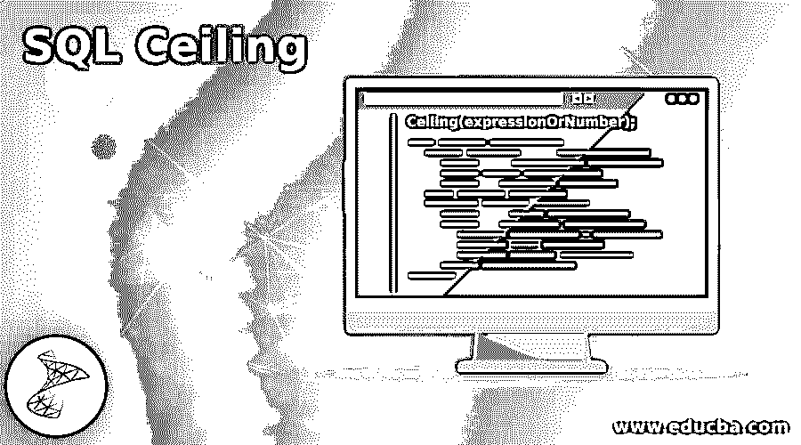

## SQL 上限介绍

SQL Ceiling 函数是 SQL 中可用的数学函数，用于数值类型的值。这些数值可以是整数，也可以是浮点数。如果数值在字符串类型的值内格式化为参数，则该值也允许用于 Ceiling 函数。简而言之，任何可以推导为数值的值或表达式都可以用作 SQL 中 Ceiling()数学函数的参数。这个函数帮助我们检索大于或等于传递值的最小整数值。

在本文中，我们将了解如何使用 Ceiling 函数来检索不小于传递的数值或表达式的整数值、其语法，以及一些有助于使 Ceiling()函数的实现简单易懂的示例。

<small>Hadoop、数据科学、统计学&其他</small>

**语法:**

以下是 SQL–中数学上限()函数的语法

`Ceiling(expressionOrNumber);`

*   **expression or number:**expression or number 可以是任意整数或浮点值，甚至可以是小数值。如果这个数值被包装成字符串，那么这些字符串值也是可以接受的。除了直接指定数值之外，最终将推导出数值的任何表达式也允许作为 Ceiling()函数的参数。
*   **返回值:**Ceiling()函数的返回值是大于或等于作为参数传递给该函数的值的最小整数值。返回值的类型取决于作为参数传递给 Ceiling()函数的值的数据类型。如果参数是或整数数据类型，则返回值也是整数类型。而在其他情况下，如果参数值的直接规范的参数推导值是浮点类型，则返回值的数据类型本身是浮点数据类型。

### SQL 上限示例

下面是一些例子:

#### 1.使用带有正值的 Ceiling()函数

我们将考虑正数值，比如 3.59，然后使用 Ceiling 函数检索大于或等于 3.59 的最小整数值。让我们执行以下 SQL 查询语句，并观察输出–

`SELECT Ceiling(3.59);`

**输出:**

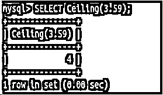

让我们再考虑一个积极价值的例子。但是在这个例子中，我们将使用一个表达式来计算数值类型的值。只需考虑实际值为 8.25 的表达式 5 * 1.65，并在 Ceiling()函数中使用该表达式，使用以下查询语句检索大于传递值的最小整数值

`SELECT Ceiling(5 * 1.65);`

**输出:**

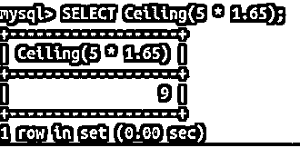

现在，我们将考虑一个包装成字符串的正数，并将其用作 Ceiling()函数的参数。例如，考虑以下列方式使用的“56.569”值

`SELECT Ceiling(56.569);`

**输出:**

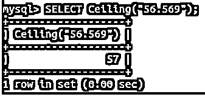

#### 2.使用带有负值的 Ceiling()函数

我们将考虑负数值，比如-65.55，然后使用 Ceiling 函数检索大于或等于-65.55 的最小整数值。让我们执行以下 SQL 查询语句，并观察输出–

`SELECT Ceiling(-65.55);`

**输出:**

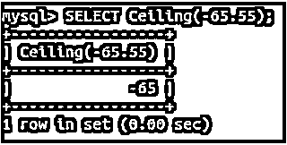

让我们再考虑一个负值的例子。但是在这个例子中，我们将使用一个表达式来计算数值类型的值。只需考虑实际值为 733.2 的表达式 8 * -91.65，并在 Ceiling()函数中使用该表达式，通过以下查询语句检索大于传递值的最小整数值

`SELECT Ceiling(8 * -91.65);`

**输出:**

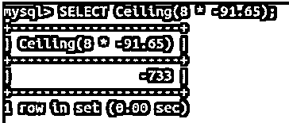

现在，我们将考虑一个包装成字符串的负数，并将其用作 Ceiling()函数的参数。例如，考虑以下列方式使用的“-98.154”值

`SELECT Ceiling(-98.154);`

**输出:**

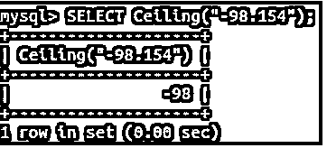

#### 3.对表中的值使用 Ceiling()函数

现在让我们看看如何在查询语句中对表的列值使用 Ceiling()函数。我们将使用以下查询语句创建一个名为 workers 的表

`CREATE TABLE `workers` (
`developer_id` int(11) NOT NULL AUTO_INCREMENT,
`team_id` int(11) NOT NULL,
`name` varchar(100) DEFAULT NULL,
`position` varchar(100) DEFAULT NULL,
`technology` varchar(100) DEFAULT NULL,
`salary` int(11) DEFAULT NULL,
PRIMARY KEY (`developer_id`),
UNIQUE KEY `name` (`name`)
) ENGINE=InnoDB AUTO_INCREMENT=28 DEFAULT CHARSET=latin1;`

**输出:**

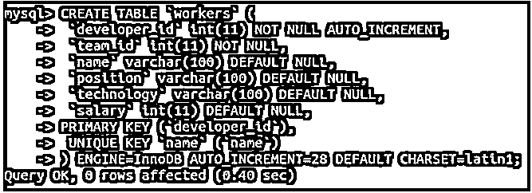

现在，我们将使用以下查询语句在 workers 表中插入一些记录

`INSERT INTO `workers` VALUES
(1,1,'Payal','Developer','Angular',30000),
(2,1,'Heena','Developer','Angular',10000),
(3,3,'Vishnu','Manager','Maven',25000),
(4,3,'Rahul','Support','Digital Marketing',15000),
(5,3,'Siddhesh','Tester','Maven',20000),
(6,7,'Siddharth','Manager','Java',25000),
(7,4,'Brahma','Developer','Digital Marketing',30000),
(8,1,'Arjun','Tester','Angular',19000),
(9,2,'Nitin','Developer','SQL',20000),
(10,2,'Ramesh','Administrator','SQL',30000),
(11,2,'Rohan','Admin',NULL,20000),
(12,2,'Raj','Designer',NULL,30000);`

**输出:**

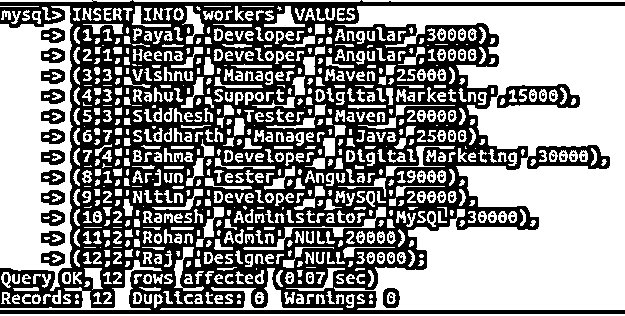

现在，我们将使用以下查询语句来计算平均工资

`SELECT avg(salary) from workers;`

**输出:**

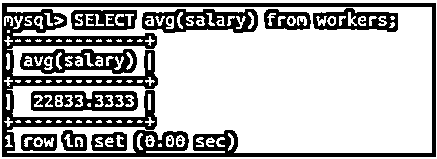

如果我们希望使用 Ceiling()函数使用以下查询语句检索整数格式的平均薪金，其中最大值大于或等于平均值

`SELECT Ceiling (avg(salary)) from workers;`

**输出:**

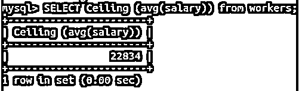

### 结论

数学函数 Ceiling()用于在 SQL 中对数值进行舍入。我们可以检索大于或等于传递的数字或表达式的整数格式的最小值，其结果可以是整数的浮点值或十进制值。Ceiling()函数的工作方式与 Floor()函数完全不同。虽然它们都是用于舍入的。Ceiling()函数向上舍入，而 Floor()函数向下舍入数值。

### 推荐文章

这是一个 SQL 天花板的指南。在这里，我们还将讨论 sql ceiling 的介绍和语法，以及不同的示例和代码实现。您也可以看看以下文章，了解更多信息–

1.  [PostgreSQL 链接](https://www.educba.com/postgresql-link/)
2.  [SQL 删除](https://www.educba.com/sql-delete/)
3.  [MySQL 创建函数](https://www.educba.com/mysql-create-function/)
4.  [SQL 删除行](https://www.educba.com/sql-delete-row/)

