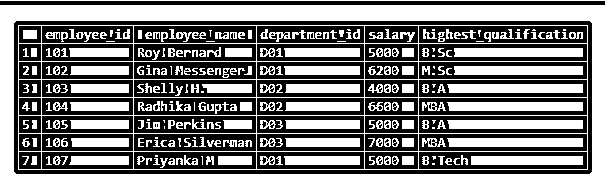
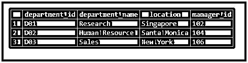
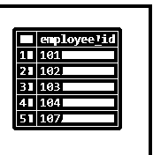
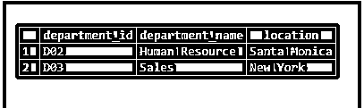
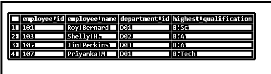
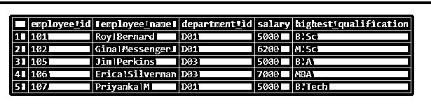
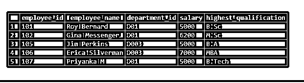

# SQL 存在

> 原文：<https://www.educba.com/sql-exists/>

## SQL 简介已存在

EXISTS 是标准查询语言(SQL)中的条件运算符，用作查询的 WHERE 子句的一部分，以测试从相关嵌套子查询获得的结果集是否为空。该条件返回一个布尔值，即真或假。如果相关子查询返回一行或多行，则满足条件，EXISTS 运算符返回 TRUE，否则返回 FALSE。EXISTS 运算符可用作 SELECT、UPDATE、DELETE 或 INSERT 语句的一部分。

在本帖中，我们将借助一些例子详细讨论 EXISTS 条件操作符。

<small>Hadoop、数据科学、统计学&其他</small>

### 语法和参数

在 SQL 查询中使用 EXISTS 运算符的基本语法如下:

**语法:**

`SELECT column_name1, column_name2, ...
FROM table_name
WHERE EXISTS
(SELECT column_name FROM table_name WHERE condition);`

**参数:**

上述语法中使用的参数如下:

*   column_name1，column_name2，…:这里必须提到为得到最终结果而提取的列或字段名称。
*   table_name:必须从中提取上述列的数据库表。
*   (SELECT column _ name FROM table _ name WHERE condition):将作为条件进行计算的子查询。如果子查询返回一行或多行，EXISTS 运算符返回 TRUE。

### SQL 存在的例子

为了说明 EXISTS 在 SQL 中的功能，还有什么比在虚拟表上尝试几个例子更好的呢？因此，让我们创建两个数据库表，分别名为“雇员”和“部门”。我们可以使用下面的 CREATE table 语句来创建这些表。

**创建员工表:**

`CREATE TABLE employee
(
employee_id integer,
employee_name character varying(255),
department_id character varying(255),
salary numeric,
highest_qualification character varying(255)
)`

**创建部门表:**

`CREATE TABLE departments
(
department_id character varying(255),
department_name character varying(255),
location character varying(255),
manager_id integer
)`

我们已经成功地创建了两个表，即“雇员”和“部门”。现在，在给定的插入查询的帮助下，让我们在两个表中插入一些记录来进行操作。

**插入对雇员表的查询。**

`INSERT INTO employee(
employee_id, employee_name, department_id, salary, highest_qualification)
VALUES (101,'Roy Bernard','D01',5000,'B.Sc'),
(102,'Gina Messenger','D01',6200,'M.Sc'),
(103,'Shelly H.','D02',4000,'B.A'),
(104,'Radhika Gupta','D02',6600,'MBA'),
(105,'Jim Perkins','D03',5000,'B.A'),
(106,'Erica Silverman','D03',7000,'MBA'),
(107,'Priyanka M','D01',5000,'B.Tech');`

**插入对部门表的查询。**

`INSERT INTO departments(
department_id, department_name, location, manager_id)
VALUES ('D01','Research','Singapore',102),
('D02','Human Resource','Santa Monica',104),
('D03','Sales','New York',106);`

**选择表格:**

`select * from employee;`

`select * from departments;`

现在，我们准备使用 EXISTS 操作符尝试基于这些表的几个示例。

#### 在 SELECT 语句中使用 EXISTS

exists 与 select 语句的使用示例:

##### 示例#1

查找不在纽约办公室的所有雇员的雇员标识。

`SELECT employee_id
FROM employee
WHERE EXISTS (SELECT location
FROM departments
WHERE employee.department_id = departments.department_id
AND location <> 'New York');`

##### 实施例 2

查找办公室中担任部门经理的所有员工的员工 id、姓名和最高资格。

`SELECT employee_id, employee_name, highest_qualification
FROM employee
WHERE EXISTS (SELECT manager_id
FROM departments
WHERE employee.employee_id = departments.manager_id);`

##### 实施例 3

查找经理收入超过 6500 美元的所有部门的 department_id、名称和位置。

`SELECT department_id, department_name,location
FROM departments
WHERE EXISTS (SELECT employee_id
FROM employee
WHERE employee.employee_id = departments.manager_id
AND salary > 6500);`

##### 实施例 4

查找雇员工资总支出低于 15000 美元的所有部门的 department_id、名称和位置。

`SELECT department_id, department_name,location
FROM departments
WHERE EXISTS (SELECT sum(salary)
FROM employee
WHERE employee.department_id = departments.department_id
GROUP BY department_id
HAVING sum(salary) < 15000);`

##### 实施例 5

查找不担任各自部门经理的所有雇员的雇员标识、姓名、部门标识和最高资格。

`SELECT employee_id, employee_name, department_id, highest_qualification
FROM employee
WHERE NOT EXISTS (SELECT manager_id
FROM departments
WHERE employee.employee_id = departments.manager_id);`

#### 将 EXISTS 与 DELETE 语句一起使用

exists 与 delete 语句的使用示例:

##### 实施例 6

删除来自 D02 或人力资源部门的所有员工的详细信息。

`DELETE
FROM employee
WHERE EXISTS (SELECT * FROM departments
WHERE departments.department_id = employee.department_id
AND department_id = 'D02');`

接下来，让我们使用下面的 SELECT 查询来检查查询是否成功删除了记录。

`SELECT * FROM employee;`

我们可以从上表中观察到，该查询已经成功地删除了与 D02 部门的雇员相关的详细信息。

#### 在 UPDATE 语句中使用 EXISTS

exists 与 update 语句的使用示例:

##### 实施例 7

在“销售”部门的雇员表中将 department_id 从 D03 更新为 D003。

`UPDATE employee
SET department_id = 'D003'
WHERE EXISTS (SELECT * FROM departments
WHERE departments.department_id = employee.department_id
AND department_name = 'Sales');`

从下图中我们可以清楚地看到，销售部门的 department_id 已被成功更新。

`SELECT * FROM employee;`

### 结论

EXISTS 在 SQL 查询的 WHERE 子句中用作运算符，用于检查从相关嵌套子查询中获得的结果集是否为空。如果结果集为空，EXISTS 返回 FALSE，否则返回 TRUE。

### 推荐文章

这是一个 SQL 存在的指南。在这里，我们还讨论了介绍和语法和参数以及不同的例子和它的代码实现。您也可以看看以下文章，了解更多信息–

1.  [SQL 映射](https://www.educba.com/sql-mapping/)
2.  [SQL MID](https://www.educba.com/sql-mid/)
3.  [用于循环的 SQL](https://www.educba.com/sql-for-loop/)
4.  [SQL 周](https://www.educba.com/sql-week/)

