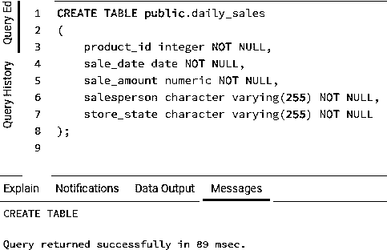
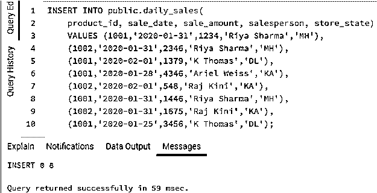
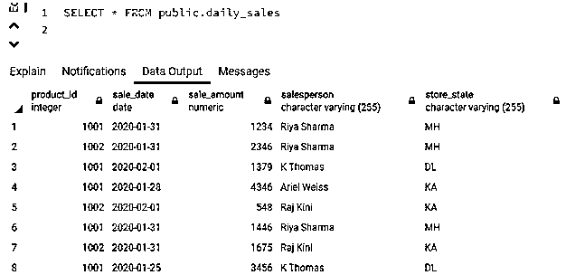
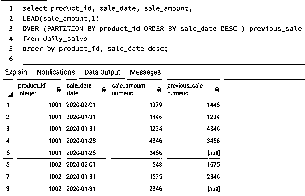
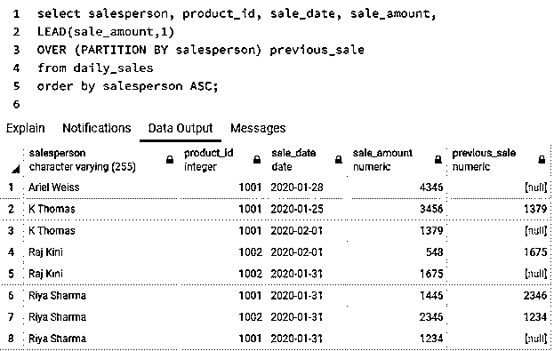
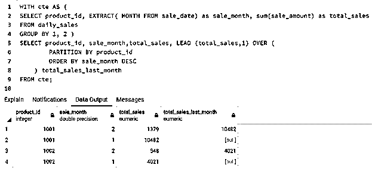
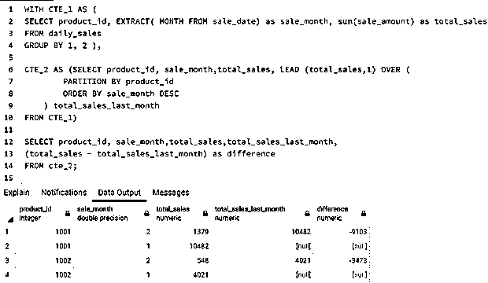
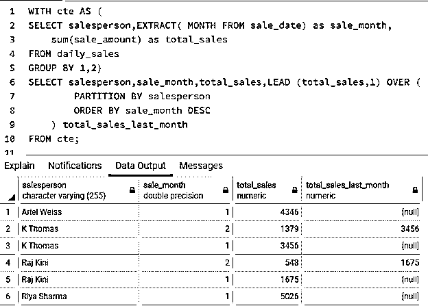
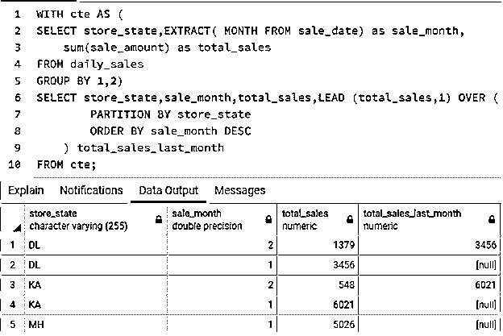

# SQL 线索()

> 原文：<https://www.educba.com/sql-lead/>

## SQL LEAD 介绍()

标准查询语言(SQL)中的 LEAD 函数是一个分析函数，用于获取结果集中指定物理偏移量处的下一行的结果，而无需对表执行任何自连接。LEAD 函数通常用在查询的 SELECT 语句中，用于将当前行的某些值与后续行中的值进行比较。

LEAD 是一个窗口函数，输入值从 SELECT 语句结果的一行或多行虚拟“窗口”中获取。它根据输入行的窗口计算汇总值或最终值。

<small>Hadoop、数据科学、统计学&其他</small>

### 语法和参数

用 SQL 编写 LEAD 函数的基本语法如下:

`LEAD(expression [,offset [,default_value]])
OVER (
[PARTITION BY partition_expression] ORDER BY order_expression [ASC | DESC] )`

上述语法中使用的参数如下:

*   **表达式:**在此指定需要评估的列。这是根据偏移量从后续行中获取值的列或表达式。
*   **Offset:** 必须从中提取数据的前面的行数。它是一个正整数。
*   **Default_value:** 在后续行中没有找到数据时返回的值。默认情况下，它被设置为 NULL。
*   **Partition_expression:** 整个数据集必须基于其进行划分或分组的列。
*   **Order_expression:** 对分区集中的行进行排序所依据的列。

#### 例子

为了详细理解 SQL LEAD 函数，让我们创建一个名为“daily_sales”的表，该表包含一家百货商店每天销售的产品的详细信息。我们可以使用下面的代码片段。

**代码#1**

`CREATE TABLE public.daily_sales
(
product_id integer NOT NULL,
sale_date date NOT NULL,
sale_amount numeric NOT NULL,
salesperson character varying(255) NOT NULL,
store_state character varying(255) NOT NULL
);`

**输出:**

成功创建表格后，让我们在其中插入一些随机数据。为此，我们可以使用下面的代码片段。

**代码#2**

`INSERT INTO public.daily_sales(
product_id, sale_date, sale_amount, salesperson, store_state)
VALUES (1001,'2020-01-31',1234,'Riya Sharma','MH'),
(1002,'2020-01-31',2346,'Riya Sharma','MH'),
(1001,'2020-02-01',1379,'K Thomas','DL'),
(1001,'2020-01-28',4346,'Ariel Weiss','KA'),
(1002,'2020-02-01',548,'Raj Kini','KA'),
(1001,'2020-01-31',1446,'Riya Sharma','MH'),
(1002,'2020-01-31',1675,'Raj Kini','KA'),
(1001,'2020-01-25',3456,'K Thomas','DL');`

**输出:**

我们已经成功地插入了数据。我们的“daily_sales”表现在看起来像这样。

现在让我们使用一下上面提到的表格。也就是说，让我们尝试一些例子。

### 实施 SQL LEAD()的示例

以下是实施 SQL LEAD()的示例

#### 示例#1

查找百货商店中每种产品的当前金额和以前金额(即上次销售收取的金额)。

**代码:**

`select product_id, sale_date, sale_amount,
LEAD(sale_amount,1)
OVER (PARTITION BY product_id ORDER BY sale_date DESC ) previous_sale
from daily_sales
order by product_id, sale_date desc;`

**输出:**

**解释:**我们可以看到，在 previous_sale 列中，我们已经从上一行获得了 sale_amount 值，因为这里的 offset 设置为 1。对于 sale_amount，我们没有任何先前的值，我们有一个缺省值 NULL。这也可以设置为其他默认值。

#### 实施例 2

查找百货商店中每个销售人员的当前金额和以前金额(即上次销售收取的金额)。

**代码:**

`select salesperson, product_id, sale_date, sale_amount,
LEAD(sale_amount,1)
OVER (PARTITION BY salesperson) previous_sale
from daily_sales
order by salesperson ASC;`

**输出:**

#### 实施例 3

查找每个产品的当月销售额(这里的销售额是指销售额)和上月销售额。

**代码:**

`WITH cte AS (
SELECT product_id, EXTRACT( MONTH FROM sale_date) as sale_month, sum(sale_amount) as total_sales
FROM daily_sales
GROUP BY 1, 2 )
SELECT product_id, sale_month,total_sales, LEAD (total_sales,1) OVER (
PARTITION BY product_id
ORDER BY sale_month DESC
) total_sales_last_month
FROM cte;`

**输出:**

**解释:**在上面的例子中，我们首先在一个 CTE 中整理了像 sales_month、total sales_amount 这样的数据。cte 是临时的类似表格的结构，帮助我们组织数据。然后，我们通过按 product_id 划分整个记录集来获取上个月的销售额。

#### 实施例 4

找出每个产品当月销售额和上月销售额之间的差异。

**代码:**

`WITH CTE_1 AS (
SELECT product_id, EXTRACT( MONTH FROM sale_date) as sale_month, sum(sale_amount) as total_sales
FROM daily_sales
GROUP BY 1, 2 ),
CTE_2 AS (SELECT product_id, sale_month,total_sales, LEAD (total_sales,1) OVER (
PARTITION BY product_id
ORDER BY sale_month DESC
) total_sales_last_month
FROM CTE_1)
SELECT product_id, sale_month,total_sales,total_sales_last_month,
(total_sales - total_sales_last_month) as difference
FROM cte_2;`

**输出:**

**

** 

#### 实施例 5

查找百货商店中每个销售人员的当月销售额和上月销售额。

**代码:**

`WITH cte AS (
SELECT salesperson,EXTRACT( MONTH FROM sale_date) as sale_month,
sum(sale_amount) as total_sales
FROM daily_sales
GROUP BY 1,2)
SELECT salesperson,sale_month,total_sales,LEAD (total_sales,1) OVER (
PARTITION BY salesperson
ORDER BY sale_month DESC
) total_sales_last_month
FROM cte;`

**输出:**

#### 实施例 6

查找百货商店运营的每个位置的当月销售额和上月销售额。

**代码:**

`WITH cte AS (
SELECT store_state,EXTRACT( MONTH FROM sale_date) as sale_month,
sum(sale_amount) as total_sales
FROM daily_sales
GROUP BY 1,2)
SELECT store_state,sale_month,total_sales,LEAD (total_sales,1) OVER (
PARTITION BY store_state
ORDER BY sale_month DESC
) total_sales_last_month
FROM cte;`

**输出:**

### 结论

LEAD 是 SQL 中的一个值函数，用于根据物理偏移量获取下一个后续值。它有助于比较同一列但不同行中的数据。因此，它帮助我们在不执行任何自连接的情况下执行无数的分析功能。

### 推荐文章

这是 SQL LEAD()的指南。在这里，我们讨论在 SQL LEAD()中实现的简介、语法和示例。您也可以浏览我们的其他相关文章，了解更多信息——

1.  [SQL 关键字](https://www.educba.com/sql-keywords/)
2.  [SQL 中的复合键](https://www.educba.com/composite-key-in-sql/)
3.  [SQL 约束](https://www.educba.com/sql-constraints/)
4.  [SQL 中的事务](https://www.educba.com/transactions-in-sql/)

