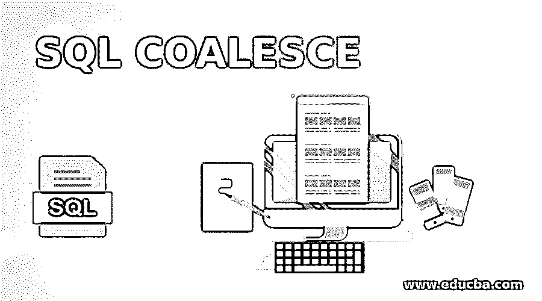
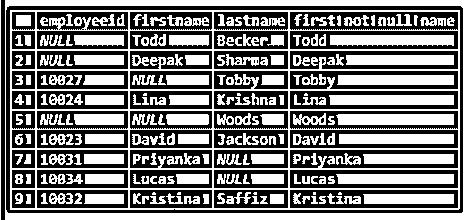
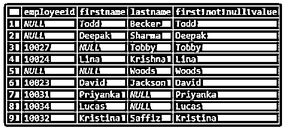
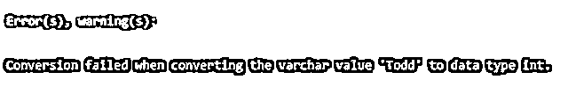
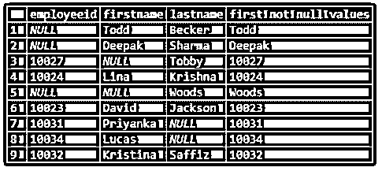
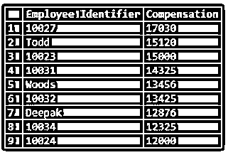

# SQL 联合

> 原文：<https://www.educba.com/sql-coalesce/>

## SQL 联合简介

COALESCE 是一个预定义的内置结构化查询语言(SQL)函数，用于处理数据记录中的空值。它按顺序计算一组或一列输入参数，并返回其中第一个非空值。一旦遇到第一个非空值并返回它，COALESCE 函数就终止。如果输入列表中的所有参数都是空值，那么函数将返回 NULL。

这是一个通用函数，所有数据库都支持，如 MYSQL、SQL Server(从 2008 年开始)、Azure SQL 数据库、PostgreSQL、Oracle 等。

<small>Hadoop、数据科学、统计学&其他</small>

SQL 联合函数的一些用途包括:

*   处理空值
*   将两个或多个查询作为单个查询运行
*   替代冗长耗时的 CASE 语句的快捷方式

### 语法和参数

在 SQL 中使用 COALESCE 函数的基本语法如下:

`SELECT COALESCE(value_1, value_2,value_3,value_4, …value_n);`

上述语法中提到的参数是:

COALESCE():返回输入列表中第一个非空值的 SQL 函数。

value_1，value_2，value_3，value_4，…value_n:必须计算的输入值。

由于 COALESCE 函数本身就是一个表达式，因此它可以用在任何接受 SELECT、WHERE 和 HAVING 等表达式的语句或子句中。

COALESCE 函数可以被认为是 SQL 中 CASE 语句的一个特殊版本。

展示 COALESCE 函数的 CASE 语句的语法如下:

`SELECT column_name1,column_name2, column_name3,
CASE
WHEN column_name1 IS NOT NULL THEN column_name1
WHEN column_name2 IS NOT NULL THEN column_name2 ELSE NULL
END as 'case_name'
FROM table_name;`

上述语法中提到的参数是:

Column_name1，column_name2:必须合并的列的值，也就是说，如果这些列中的任何一列的结果为空值，那么将返回其中的第一个非空值。但是如果两者的值都是 NULL，那么 CASE 将返回 NULL。

接下来，我们将详细讨论上面提到的合并函数。

为了更好地理解这个概念，我们将借助员工表(包含所有员工的个人详细信息)。

“雇员”表中的数据如下:

### SQL 联合的示例

这里有几个例子可以更好地理解 SQL 联合。

#### 示例#1

SQL 查询来说明简单合并函数的使用。

**代码:**

`SELECT COALESCE(NULL, NULL, NULL, 'EduCBA', NULL, NULL);`

**输出:**

在这个例子中，我们可以看到 COALESCE 函数选择了它遇到的第一个 not NULL 值，然后终止。

#### 实施例 2

从雇员的名和姓中查找第一个非空值的 SQL 查询。

**代码:**

`SELECT employeeid,firstname, lastname,
COALESCE(firstname,lastname) as 'first not null name'
FROM employees;`

**输出:**

在此示例中，返回第一个非 NULL。

#### 实施例 3

SQL 查询来说明 COALESCE 函数作为 case 的一个特例。

**代码:**

`SELECT employeeid,firstname, lastname,
CASE
WHEN firstname IS NOT NULL THEN firstname
WHEN lastname IS NOT NULL THEN lastname ELSE NULL
END as 'first not null value'
FROM employees;`

**输出:**

将该查询的结果与第三个示例中的查询结果进行比较。我们可以看到它们产生了相同的结果。这是因为 COALESCE 函数可以被认为是 case 的一个特例。

**例#4**

SQL 查询，说明对不同数据类型的值使用联合函数。

**代码:**

`SELECT employeeid,firstname, lastname,
COALESCE(employeeid,firstname,lastname) as 'first not null name'
FROM employees;`

**输出:**

在上面的示例中，我们可以看到，雇员 id 不能与名字和姓氏数据值组合在一起，因为它们具有不同的数据类型。

为了解决这个问题，我们可以使用 CONVERT 函数来更改 employeeid 的数据类型，如下所示。

**代码:**

`SELECT employeeid,firstname, lastname,
COALESCE(CONVERT(varchar(50),employeeid),firstname,lastname) as 'first not null values'
FROM employees;`

**输出:**

**例#5**

一个复杂的 SQL 查询来说明 COALESCE 函数的使用。

假设我们想知道公司所有员工的工资。但是在员工表中，我们可以看到所有员工的工资都没有被提及。但是，已经提到了缺少薪金字段的雇员的小时工资率和佣金。我们可以用它来比较员工的工资，如下所示。

**代码:**

`SELECT COALESCE(CONVERT(varchar(50),employeeid),firstname,lastname) as 'Employee Identifier',
COALESCE(salary,hourly_rate*8*30 + COALESCE(commission,0))as 'Compensation'
FROM employees
ORDER BY 2 DESC;`

**输出:**

使用第一个 COALESCE 函数，我们尝试通过将 employeeid、first name 和 last name 结合在一起来识别雇员，然后使用第二个 COALESCE 函数，我们尝试选择 salary 或 computed compensation。

### 结论

SQL COALESCE 函数是 SQL Server、Azure 等数据库中的内置函数。它返回输入参数列表中的第一个非 NULL 值。它在处理空值时非常有用，是 SQL CASE 语句的一种快速而简单的替代方法。

### 推荐文章

这是一个 SQL 联合的指南。这里我们讨论几个例子来理解 SQL 联合以及语法和参数。您也可以看看以下文章，了解更多信息–

1.  [SQL 子查询](https://www.educba.com/sql-subquery/)
2.  [带子句的 SQL](https://www.educba.com/sql-with-clause/)
3.  [SQL 算术运算符](https://www.educba.com/sql-arithmetic-operators/)
4.  MySQL 中的[表](https://www.educba.com/table-in-mysql/)

