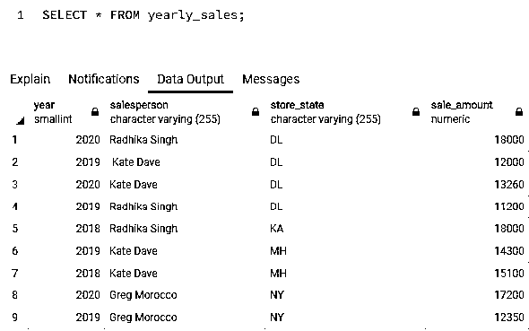
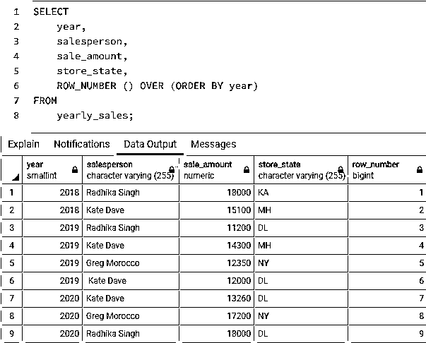
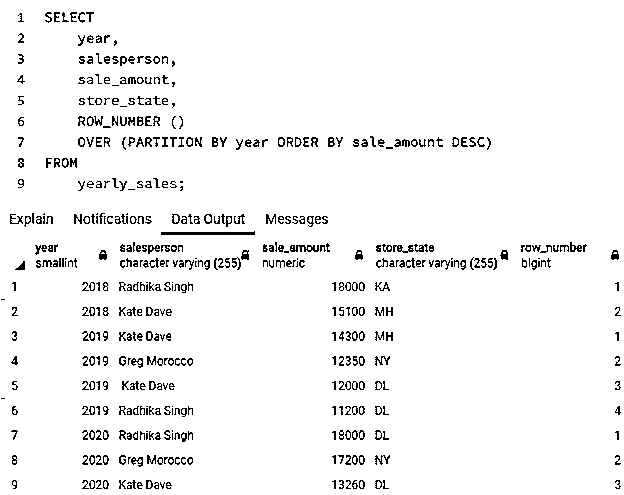
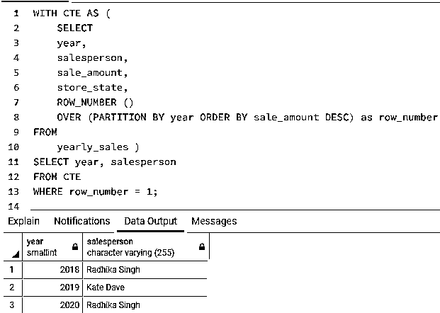
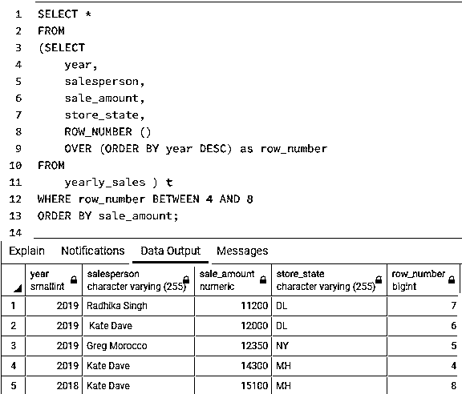

# SQL 行号

> 原文：<https://www.educba.com/sql-row_number/>

## SQL 行号简介

SQL 中的 ROW_NUMBER 是一个窗口函数，用于为结果集中的每一行分配一个唯一的整数序列号，从 1 开始。这就像点名一样简单，只要给每一行一个唯一的号码来识别它。由于 ROW_NUMBER 是一个 windows 函数，因此它不会对原始数据表进行任何更改。

当我们想要找到诸如结果集中第 n 个最高/最低的条目是什么这样的问题的答案时，它非常有用。ROW_NUMBER 函数可用于对结果集进行分页，而不是一次显示所有细节。这个函数有很多用途，比如 SQL 中的 RANK()函数。在这篇文章中，我们将通过一些例子来了解其中的大部分。

<small>Hadoop、数据科学、统计学&其他</small>

**语法和参数:**

用 SQL 编写 ROW_NUMBER 函数的基本语法如下:

`ROW_NUMBER() OVER(
[PARTITION BY partition_expression] [ORDER BY order_expression [ASC | DESC]] )`

上述语法中使用的参数如下:

*   **partition_expression:** 对整个数据集进行划分所依据的列或表达式。如果没有指定任何内容，默认情况下，整个结果集被视为单个窗口或分区。
*   **order_expression:** 分区集中的行以特定的升序或降序排序所基于的列或表达式。

### SQL 行编号的示例

为了更详细地说明 ROW_NUMBER()函数，让我们创建一个名为“yearly_sales”的表。它包含与销售人员在特定年份的销售额相关的详细信息。我们可以使用下面的代码片段来创建表格。

`CREATE TABLE public.yearly_sales
(
year smallint NOT NULL,
salesperson character varying(255) COLLATE pg_catalog."default" NOT NULL,
store_state character varying(255) COLLATE pg_catalog."default" NOT NULL,
sale_amount numeric NOT NULL
);`

创建了表之后，让我们在其中插入一些记录进行操作。我们可以使用下面的代码片段来插入值。

`INSERT INTO public.yearly_sales(
year, salesperson, store_state, sale_amount)
VALUES (2020,'Radhika Singh','DL',18000),
(2019,' Kate Dave','DL',12000),
(2020,'Kate Dave','DL',13260),
(2019,'Radhika Singh','DL',11200),
(2018,'Radhika Singh','KA',18000),
(2019,'Kate Dave','MH',14300),
(2018,'Kate Dave','MH',15100),
(2020,'Greg Morocco','NY',17200),
(2019,'Greg Morocco','NY',12350);`

完成上述插入操作后,“yearly_sales”表中的数据如下所示:

`SELECT * FROM yearly_sales;`

现在，我们已经准备好尝试几个基于新创建的“yearly_sales”表的示例。

#### 示例 1:说明如何使用 ROW_NUMBER()函数为结果集中的每一行分配一个序列号的 SQL 查询。

`SELECT
year,
salesperson,
sale_amount,
store_state,
ROW_NUMBER () OVER (ORDER BY year)
FROM
yearly_sales;`

在本例中，由于我们没有创建任何分区，默认情况下，整个结果集被视为单个分区。我们可以在数据输出中看到，row_number()函数为分区中的每一行顺序分配了一个惟一的整数，从 1 开始，到 9 结束。

#### 示例 2:使用 ROW_NUMBER()函数为结果集中按年份创建的分区中的每一行分配一个行号。

`SELECT
year,
salesperson,
sale_amount,
store_state,
ROW_NUMBER ()
OVER (PARTITION BY year ORDER BY sale_amount DESC)
FROM
yearly_sales;`

我们可以在图像中观察到，ROW_NUMBER()函数首先按年份(2018、2019 和 2020)创建分区，然后在每个分区内从 1 开始对每一行进行唯一编号。

#### 示例#3:使用 ROW_NUMBER()函数查找 2018 年、2019 年和 2020 年期间销售额最高的销售人员
(销售额最高的销售人员)的姓名。

`WITH CTE AS (
SELECT
year,
salesperson,
sale_amount,
store_state,
ROW_NUMBER ()
OVER (PARTITION BY year ORDER BY sale_amount DESC) as row_number
FROM
yearly_sales )
SELECT year, salesperson
FROM CTE
WHERE row_number = 1;`

为了在 SQL 查询的 WHERE 子句中使用 row_number，我们必须首先在子查询或通用表达式表(CTE)中使用 ROW_NUMBER()函数，因为它是一个 windows 函数，并且在 WHERE 子句筛选完成后分配行号。在本例中，我们创建了一个 CTE 来说明这一点。在下一个示例中，我们将使用子查询来进一步说明这一点。

#### 示例 4:说明如何使用 ROW_NUMBER()函数对巨大的结果集进行分页的 SQL 查询。

`SELECT *
FROM
(SELECT
year,
salesperson,
sale_amount,
store_state,
ROW_NUMBER ()
OVER (ORDER BY year DESC) as row_number
FROM
yearly_sales ) t
WHERE row_number BETWEEN 4 AND 8
ORDER BY sale_amount;`

很多时候，我们可能不得不创建不能在一个页面上显示整个结果集的仪表板或 web 应用程序。在这种情况下，我们需要执行分页。这可以通过使用 ROW_NUMBER()函数来实现，如上例所示。

### 结论

ROW_NUMBER()是一个 windows 函数，用于对结果集或其分区中的行或数据记录进行顺序编号。它在某些方面类似于 RANK()函数。它有助于执行分页，查找数据集中第 n 个最高/最低的条目。

### 推荐文章

这是一个 SQL ROW_NUMBER 的指南。这里我们讨论介绍、语法、参数和代码实现的例子。您也可以浏览我们的其他相关文章，了解更多信息——

1.  [SQL 删除](https://www.educba.com/sql-delete/)
2.  [MySQL 导出数据库](https://www.educba.com/mysql-export-database/)
3.  [SQL 比较字符串](https://www.educba.com/sql-compare-string/)
4.  [SQL 滞后()](https://www.educba.com/sql-lag/)

