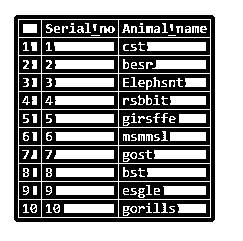
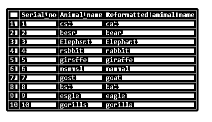
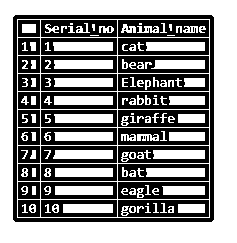
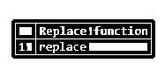
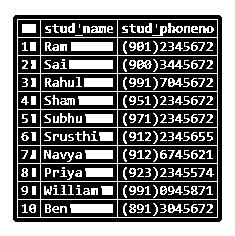
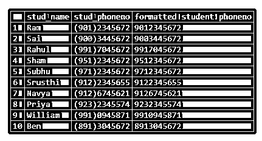
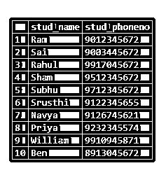

# SQL Server 替换

> 原文：<https://www.educba.com/sql-server-replace/>

## SQL Server Replace 简介

Replace 函数用于替换您指定的子字符串的所有匹配项。通常我们在替换函数中指定三个参数。

**1)实际 _ 字符串**

<small>Hadoop、数据科学、统计学&其他</small>

2)旧子串

3)新的子串。

这里的 Actual_string 类似于您希望更改发生的字符串。Old_substring 是您要将其更改为 New_substring 的 Actual_string 子串。

我们还可以在数据库列中执行替换操作。我们需要指定需要用 New_substring 替换的必需列。

在本节课中，我们将学习一些东西，比如“替换功能”的使用方式和位置。

**语法:**

现在让我们看看替换函数的语法:

`replace(Actual_string, Old_substring, New_substring)`

如果我们想对数据库表的列执行操作，现在让我们看看 replace 函数的语法:

`replace(column_name, Old_substring, New_substring)`

### 如何在 SQL Server 中使用 Replace？

现在让我们看看替换函数在 SQL server 中是如何工作的:

`select replace('Sunction','S','F')as "Replace function";`

**输出:**

现在让我们用某个特定的字符串替换这个列。需要记住的是，如果你在一列中指定了一个替换函数，那么整列都将被替换为上面提到的字符串。

让我们创建一个包含默认数据的表，并在一列中执行替换功能。

**表格创建:**

`create table replace_test
(
Serial_no int,
Animal_name varchar(20)
)`

**将数据插入表格:**

`insert into replace_test values ( 1,'cst');
insert into replace_test values ( 2,'besr');
insert into replace_test values ( 3,'Elephsnt');
insert into replace_test values ( 4,'rsbbit');
insert into replace_test values ( 5,'girsffe');
insert into replace_test values ( 6,'msmmsl');
insert into replace_test values ( 7,'gost');
insert into replace_test values ( 8,'bst');
insert into replace_test values ( 9,'esgle');
insert into replace_test values ( 10,'gorills');
select * from replace_test;`

**输出:**

在上表中，我们插入了包含“a”字符串的动物名称。但是我们把 a 和 s 放错了位置。

例如:- Cat ->cst

Bear ->besr 等等。现在让我们将“animal_name”列中的子字符串“s”替换为“a”。

`select *, Replace(animal_name,'s','a') as "Reformatted animal name" from replace_test;`

**输出:**

从上面的输出中，我们可以观察到‘s’被‘a’替换了。

要更新列值，我们可以执行以下操作:

`update replace_test
set Animal_name = replace( animal_name,'s','a');
select * from replace_test;`

现在我们已经用所需的替换更新了动物替换列。让我们看看数据更新了。更新后的数据输出应如下所示:-

**输出:**

我们可以看到表中的数据也被更新了。

Replace 函数不区分大小写。因此 S 和 S 是相同的。让我们看一个同样的例子。

`select replace('Sassal','S','m')as "Replace function";`

上面的例子是把“s”替换成“m”。因为 replace 不区分大小写，所以所有的' s '字符串都将被替换为' m '。

**输出:**

### 例子

现在让我们考虑替换函数及其输出的几个例子，如下所示

#### 示例#1

`select replace('repldce','d','a')as "Replace function";`

**输出:**

#### 实施例 2

现在让我们考虑学生的表格以及他们的电话号码。

**表格创建:**

`create table replace_test_student
(
stud_name varchar(20),
stud_phoneno varchar(20)
);`

`Insert data into the table:
insert into replace_test_student values ('Ram','(901)2345672');
insert into replace_test_student values ('Sai','(900)3445672');
insert into replace_test_student values ('Rahul','(991)7045672');
insert into replace_test_student values ('Sham','(951)2345672');
insert into replace_test_student values ('Subhu','(971)2345672');
insert into replace_test_student values ('Srusthi','(912)2345655');
insert into replace_test_student values ('Navya','(912)6745621');
insert into replace_test_student values ('Priya','(923)2345574');
insert into replace_test_student values ('William','(991)0945871');
insert into replace_test_student values ('Ben','(891)3045672');
select * from replace_test_student;`

**输出:**

现在让我们用 none 代替'('和')'。

`select *,replace(replace(stud_phoneno,'(',''),')','') as "formatted student phoneno" from replace_test_student;`

**输出:**

要将更改更新到表格中:

`update replace_test_student
set stud_phoneno = replace(replace(stud_phoneno,'(',''),')','');
select * from replace_test_student;`

**输出:**

### 推荐文章

这是 SQL Server 替换指南。这里我们讨论一下简介，语法，如何在 SQL Server 中使用 Replace？和代码实现示例。您也可以看看以下文章，了解更多信息–

1.  [SQL NULLIF()](https://www.educba.com/sql-nullif/)
2.  [SQL 行号](https://www.educba.com/sql-row_number/)
3.  [SQL NTILE()](https://www.educba.com/sql-ntile/)
4.  [MySQL 回合](https://www.educba.com/mysql-round/)

