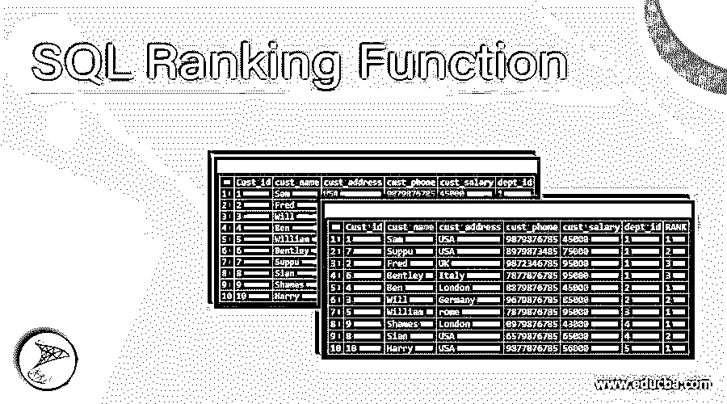
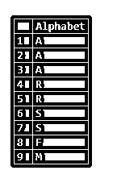
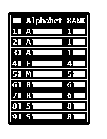
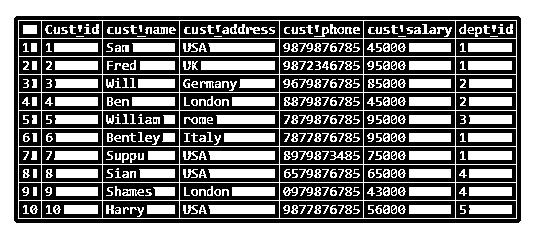
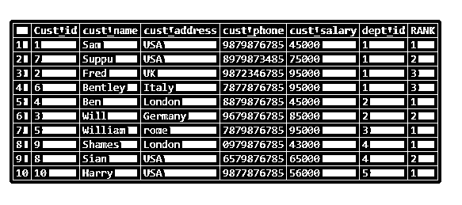
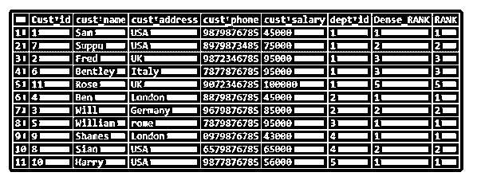

# SQL 排名函数

> 原文：<https://www.educba.com/sql-ranking-function/>

## SQL 排名函数介绍

秩函数属于 windows 函数。它通常在 SQL 中为结果集的分区集中的每一行分配一个等级。如果分区的行具有相同的值，那么我们会收到匹配记录的相同等级。

我们使用 Rank 函数来获得基于分区条件的最新值。

<small>Hadoop、数据科学、统计学&其他</small>

`RANK() OVER ( [PARTITION BY partition_expression, ... ] ORDER BY sort_expression [ASC | DESC], ... )`

在上面的语法中，我们可以说基于表达式的 **partition，行集合被划分为 partition by expression 的结果集合，函数将被应用。**

Order by 用于按升序或降序对每个分区中的行进行逻辑排序。

**语法:**

`RANK() OVER ( [PARTITION BY partition_expression, ... ] ORDER BY sort_expression [ASC | DESC], ... )`

### SQL 中的排名函数是如何工作的？

让我们创建一个表并应用 Rank 函数来看看它是如何工作的:

`create table test_rank_fun
(
Alphabet varchar(10)
);`

现在让我们插入一些重复的值如下，并应用等级。

`insert into test_rank_fun values ('A');
insert into test_rank_fun values ('A');
insert into test_rank_fun values ('A');
insert into test_rank_fun values ('R');
insert into test_rank_fun values ('R');
insert into test_rank_fun values ('S');
insert into test_rank_fun values ('S');
insert into test_rank_fun values ('F');
insert into test_rank_fun values ('M');`

现在让我们选择上表。

`SELECT * FROM test_rank_fun;`

**输出:**

以上是表 test_rank_fun 的输出。现在让我们在“test_rank_fun”表上应用 rank 函数。这里不需要在“字母表”列上应用划分，而是在“字母表”列上应用升序。让我们看看在表上应用 partition 和不应用 partition by 会发生什么。

通过以下方式应用分区:

`SELECT Alphabet, RANK() OVER (PARTITION BY Alphabet ORDERBY Alphabet)as RANK
FROM test_rank_fun;`

**输出:**

这里，当我们在字母表列上应用 partition by 时，所有的字母表都被考虑在相同的划分结果中，导致相同的等级。

现在让我们只应用“字母表”列上的顺序。相同字母表被认为在相同的逻辑分区中，并被赋予相同的值。

`SELECT Alphabet, RANK() OVER (ORDER BY Alphabet)as RANK
FROM test_rank_fun;`

**输出:**

### 例子

现在让我们考虑一个实时例子，应用秩函数并检查输出:-

让我们创建一个表“test_rank_customer ”,其中包含列 cust_id、cust_name、cust_address、cust_phone、cust_salary，如下所示:–

`create table test_rank_customer
(
Cust_id int,
cust_name varchar(20),
cust_address varchar(20),
cust_phone varchar(10),
cust_salary int,
dept_id int
);`

让我们在上表中插入几行，如下所示，并应用等级函数:

`insert into test_rank_customer values (1,'Sam','USA','9879876785', 45000,1);
insert into test_rank_customer values (2,'Fred','UK','9872346785', 95000,1);
insert into test_rank_customer values (3,'Will','Germany','9679876785', 85000,2);
insert into test_rank_customer values (4,'Ben','London','8879876785', 45000,2);
insert into test_rank_customer values (5,'William','rome','7879876785', 95000,3);
insert into test_rank_customer values (6,'Bentley','Italy','7877876785', 95000,1);
insert into test_rank_customer values (7,'Suppu','USA','8979873485', 75000,1);
insert into test_rank_customer values (8,'Sian','USA','6579876785', 65000,4);
insert into test_rank_customer values (9,'Shames','London','0979876785', 43000,4);
insert into test_rank_customer values (10,'Harry','USA','9877876785', 56000,5);`

现在让我们看看表中的行:

`select * from test_rank_customer;`

现在让我们在表“测试等级客户”中应用等级函数。

`select*,RANK() OVER (PARTITION BY dept_id order by cust_salary) AS RANK
from test_rank_customer;`

在这里，如果我们检查结果集，则基于“dept_id”列应用分区，基于“cust_salary”应用 order by。因此,“dept_id”的所有相同值将被一起分区，并在其上应用顺序。然后最后应用等级函数。

现在让我们来谈谈结果集中突出显示的部分。突出显示的部分属于“dept _ id”= 1。这里我们可以看到订单是由“客户薪资”完成的。如果您观察到 Fred 和 Bentley 的“95000”薪金是相同的，因此分配的级别不会不同，而薪金的其余部分是唯一的，级别也相应地分配。

上图中，弗雷德和本特利的工资是 95000 卢比。因此，等级被指定为 3。如果我们的薪金高于 95000，假设 dept_id = 1 中的薪金为 100000，则为薪金分配的等级是 5，而不是 4。而在 Dense_rank 中，我们将等级指定为 4 而不是 5。

我们在下表中插入了另一行，以显示 dense_rank 和 rank 函数的区别:

`insert into test_rank_customer values (11,'Rose','UK','9072346785', 100000, 1);
select*,RANK() OVER (PARTITION BY dept_id order by cust_salary) AS Dense_RANK, RANK() OVER (PARTITION BY dept_id order by cust_salary) AS RANK from test_rank_customer;`

**输出:**

### 结论

秩函数属于 windows 函数。它通常在 SQL 中为结果集的分区集中的每一行分配一个等级。如果分区的行具有相同的值，那么我们将收到相同的匹配记录的等级，随后的数字将被忽略，下一个数字被指定为下一个等级。

需要知道哪些列需要在分区 by 列中指定

### 推荐文章

这是一个 SQL 排序函数的指南。这里我们讨论一下 SQL 中的排名函数是如何工作的？带有示例及其代码实现。您也可以看看以下文章，了解更多信息–

1.  [SQL NULLIF()](https://www.educba.com/sql-nullif/)
2.  [SQL 行号](https://www.educba.com/sql-row_number/)
3.  [SQL NTILE()](https://www.educba.com/sql-ntile/)
4.  [SQL DENSE_RANK()](https://www.educba.com/sql-dense_rank/)

