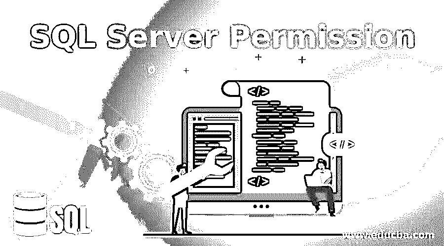
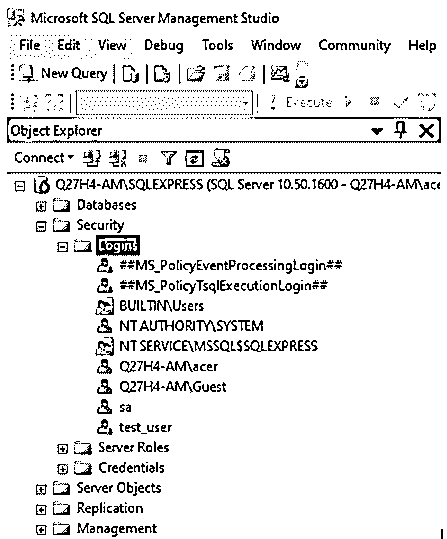
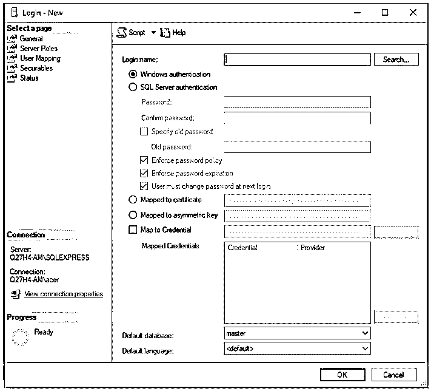
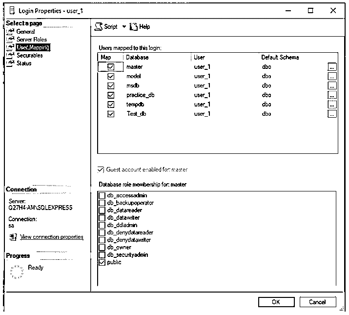
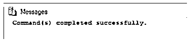
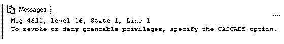

# SQL Server 权限

> 原文：<https://www.educba.com/sql-server-permission/>

## SQL Server 权限简介

SQL Server 有 230 多个权限可以授予主体。原则是指不同的登录、用户组和服务器角色。权限范围从允许用户创建、更改或修改数据库对象到限制用户只能从中选择。管理员可以使用这些权限，并根据需要授予、撤销或拒绝各种用户登录、组或服务器的权限。SQL SERVER 中的这些权限有助于维护数据库的安全性。

以下是 SQL Server 中的一些数据库级权限:

<small>Hadoop、数据科学、统计学&其他</small>

*   **创建数据库:**这是数据库级别的权限，允许用户创建或恢复数据库。该权限只能在 master 数据库中授予。
*   **修改任何< >** :有了这个权限，用户可以修改任何应用角色、列、键、数据库触发器、安全策略、数据库名称等。该权限通常授予数据库管理员。
*   **创建< >** :是允许用户创建<函数、过程、表格、集合、规则>等的权限。在数据库里。
*   **DELETE | EXECUTE | INSERT | SELECT | REFERENCES | UPDATE**:这是数据库所有者或管理员可以授予用户的少数权限。它们适用于数据库中的模式级对象。
*   **备份数据库|日志|检查点**:这种权限允许用户备份数据库、创建检查点等。他们通常被分配给备份操作员和其他值得信任的角色。
*   **控制数据库**:这个权限是最关键的，默认只有 db_owner 才有这个权限。它允许所有者删除数据库。

必须注意，SQL Server 中的 db_owner 角色默认情况下拥有数据库的所有权限。这很直观，因为你是所有者，你应该拥有所有的权限。到目前为止，我们对 SQL Server 中的权限已经有了大致的了解。您脑海中一定会出现的另一件事是，谁管理所有这些权限，它们是如何被授予或取消的？你会找到所有这些问题的答案，坚持到本文结束。

如果您创建了数据库，您就是所有者，整个控制权在您手中。你想给谁许可由你决定。您还可以通过授予其他用户一些顶级权限，将管理权限的任务委托给他们。在 SQL Server 中，我们有三个命令，即 GRANT、REVOKE 和 DENY，让管理员或所有者管理权限。以下是这三个命令的语法。

### 语法和参数

sql server 权限的语法和参数如下所示:

#### 授予权限语法

`GRANT <permission>
ON  database_object
TO role
[WITH GRANT OPTION];`

上述语法中使用的参数如下:

*   **权限:**提及创建、执行、删除、修改、更新等权限。您希望授予 user_role 的权限。
*   **database_object:** 指定数据库对象，如数据库表名、模式名等。必须在其上授予权限。
*   **role:** 这里的 role 是指必须被授予上述权限的用户登录、组或主体。
*   **【WITH GRANT OPTION】:**该选项表示该用户角色可以进一步将上述任何权限授予其他用户。基本上是将他的权限委托或分享给其他人。

#### 撤销权限语法

`REVOKE<Permission>
ON database_object
TO role
CASCADE;`

上述语法中使用的参数与 GRANT 语法中提到的参数非常相似。

#### 拒绝权限语法

`DENY <Permissions>
ON database_object
TO role
CASCADE;`

最后两个语法中的 CASCADE 关键字表示将从该用户授予权限的其他用户那里收回权限。

### SQL Server 权限的示例

为了举例说明 SQL Server 权限，我们需要创建一个虚拟用户。姑且称之为“用户 _1”。可以通过以下方式创建用户。

**步骤 1:** 转到 SQL server 的安全部分，右键单击登录。

**步骤 2:** 在对话框中填写所有必需的详细信息，创建一个新的登录帐户。

**步骤 3:** 创建完登录后，不要忘记使用“用户映射”来映射新用户。

我们都设置了授予、撤销和拒绝该用户的权限。

#### 示例#1

向用户授予 select 权限的 SQL 查询。

`GRANT SELECT ON [master].[dbo].[Account_details] TO user_1
WITH GRANT OPTION;`

#### 实施例 2

撤销用户 select 权限的 SQL 查询。

`REVOKE SELECT ON [master].[dbo].[Account_details] TO user_1;`

我们出错了。是的，因为当我们授予该用户 SELECT 权限时，我们使用[WITH GRANT OPTION]授予了它。所以，是的，我们也必须撤销它。

`REVOKE SELECT ON [master].[dbo].[Account_details] TO user_1
CASCADE;`

#### 实施例 3

向用户授予 ALTER 权限的 SQL 查询。

`GRANT ALTER ON [master].[dbo].[Account_details] TO user_1;`

#### 实施例 4

拒绝授予用户 ALTER 权限的 SQL 查询。

`DENY ALTER ON [master].[dbo].[Account_details] TO user_1;`

### 推荐文章

这是 SQL Server 权限指南。在这里，我们还将讨论 sql server 权限的语法和参数，以及不同的示例及其代码实现。您也可以看看以下文章，了解更多信息–

1.  [SQL DATEPART()](https://www.educba.com/sql-datepart/)
2.  [MySQL 偏移量](https://www.educba.com/mysql-offset/)
3.  [SQL 窗口函数](https://www.educba.com/sql-window-functions/)
4.  [SQL 用户](https://www.educba.com/sql-users/)

