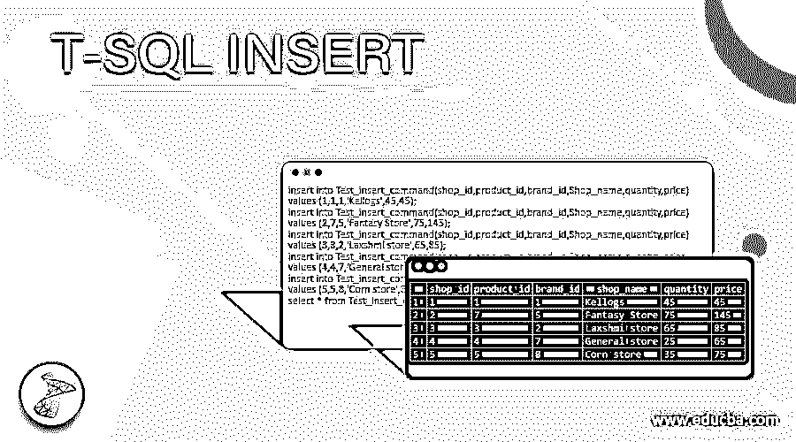
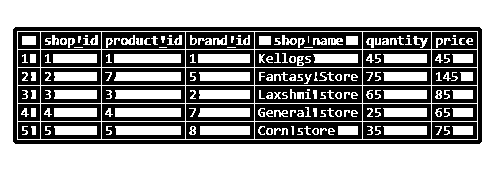
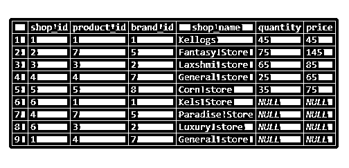
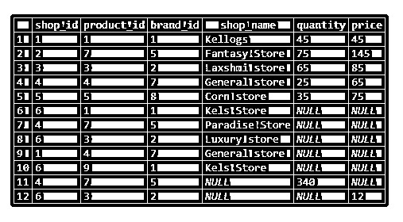
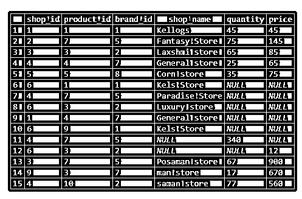
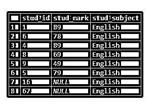

# T-SQL 插入

> 原文：<https://www.educba.com/t-sql-insert/>

## T-SQL INSERT 简介

T-SQL 是一种 Transact SQL。它是 SQL 语言的扩展。与 SQL 类似，T-SQL 中也有数据类型、函数、索引和过程概念。这是微软的产品。SQL 代表结构化查询语言。SQL(结构化查询语言)是所有 RDBMS 通用的。

结构化查询语言(SQL)是数据库的中间交互。我们使用命令从数据库中获取数据。它具有插入、选择、删除、丢弃、截断以及其他与数据操作相关的命令。

<small>Hadoop、数据科学、统计学&其他</small>

SELECT 命令根据条件从一个或多个表中选择数据。插入命令用于将数据插入表中。Delete 命令用于根据条件从表中删除指定的行。Drop 是完全删除表和模式，我们也可以使用 Truncate 命令删除所有行。在 Truncate 命令的情况下，表模式不会从数据库中删除。

**语法:**

让我们考虑一下 T-SQL 中的 Insert 命令语法；–因为 T-SQL insert 是 SQL 语言的扩展，所以语法与 SQL 相似。

我们有两种方法可以确定它们，如下所述:

**1。** `INSERT INTO TABLE_NAME [(column_name1, column_name2, column_name3,...column_nameN)] VALUES (col1_value, col2_value, col3_value,...colN_value);`

上面我们也确定了列列表，如果我们不指定列并插入它，则值为“NULL”

2.`INSERT INTO TABLE_NAME VALUES (col1_value, col2_value, col3_value,...colN_value);`

以上语法所有的列数据都应该匹配，否则将会抛出错误。

### 如何在 T-SQL 中完成插入？

现在让我们考虑上述两种语法，并尝试插入到表中。

1.`INSERT INTO TABLE_NAME [(column_name1, column_name2, column_name3,...column_nameN)] VALUES (col1_value, col2_value, col3_value,...colN_value);`

让我们创建一个表，使用上面的语法格式并将数据插入表中:–

`create table Test_insert_command
(
shop_id int,
product_id int,
brand_id int,
Shop_name varchar(20),
quantity int,
price int
);`

现在让我们将数据插入表中:

`insert into Test_insert_command(shop_id,product_id,brand_id,Shop_name,quantity,price)
values (1,1,1,'Kellogs',45,45);
insert into Test_insert_command(shop_id,product_id,brand_id,Shop_name,quantity,price)
values (2,7,5,'Fantasy Store',75,145);
insert into Test_insert_command(shop_id,product_id,brand_id,Shop_name,quantity,price)
values (3,3,2,'Laxshmi store',65,85);
insert into Test_insert_command(shop_id,product_id,brand_id,Shop_name,quantity,price)
values (4,4,7,'General store',25,65);
insert into Test_insert_command(shop_id,product_id,brand_id,Shop_name,quantity,price)
values (5,5,8,'Corn store',35,75);
select * from Test_insert_command;`

在上面的 insert 语句中，我们给出了所有的值并插入到表中。结果将如下所示:

现在让我们只传递几个列数据，并查看输出:

`insert into Test_insert_command(shop_id,product_id,brand_id,Shop_name)
values (6,1,1,'Kels Store');
insert into Test_insert_command(shop_id,product_id,brand_id,Shop_name)
values (4,7,5,'Paradise Store');
insert into Test_insert_command(shop_id,product_id,brand_id,Shop_name)
values (6,3,2,'Luxury store');
insert into Test_insert_command(shop_id,product_id,brand_id,Shop_name)
values (1,4,7,'General store');
select * from test_insert_command;`

**输出:**

因为在 quantity、price 列中没有插入数据，所以插入的值为 NULL。

现在让我们改变顺序并插入数据。

`insert into Test_insert_command(shop_id,brand_id,Shop_name,product_id)
values (6,1,'Kels Store',9);
insert into Test_insert_command(shop_id,product_id,brand_id, quantity)
values (4,7,5,340);
insert into Test_insert_command(shop_id,product_id,brand_id, price)
values (6,3,2,12);
select * from test_insert_command;`

现在让我们以下面的格式插入:

**语法:**

`INSERT INTO TABLE_NAME VALUES (col1_value, col2_value, col3_value,...colN_value);`

**查询:**

`insert into test_insert_command values(3, 7, 5,'Posaman store', 67, 900);
insert into test_insert_command values(9, 3, 7,'man store', 17, 670);
insert into test_insert_command values(4, 10, 2,'saman store', 77, 560);
select * from test_insert_command;`

**输出:**

### 例子

现在让我们来看看 insert 命令的另一个例子:

`create table test_insert
(
stud_id int,
stud_mark int,
stud_subject varchar(10)
);`

**1。将数据插入表格:**

`insert into test_insert(stud_id,stud_mark,stud_subject)values (1, 89,'English');
insert into test_insert(stud_id,stud_subject,stud_mark)values (6,'English', 78);
insert into test_insert(stud_subject,stud_id,stud_mark)values ('English', 4, 89);
insert into test_insert values (8, 69,'English');
insert into test_insert values (9, 49,'English');
insert into test_insert values (5, 79,'English');`

让我们再插入几行，并对上表执行 Select 语句:

`insert into test_insert(stud_id,stud_subject)values (16,'English');
insert into test_insert(stud_subject,stud_id)values ('English', 67);
select * from test_insert;`

### 结论

T-SQL 是一种 Transact SQL(结构化查询语言)。它是 SQL 语言(结构化查询语言)的扩展。与 SQL 类似，T-SQL 中也有数据类型、函数、索引和过程概念。这是微软的产品。SQL 代表结构化查询语言。SQL(结构化查询语言)是所有 RDBMS 通用的。

### 推荐文章

这是一个 T-SQL 插入指南。这里我们讨论介绍，语法，如何在 T-SQL 中插入？和代码实现示例。您也可以看看以下文章，了解更多信息–

1.  [SQL NULLIF()](https://www.educba.com/sql-nullif/)
2.  [SQL 行号](https://www.educba.com/sql-row_number/)
3.  [SQL NTILE()](https://www.educba.com/sql-ntile/)
4.  [SQL DENSE_RANK()](https://www.educba.com/sql-dense_rank/)

