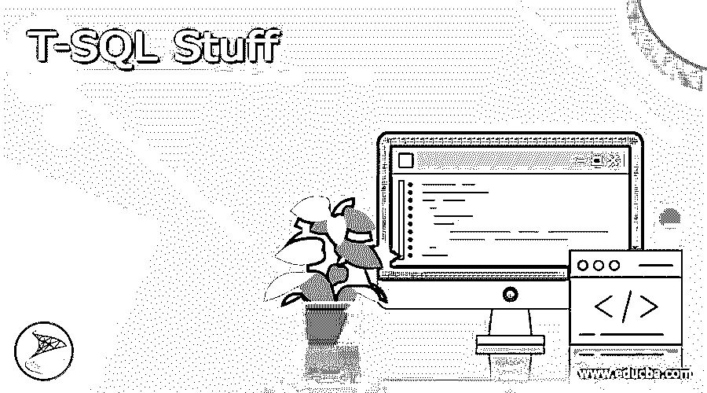
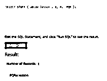
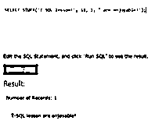
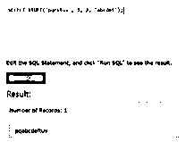
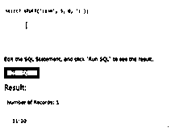
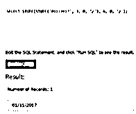

# T-SQL 的东西

> 原文：<https://www.educba.com/t-sql-stuff/>




## T-SQL 材料介绍

T-SQL stuff 的定义是，它是一个函数，可以删除字符串的一部分，然后可以将另一部分添加到字符串中，这可以从特定的状态开始，它可以删除第一个字符串中的特定跨度，然后在开始状态之后，它可以在第一个字符串中添加第二个字符串，它可以接受四个参数，“字符串”可以修改， “start”是字符串中开始移除字符的状态，length 是从字符串中移除的字符数，new_string 是可以在开始状态添加的字符串。

### 什么是 T-SQL 的东西？

STUFF()是一个函数，可用于删除字符串的一部分，并从 T-SQL 中提供的起始位置添加新的子字符串，该函数可以执行任务，因为它可以更改日期或时间格式，也可以从给定的字符串中添加或删除字符数，因为它可以接受四个参数，通过这些参数我们可以提供输入字符串。 我们可以从中删除字符串的起始位置，我们也可以给出长度，它可以说明我们需要从字符串中删除多少字符，如果我们提供了字符数据类型支持的字符串，它可以返回字符串，如果提供的字符串受二进制数据类型支持，它将返回二进制数据。

<small>Hadoop、数据科学、统计学&其他</small>

### 使用 T-SQL 材料()

我们可以利用 STUFF()函数来执行以下任务，

*   为了从字符串中删除字符，我们必须使用 length 参数替换集合字符，但是如果我们使用了零替换，那么它将不允许从字符串中删除字符。
*   我们必须识别字符串中的开始阶段，从那里我们可以得到字符的数量，这可以借助于我们需要删除的长度参数来描述。
*   我们还必须为新参数中需要的字符串定义替换，以便新字符串可以在开始状态更新。
*   正如我们所知，STUFF()函数的语法也在下面给出，

```
“STUFF (origin_string, begin, length, add_string)”
```

因此，让我们看看这个函数如何删除起始位置为“1”的零字符，

```
DECLARE @origin_string VARCHAR(50);
SET @origin_string = 'SQL Server';
SELECT STUFF(@origin_string, 1, 0, 'Windows') AS 'STUFF function';
```

*   因此，在上面的例子中，我们使用了 VARCHAR 数据类型的变量，在字符串中，我们必须在不删除任何记录的情况下将“Windows”word 填充到“1”位置。
*   通过使用 STUFF()，我们可以将一个字符串添加到另一个字符串中，还可以转换日期和时间格式。
*   我们还可以删除或删减特定的字符串，插入其他字符串也可以通过使用 STUFF()函数来完成。

### T-SQL STUFF()函数

在 T-SQL 中，STUFF()函数用于从起始字符串中移除字符段，之后，它可以在源字符串中添加可以从特定位置开始的一系列字符，其中我们可以说 STUFF()函数已经被用于从起始字符串中移除一系列给定长度的字符，并从特定起始索引添加给定的一系列字符。

**语法:**

```
STUFF(origin_string, begin, length, add_string)
```

在哪里，

*   origin_string:是要修改的源字符串。
*   begin:它是一个字符串中开始删除某些字符的状态。
*   length:它是一个整数值，可以描述要删除的字符数，如果 length 的值为负，则返回一个空字符串。
*   add_string:与字符数据相关的表达式，其值可以是常量、变量或列，可以在字符串的起始位置添加一个新的字符串。

### T-SQL 材料示例

下面给出了一些使用 STUFF()函数的例子，

*   让我们看看从给定的字符串中删除 4 个字符的例子，这可以从第一个位置开始，在这之后，我们给出了可以添加到位置 1 的文本“PQR ”,

```
SELECT STUFF ('abcde lesson', 1, 4, 'PQR');
```

**输出:**




*   现在，我们将看到一个示例，从位置 12 开始的给定字符串中删除 1 个字符，然后我们必须添加字符串“令人愉快”，

```
SELECT STUFF ('T-SQL lesson!', 13, 1, ' are enjoyable!');
```

**输出:**




*   通过从第一个字符串“pqrstuv”中删除 2 个字符，并从“r”处的位置“3”开始，在删除点添加第二个字符串，可以返回一个字符串。

```
SELECT STUFF ('pqrstuv', 3, 2, 'abcdef');
```

**输出:**




*   示例在 STUFF()函数的帮助下，将时间从 HHMM 转换为 HH: MM，

在这个例子中，我们使用了 STUFF()函数在时间中心添加':'(冒号)，格式为 HH: MM，它将返回格式为 HH:MM 的时间值。

```
SELECT STUFF ('1130', 3, 0, ':');
```

**输出:**




*   示例借助 STUFF()函数将日期格式从 MMDDYYYY 转换为 MM/DD/YYYY，

在本例中，我们使用了两次 STUFF()函数来转换格式，如给定语句所示。

```
SELECT STUFF (STUFF ('01112017', 3, 0, '/'), 6, 0, '/');
```

**输出:**




### 结论

在本文中我们得出结论，T-SQL 的 STUFF()函数能够删除一段字符串，在这之后，它可以添加到另一段字符串中的特定位置，我们也看到了使用 STUFF()函数的例子，所以本文。

### 推荐文章

这是 T-SQL 的指南。这里我们讨论介绍，什么是 T-SQL 的东西，以及代码实现的例子。您也可以看看以下文章，了解更多信息–

1.  [T-SQL 插入](https://www.educba.com/t-sql-insert/)
2.  [T-SQL 字符串函数](https://www.educba.com/t-sql-string-functions/)
3.  [什么是 T-SQL？](https://www.educba.com/what-is-t-sql/)
4.  [T-SQL 命令](https://www.educba.com/t-sql-commands/)


