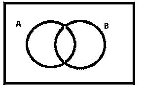
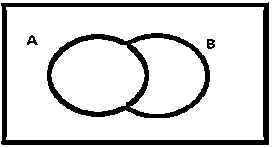
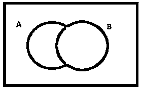
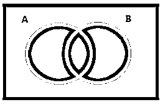
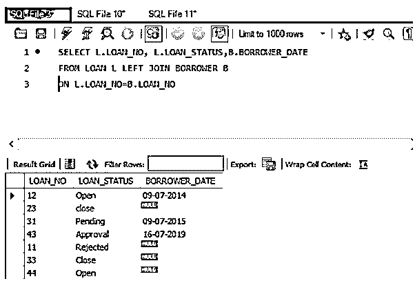
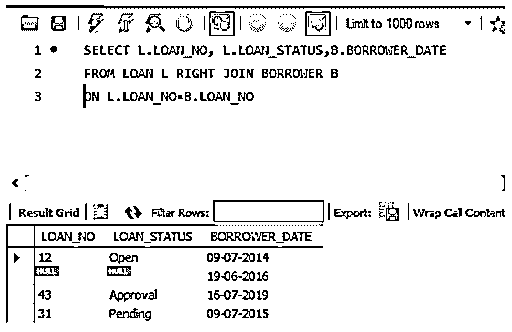
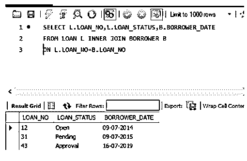
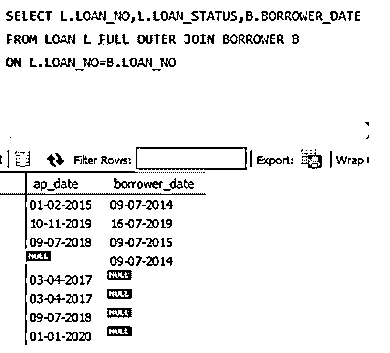

# SQL 中的联接查询

> 原文：<https://www.educba.com/join-query-in-sql/>

## SQL 中的连接查询介绍

在下面的部分，让我们看看什么是连接和不同类型的连接的例子。

什么是连接？

<small>Hadoop、数据科学、统计学&其他</small>

联接用于从多个表中获取数据。要连接多个表，我们需要两个表中至少有一个公共列。基于指定的条件连接表。使用了“ON”关键字。SQL 中有如下不同类型的连接。

### 不同类型的联接

*   内部连接
*   左连接
*   右连接
*   完全连接

#### 1.内部连接

内部联接根据指定的条件获取两个表中的所有公共行。让我们以内部连接为例。

**举例:**

下面是内部连接的维恩图。

这里让我们考虑表 A 和表 b，因为内部连接考虑两个表的公共行。阴影区域表示两个表的公共行。

**语法:**

`SELECT * FROM TABLE_A A
INNER JOIN TABLE_B B
ON A. Common_COLUMN =B. Common_COLUMN`

#### 2.左连接

Left Join 获取左表中的所有行和两个表中的公共行。让我们以左连接为例。

**举例:**

下面是左连接的维恩图。

在下面的图表中，表 A 与表 b 左连接。在这里，表 A 中的所有行都被考虑，并且是两个表中的公共行。

**语法:**

`SELECT * FROM TABLE_A A
LEFT JOIN TABLE_B B
ON A. Common_COLUMN =B. Common_COLUMN`

#### 3.右连接

Right Join 获取右表中的所有行和两个表中的公共行。让我们举一个正确连接的例子。

**举例:**

下面是右连接的维恩图。

在下面的图表中，表 A 与表 B 右连接。在这里，表 B 中的所有行都被考虑，并且是两个表中的公共行。

**语法:**

`SELECT * FROM TABLE_A A
RIGHT JOIN TABLE_B B
ON A.Common_COLUMN=B.Common_COLUMN`

#### 4.完全连接

完全联接从两个表中获取所有行。让我们举一个正确连接的例子。

**举例:**

下面是完全连接的维恩图。

**语法:**

`SELECT * FROM TABLE_A A
FULL JOIN TABLE_B B
ON A. Common_COLUMN =B. Common_COLUMN`

结果集包含空集值。以下语法可用于忽略空值:–

`SELECT * FROM TABLE_A A
FULL JOIN TABLE B B
ON A. Common_COLUMN =B. Common_COLUMN
WHERE A.Common_COLUMN IS NULL
AND A.Common_COLUMN IS NULL`

### 举例说明如何在 SQL 中使用连接查询

这里我们用例子来讨论连接查询的用法:

#### 1.左连接

左连接=左表中的所有行+内部连接

**举例:**

让我们考虑两个表，并对这两个表应用左连接:-

**贷款表**:

| **贷款 _ 编号** | **贷款 _ 状态** | **状态** | **贷款 _ 金额** | **Ap_Date** |
| Twelve | 打开 | 兰契 | Thirty thousand | 01-02-2015 |
| Twenty-three | 关闭 | 巴特那 | Fifty thousand | 03-04-2017 |
| Thirty-one | 悬而未决的 | 加尔各答 | Eighty thousand | 09-07-2018 |
| Forty-three | 同意 | 电子城 | Fifty-four thousand | 10-11-2019 |
| Eleven | 拒绝 | 班加罗尔 | Forty-three thousand | 03-04-2017 |
| Thirty-three | 关闭 | 巴特那 | Ninety thousand | 09-07-2018 |
| Forty-four | 打开 | 加尔各答 | Sixty-seven thousand | 01-01-2020 |

**借款人表:**

| **贷款 _ 编号** | **借款人姓名** | **借款人 _ 日期** | **银行 id** |
| Twelve | 随机存取存储器(random access memory 的缩写)ˌ随机访问内存(random-access memory 的缩写) | 09-07-2014 | 一流的 |
| Twenty-seven | 孙达尔 | 19-06-2016 | 主动脉第二声 |
| Forty-three | 棕色的 | 16-07-2019 | A4 号 |
| Thirty-one | Blacky | 09-07-2015 | 主动脉第二声 |

从两个表中查询贷款编号、状态和借款人日期:–

**查询:**

`SELECT L.LOAN_NO, L.LOAN_STATUS,B.BORROWER_DATE
FROM LOAN L LEFT JOIN BORROWER B
ON L.LOAN_NO=B.LOAN_NO`

让我们在对它们应用左连接后检查上表的输出。

**输出:**

#### 2.右连接

右连接=右表中的所有行+内部连接

**举例:**

让我们考虑两个表，并在表上应用右连接:-

从两个表中查询贷款编号、状态和借款人日期:–

**查询:**

`SELECT L.LOAN_NO, L.LOAN_STATUS,B.BORROWER_DATE
FROM LOAN L RIGHT JOIN BORROWER B
ON L.LOAN_NO=B.LOAN_NO`

在对它们应用了正确的连接之后，让我们检查一下上表的输出。

**输出:**

#### 3.内部连接

内部联接=两个表中的所有公共行。联接时，至少有一列应该是相同的数据类型，并且在表之间是公共的。

**举例:**

让我们考虑两个表，并对这两个表应用内部连接:-

让我们构建一个查询，从两个表中获取 loan_no、status 和借款日期:-

**查询:**

`SELECT L.LOAN_NO,L.LOAN_STATUS,B.BORROWER_DATE
FROM LOAN L INNER JOIN BORROWER B
ON L.LOAN_NO=B.LOAN_NO`

让我们在对它们应用内部连接后检查上表的输出。

**输出:**

在上面的输出中，我们根据条件“L.LOAN_NO=B.LOAN_NO”得到了两个表的公共行。

#### 4.完全外部连接

完全外部连接=两个表中的所有行。联接时，至少有一列应该是相同的数据类型，并且在表之间是公共的。

**举例:**

让我们考虑两个表，并在这两个表上应用完全外连接:-

让我们构建一个查询，从两个表中获取 ap_date 和借方日期:-

**查询:**

`SELECT L.LOAN_NO,L.LOAN_STATUS,B.BORROWER_DATE
FROM LOAN L FULL OUTER JOIN BORROWER B
ON L.LOAN_NO=B.LOAN_NO`

让我们在对它们应用内部连接后检查上表的输出。

**输出:**

在上面的输出中，我们根据条件“L.LOAN_NO=B.LOAN_NO”得到了两个表的公共行。

### 结论

为了获取与客户需求相关的数据，我们可能需要连接表，这将通过连接来实现。如前所述，连接用于从多个表中获取数据。要连接多个表，我们需要两个表中至少有一个公共列。基于指定的条件连接表。

### 推荐文章

这是一个在 SQL 中连接查询的指南。在这里，我们还讨论了简介和不同类型的连接，以及不同的例子和代码实现。您也可以看看以下文章，了解更多信息–

1.  [SQL DATEADD()](https://www.educba.com/sql-dateadd/)
2.  [SQL 重命名表](https://www.educba.com/sql-rename-table/)
3.  [SQL NULLIF()](https://www.educba.com/sql-nullif/)
4.  [MySQL 回合](https://www.educba.com/mysql-round/)

