# SQL Server 中的联接类型

> 原文：<https://www.educba.com/types-of-joins-in-sql-server/>

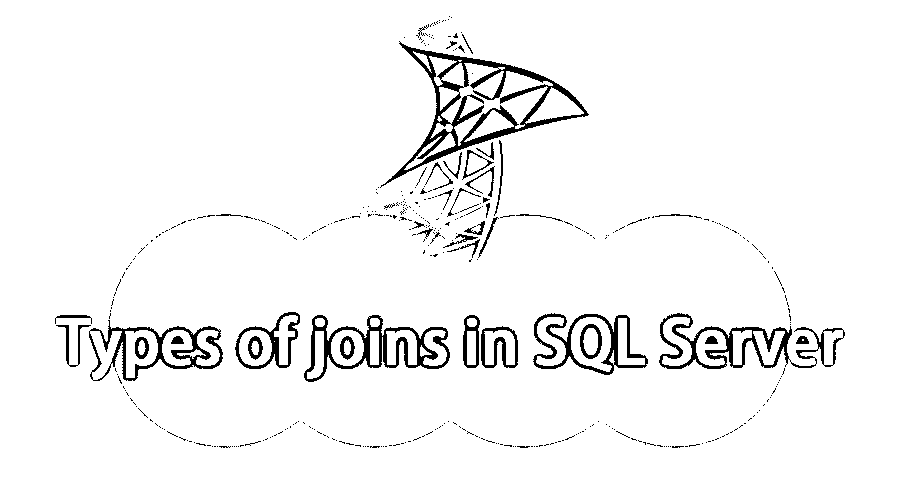

## SQL Server 中联接类型概述

连接是单个概念的类型，它允许使用 SQL 编程中定义的语法连接两个或多个表。通过存在于每个表中的相同或不同名称的公共字段来促进表的连接，并且基于通过 SQL 查询从表中提取的记录的数量和性质，将连接表征为各种类型，例如内部连接、左外部连接、右外部连接、完全外部连接和自外部连接等。在 SQL Server 中被称为联接类型。

### SQL Server 中的联接类型

有不同类型的连接

<small>Hadoop、数据科学、统计学&其他</small>

1.交叉连接

2.内部连接

3.外部连接

*   左外部连接
*   右外部联接

4.完全外部连接

5.自连接

让我们详细了解一下这些连接:-

#### 1.交叉连接

*   这是最简单的连接
*   它返回两个表中的所有行
*   无处条款
*   这也是最没用的
*   效率非常低
*   它创建了一个笛卡尔乘积
*   隐含交叉关键字

**例子**

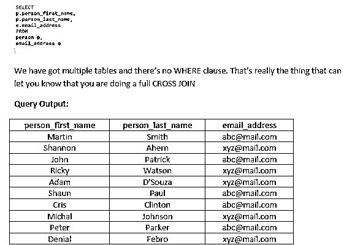

因此，第一个表中的每个人都使用第二个表中的每条数据，而不尝试任何匹配，所以这是您不想做的事情。

在有多个表但没有 where 子句的地方查找 FROM 子句。

#### 2.内部连接

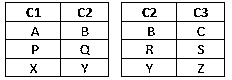

**查询输出:** 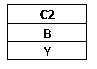

你的第一行和最后一行包含了 C2 的坐标值。中间的两排通常不相交。最后的最终结果提供了初始行和最后行的所有值，但不包括不匹配的中间部分行。

*   这是最典型的连接
*   这强调了数据库的关系性质
*   它允许我们将一个表中的列值与另一个表中的列值进行匹配。
*   其中一个表中的主键和另一个表中的[外键](https://www.educba.com/foreign-key-in-sql/)。

**例子**

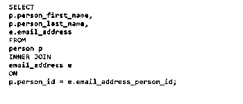

这里 p.person_id 是我们的 person 表中的主键，

email_address_person_id 是我们在电子邮件地址表中的外键。

**我们来看看人物表**

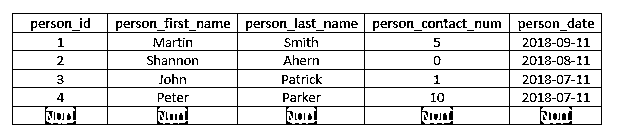

我们有四排。然后是电子邮件地址表中的所有匹配项。

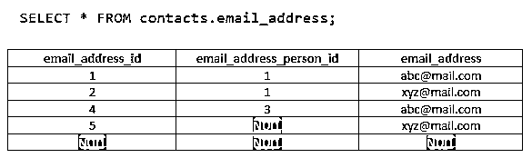

所以，最后，应该有三个人，因为我们已经有了 Shannon，他没有电子邮件地址

**查询输出:**

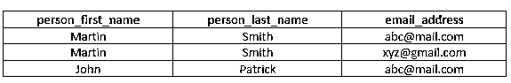

因此，我们只获取每个表中两列匹配的数据

#### 3.外部连接

*   内部联接不处理空值
*   即使在第二个表中没有匹配项，外部连接仍然有效。
*   如果第二个表中没有匹配项，则为空列
*   完全外部连接返回所有连接的行
*   在任一表中均不匹配时为空

##### 形容词（adjective 的缩写）左外部连接

**查询输出:** 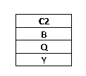

 You’re initial as well as, last rows have coordinating values involved with C2\. The center rows usually do not meet. The last end result could keep all rows of the first table but actually will leave out the un-matched row through the second table.

*   另一个与空值相关的连接
*   将返回左侧的所有行
*   不匹配的右侧表为空

**例子**

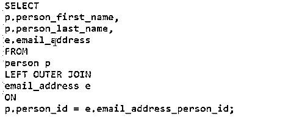

**查询输出:**

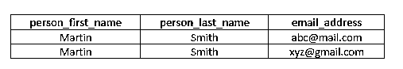

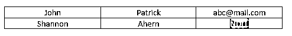

您注意到 Person 表中有一行在 email address 表中没有值。所以左外连接会给我们。

##### b.右外部联接

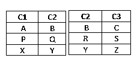

**查询输出:**

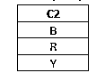

You’re initial as well as, last rows have coordinating values involved with C2\. The center rows usually do not meet. The last end result could keep all rows of the second table but actually will leave out the un-matched row through the first table.

*   与左外部联接相反
*   将返回右侧的所有行
*   不匹配的左侧表为空

**例题** 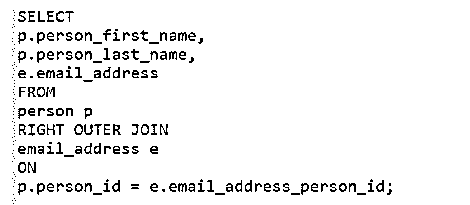

**Query Output:**

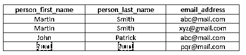

我们得到三个结果。这是我们的右外部连接结果，其中我们有来自电子邮件地址表的行，但在右边的表中没有对应的行。

#### 4.完全外部连接

**例题** 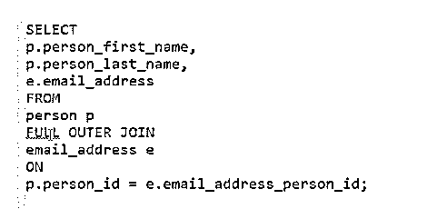

**查询输出:**

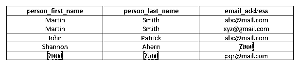

我们要合并左外连接和右外连接的结果

#### 5.自连接

*   自我不是关键词。这只是一个想法，你可以把一张桌子放在它自己身上
*   奇怪但有时有用
*   没有特殊语法
*   连接左侧和右侧的相同表
*   当表包含分层数据时很有用

**例子**

`SELECT *
FROM orders
JOIN subscriptions
ON orders.subscription_id = subscriptions.subscription_id;`

我们得到订单表和订阅表，并使用 SELECT all 列连接该表。

才能得到结果。

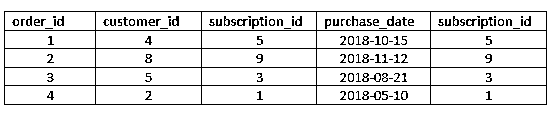

### 结论

连接是我们真正让关系模型变得生动的方式。关系模型是将数据分离出来，规范化到多个表中，但是当我们想要查看这些关系时，能够将数据重新组合在一起。不同类型的连接允许我们以稍微不同的方式来完成。

### 推荐文章

这是 SQL server 中连接类型的指南。在这里，我们讨论 SQL 中连接的概述和类型及其示例。您也可以浏览我们推荐的其他文章，了解更多信息——

1.  [什么是 SQL Server？](https://www.educba.com/what-is-sql-server/)
2.  [SQL Server 职业生涯](https://www.educba.com/careers-in-sql-server/)
3.  [PL SQL 培训](https://www.educba.com/software-development/courses/pl-sql-training/)
4.  [MySQL 操作符](https://www.educba.com/mysql-operators/)

