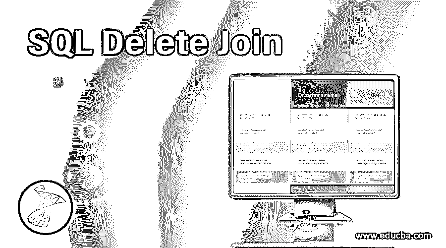
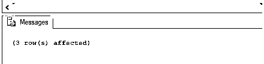
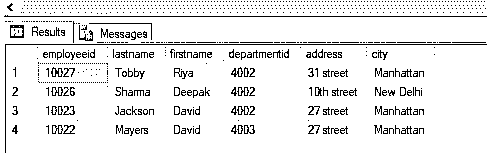
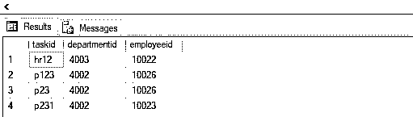
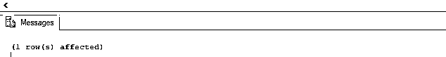
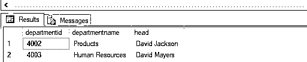
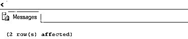
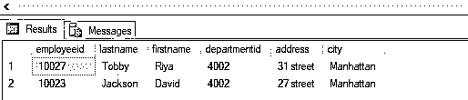

# SQL 删除连接

> 原文：<https://www.educba.com/sql-delete-join/>

## SQL 删除连接简介

DELETE JOIN 是一个高级的[结构化查询语言(SQL)](https://www.educba.com/what-is-sql/) 语句，用于在使用 SQL JOIN 时在多个表中执行删除操作，以便删除第一个表中的所有行和另一个表中的匹配行，或者基于查询中使用的连接操作的种类。它基本上是 DELETE 和 JOIN 语句的组合。在本文中，我们将学习四种类型的删除操作，即使用内部连接时删除、左连接、右连接和全连接。

### SQL 删除连接的语法和参数

以下是 Delete Join 及其参数的基本语法。

<small>Hadoop、数据科学、统计学&其他</small>

**语法 1:**

SQL Server 中删除联接的基本语法如下:

`DELETE t1
FROM table_name1 AS t1 JOIN {INNER, RIGHT,LEFT,FULL} table_name1 AS t2
ON t1.column_name = t2.column_name
WHERE condition;`

**语法 2:**

MySQL 中删除连接的基本语法如下:

`DELETE t1.*
FROM table_name1 AS t1 JOIN {INNER, RIGHT,LEFT, FULL} table_name1 AS t2
ON t1.column_name = t2.column_name
WHERE condition;`

**SQL 删除连接的参数**

语法中使用的不同参数是:

*   **删除 t1:** 用于从数据库中删除需要的表。这里，您可以从第一个表的实例 t1 和第二个表的实例 t2 中进行选择。
*   **FROM table _ name 1 as T1 JOIN table _ name 2 as T2:**用于指定要从哪个数据源取数和删除数据。这里，table_name1 是左表的名称，table_name2 是右表的名称。要加入，您可以选择内连接、左连接、全连接和右连接。
*   **ON T1 . column _ name = T2 . column _ name:**用于指定两个表连接的公共条件。它可以是一对主键和外键。
*   **其中条件:**用于指定过滤记录的条件。

上述参数中，除 WHERE 子句外的所有参数都是强制的。继续，我们将逐一详细了解删除连接。

### SQL 删除连接示例

以下是 SQL 删除连接的不同示例。

#### 使用内部联接删除

Delete with inner join 用于删除第一个表中的所有记录和第二个表中的所有匹配记录。为了更好地理解这个概念，我们将借助两个表，Employees(它包含所有雇员的个人详细信息)和 departments(它包含部门 id、名称及其 hod 等详细信息)。

该部门表格中的数据如下所示:

| **部门编号** | **部门名称** | **头** |
| Four thousand and one | 销售和营销 | 莉娜·克里希纳 |
| Four thousand and two | 制品 | 大卫·杰克逊 |
| Four thousand and three | 人力资源 | 大卫·迈尔斯 |

雇员表中的数据如下:

| **员工 id** | **姓氏** | **名字** | **部门编号** | **地址** | **城市** |
| Ten thousand and twenty-eight | １９８９．　贝克尔 | 托德 | Four thousand and one | 27 街 | 奥斯陆 |
| Ten thousand and twenty-nine | 丽贝卡(女子名ˌ寓意迷人的美) | 杜松子酒的 | Four thousand and one | 27 街 | 曼哈顿 |
| Ten thousand and twenty-seven | Tobby | 丽雅 | Four thousand and two | 31 街 | 曼哈顿 |
| Ten thousand and twenty-six | 夏尔马 | 迪帕克（男子名） | Four thousand and two | 第十街 | 新德里 |
| Ten thousand and twenty-four | 克利须那 | 丽娜 | Four thousand and one | 27 街 | 奥斯陆 |
| Ten thousand and twenty-three | 杰克逊 | 大卫 | Four thousand and two | 27 街 | 曼哈顿 |
| Ten thousand and twenty-two | 迈耶斯 | 大卫 | Four thousand and three | 27 街 | 曼哈顿 |

##### 示例 1–说明删除内部连接的 SQL 查询

假设在这个例子中，一家公司想要关闭“销售和营销”部门。它希望从公司的数据库中删除该部门的所有员工。你将如何执行这个操作？这可以通过编写多个子查询来完成，但我们将简单地通过编写一个 delete join 语句来完成。

**代码:**

`DELETE t1
FROM employees AS t1 INNER JOIN department AS t2
ON t1.departmentid = t2.departmentid
WHERE t2.departmentname = 'Sales & Marketing';`

**输出:**

我们可以使用 SELECT 语句检查销售和营销员工的所有信息是否已被成功删除。

**代码:**

`SELECT TOP 1000 [employeeid],
[lastname],
[firstname],
[departmentid],
[address],
[city] FROM [practice_db].[dbo].[employees]`

**输出:**

#### 用左连接删除

当我们希望从一个表(左)中删除所有数据，而只从另一个表中删除匹配数据时，应该使用 SQL DELETE LEFT join。

##### 示例 2–说明删除左连接的 SQL 查询

因为在前面的步骤中，我们已经关闭了销售和市场部。然后，我们可能还想从其他数据库表(如 tasks)中删除与之相关的数据。

任务表如下所示:

| **taskid** | **部门编号** | **员工 id** |
| hr12 | Four thousand and three | Ten thousand and twenty-two |
| p123 | Four thousand and two | Ten thousand and twenty-six |
| p23 | Four thousand and two | Ten thousand and twenty-six |
| p231 | Four thousand and two | Ten thousand and twenty-three |
| sm12 | Four thousand and one | Ten thousand and twenty-eight |
| sm45 | Four thousand and one | Ten thousand and twenty-nine |

以下 SQL 代码将删除销售和市场部的所有任务。我们希望删除第一个表“tasks”中的所有内容，但不删除“departments”中的所有内容。因此，我们将使用左连接。

**代码:**

`DELETE t1
FROM tasks AS t1 LEFT JOIN department AS t2
ON t1.departmentid = t2.departmentid
WHERE t2.departmentname = 'Sales & Marketing';`

**输出:**

让我们检查一下，是否所有与销售和市场部相关的任务都已经从表中删除了。

**代码:**

`SELECT TOP 1000 [taskid],
[departmentid],
[employeeid],
FROM [practice_db].[dbo].[tasks]`

**输出:**

如您所见，它已被成功删除。

#### 用右连接删除

当我们希望删除一个表(右)中的所有数据，而只删除另一个表中的匹配数据时，应该使用 SQL DELETE RIGHT join。

##### 示例 3–说明删除右连接的 SQL 查询

因为我们已经删除了 tasks 和 employee 表中与销售和市场部相关的所有内容。现在让我们使用 DELETE with RIGHT JOIN 从 department 表中删除部门。

**代码:**

`DELETE t2
FROM employees AS t1 RIGHT JOIN department AS t2
ON t1.departmentid = t2.departmentid
WHERE t2.departmentid NOT IN (SELECT t1.departmentid FROM employees as t1);`

**输出:**

让我们检查一下是否已经从部门表中成功删除了所有内容。

**代码:**

`SELECT TOP 1000 [departmentid],
[departmentname],
[head] FROM [practice_db].[dbo].[department]`

**输出:**

如您所见，我们已经成功实现了这一目标。

#### 使用完全连接删除

带完全联接的删除类似于内部联接。这有助于删除所有数据，因为完全连接将返回两个表中的所有记录，并将使用空值替换不匹配的列。

##### 示例 4–说明删除完全连接的 SQL 查询

最后，让我们尝试对 employees 和 task 表执行完全连接的删除操作。假设 tasks 表中有一个额外的列显示特定任务的状态。我们的目标是删除所有任务已经完成的员工(假设他们是自由职业者)。

**代码:**

`DELETE t1
FROM employees AS t1 FULL JOIN tasks AS t2
ON t1.employeeid = t2.employeeid
WHERE t2.status = 'completed';`

**输出:**

让我们检查一下是否已经从雇员的表中成功删除了所有内容。

**代码:**

`SELECT TOP 1000 [employeeid],
[lastname],
[firstname],
[departmentid],
[address],
[city] FROM [practice_db].[dbo].[employees]`

**输出:**

如您所见，我们已经成功实现了这一目标。

### 结论

删除连接是 SQL 中删除和连接的组合。它们帮助我们非常有效地执行复杂的删除查询。如果我们没有删除连接，那么我们可能必须在删除语句中编写复杂的 SQL 子查询。

### 推荐文章

这是一个 SQL 删除连接的指南。这里我们讨论 SQL Delete Join 的基本概念和参数，以及不同的示例和代码实现。您也可以看看以下文章，了解更多信息–

1.  [SQL 交叉连接–简介](https://www.educba.com/sql-cross-join/)
2.  [SQL 中的左外连接–示例](https://www.educba.com/left-outer-join-in-sql/)
3.  [MySQL 中的左外连接–主要区别](https://www.educba.com/left-outer-join-in-mysql/)
4.  [SQL 集合运算符–语法和参数](https://www.educba.com/sql-set-operators/)

