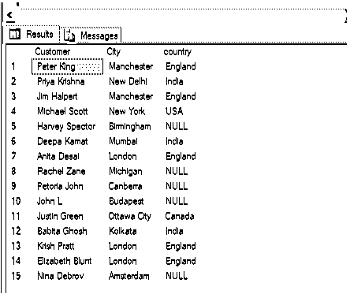
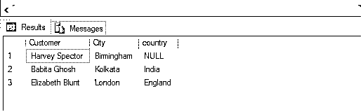
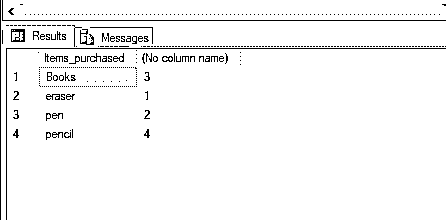
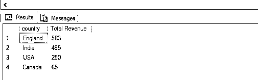
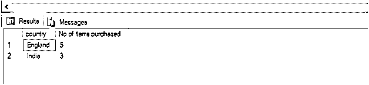

# SQL 左连接

> 原文：<https://www.educba.com/sql-left-join/>

## SQL 左连接简介

SQL LEFT join 是一个结构化查询语言(SQL)语句，在该语句中，当两个表连接在一起时，该语句将返回左表中的所有行，即使所有行都不满足指定的 ON 条件，但是右表中不匹配的行将显示为 NULL。这是一种外部连接。

**语法和参数**

<small>Hadoop、数据科学、统计学&其他</small>

`SELECT t1.column_name, t2.column_name
FROM table_name1 as t1
LEFT JOIN table_name2 as t2
ON t1.column_name = t2.column_name
WHERE condition;`

语法中使用的不同参数是:

**SELECT t1.column_name，t2.column_name** :用于从数据库中选择需要的数据。

这里， **t1.column_name** 是表的实例 T1 中的列。

**t2.column_name** 是表的实例 t2 中的列。

**FROM table _ name 1 LEFT JOIN table _ name 2:**用于指定必须从中提取数据的来源。

这里， **table_name1** 是左表的名称，table_name2 是右表的名称。t1 和 t2 是表格的缩写。左连接将从左表(t1)中获取所有记录，并从右表(t2)中获取匹配的记录。

**ON T1 . column _ name = T2 . column _ name:**用于指定两个表连接的公共条件。它可以是一对主键和外键。

**其中条件:**用于指定过滤记录的条件。

上述参数中，除 WHERE 子句外的所有参数都是强制的。您可以根据需要使用 GROUP BY、ORDER BY 和 HAVING 子句。

### SQL 左连接是如何工作的？

当我们需要一个表中的所有数据并且只匹配另一个表中的数据时，应该使用 SQL LEFT。

下面的文氏图解释了 SQL 左连接是如何工作的。

接下来，我们将详细讨论上述自连接。

为了有效地演示和解释 SQL 中的左连接，我们将使用下表。这些表格是为一个电子商务网站制作的。第一个表“customers”包含客户 id、姓名和他们所属的城市。第二个表“城市”包含 id、城市和它们所属的国家。

上面提到的“客户”表的模式是:

记录数量:15 项

| **客户** |
| ID(主键) |
| 顾客 |
| 城市 |

让我们看看客户表中的记录。这样以后，我们就能明白

自连接很有帮助:

| **ID** | **客户** | **城市** | **物品 _ 已购买** | **已付金额** |
| One | 彼得·金 | 曼彻斯特 | 书 | One hundred and twenty |
| Two | 普里雅·克里希纳 | 新德里 | 围栏 | Fifty |
| Three | 吉姆·哈尔珀特 | 曼彻斯特 | 铅笔 | Forty-three |
| Four | 迈克尔·斯科特 | 纽约 | 书 | Two hundred and fifty |
| Five | 哈维·斯佩克特 | 伯明翰 | 铅笔 | One hundred |
| Six | 迪帕的钱 | 孟买 | 书 | Three hundred and seventy |
| Seven | 安妮塔·德赛 | 伦敦 | 铅笔 | Fifty |
| Eight | 雷切尔·赞 | 密歇根 | 围栏 | Seventy |
| Nine | 比勒陀利亚约翰 | 堪培拉 | 围栏 | One hundred and ninety |
| Ten | 约翰·L | 布达佩斯 | 书 | Five hundred and forty |
| Eleven | 贾斯汀·格林 | 渥太华市 | 围栏 | Sixty-five |
| Twelve | 哈比塔·戈什 | 加尔各答 | 铅笔 | Seventy-five |
| Thirteen | 克里斯·普拉特 | 伦敦 | 橡皮擦 | Thirty |
| Fourteen | 伊丽莎白·布朗特 | 伦敦 | 铅笔 | Three hundred and forty |
| Fifteen | Nina Debrov | 阿姆斯特丹 | 书 | Four hundred and fifty-two |

“城市”表的模式是:

记录数量:10

| **客户** |
| ID(主键) |
| 城市名称 |
| 国家 |

让我们看看城市表中的记录。

| **ID** | **城市名称** | **国家** |
| One | 新德里 | 印度 |
| Two | 孟买 | 印度 |
| Three | 加尔各答 | 印度 |
| Four | 伦敦 | 英格兰 |
| Five | 曼彻斯特 | 英格兰 |
| Six | 渥太华市 | 加拿大 |
| Seven | 安大略 | 加拿大 |
| Eight | 浦那 | 印度 |
| Nine | 纽约 | 美利坚合众国 |
| Ten | 华盛顿哥伦比亚特区 | 美利坚合众国 |

### SQL 左连接示例

这里有几个例子来说明 SQL 中的左连接。

#### 示例 1–简单的左连接

查找客户的姓名以及他们所属的城市和国家。

**代码:**

`SELECT t1.Customer, t1.City, t2.country
FROM customers as t1 LEFT JOIN cities as t2
ON t1.City = t2.city_name;`

在上面的例子中，我们可以注意到伯明翰、密歇根、堪培拉、布达佩斯和阿姆斯特丹等城市没有出现在城市表中。但是由于它们出现在左表(customers)中，所以它们在最终结果中显示为 NULL(因为 left join 从左表中提取所有记录，即使右表中没有匹配项。)

#### 示例# 2–用 WHERE 子句进行左连接

查找购买铅笔并花费超过 50 英镑的客户及其各自国家的名称。

**代码:**

`SELECT t1.Customer, t1.City, t2.country
FROM customers as t1 LEFT JOIN cities as t2
ON t1.City = t2.city_name
WHERE t1.Items_purchased= 'pencil' and t1.Amount_paid > 50;`

#### 示例# 3–使用 GROUP BY 子句的左连接

查找在哪些国家购买了特定类别的文具。

**代码:**

`SELECT t1.Items_purchased, count(t2.country)
FROM customers as t1 LEFT JOIN cities as t2
ON t1.City = t2.city_name
GROUP BY t1.Items_purchased;`

#### 示例# 4–使用 ORDER BY 子句的左连接

查找电子商务公司在不同国家产生的总收入，从最高到最低排序。

**代码:**

`SELECT t1.country, sum(t2.Amount_paid) as "Total Revenue"
FROM cities as t1 LEFT JOIN customers as t2
ON t1.city_name = t2.City
GROUP BY t1.country
ORDER BY 2 DESC;`

**示例# 5–用 HAVING 子句进行左连接**

查找客户购买了多种商品的国家。

**代码:**

`SELECT t1.country, count(t2.Items_purchased ) as "No of items purchased"
FROM cities as t1 LEFT JOIN customers as t2
ON t1.city_name = t2.City
GROUP BY t1.country
HAVING count(t2.Items_purchased ) >1
ORDER BY 2 DESC;`

当在 SQL 中执行连接时，我们应该总是尝试使用表别名，它是给定表的缩写。这有助于编写漂亮的代码。

### 结论

SQL left join 语句返回左表中的所有记录，即使右表中没有匹配项。当我们只需要第一个表中的记录，并希望在第二个表中检查它们的匹配时，通常使用它。

### 推荐文章

这是一个 SQL 左连接的指南。这里我们讨论一些例子来说明 SQL 中的左连接，以及它是如何与适当的语法和参数一起工作的。您也可以参考我们的其他相关文章，了解更多信息——

1.  [像 SQL 中的查询](https://www.educba.com/like-query-in-sql/)
2.  [SQL 右连接](https://www.educba.com/sql-right-join/)
3.  [Tableau 中的自定义 SQL](https://www.educba.com/custom-sql-in-tableau/)
4.  [SQL 子句](https://www.educba.com/sql-clauses/)
5.  [MySQL 自助加入指南](https://www.educba.com/mysql-self-join/)

