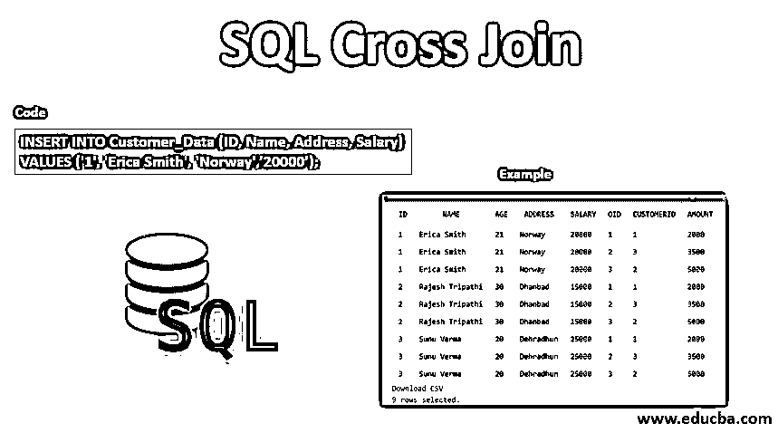
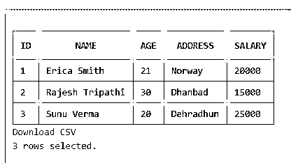
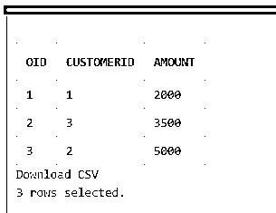
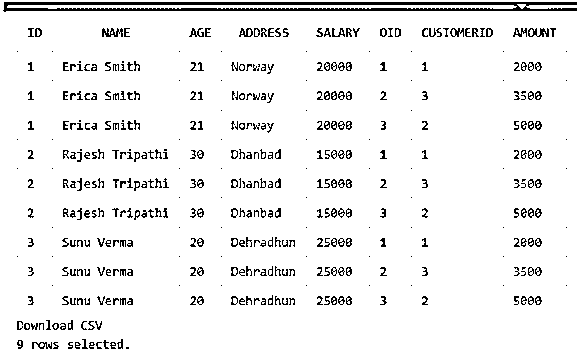
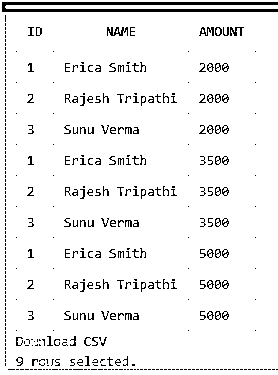

# SQL 交叉连接

> 原文：<https://www.educba.com/sql-cross-join/>

## SQL 交叉连接简介

让我们研究一下 SQL 交叉连接。在 SQL 中，交叉连接是一个子句，用于根据两个表中的相关公共字段连接两个或多个表中的记录。通常，我们可以说 SQL 交叉连接操作一个返回两个或更多表的笛卡尔积的连接过程。在 Cartesian join 中，第一个表中的行与第二个表中具有公共列的行配对，以产生结果集，该结果集是两个表数据中所有行的组合。因此，我们还可以将这个 SQL 交叉连接子句与内部连接子句进行比较，在内部连接子句中，连接条件总是被计算为 true，或者连接条件或语句不包括在 SQL 查询中。

### SQL 中交叉连接的语法

对于 SQL 中的交叉连接子句，我们可以考虑以下基本语法:

<small>Hadoop、数据科学、统计学&其他</small>

`SELECT table1.column1, table2.column2…tableN.columnN From table1,table2 [, tableN]`

*   此外，我们可以遵循 SELECT 语句的简单语法，如下所示:

`Select * From table1 CROSS JOIN table2;`

或者

`Select * From table1,table2…`

*   众所周知，在数学中，笛卡尔积是一种乘积运算，它通过将第一个表中的行与第二个表中的行相乘，为我们提供两个不同表的乘积结果集。
*   比如我们取两组项，首先 A={a，B，c}，其次 B={x，y，z}。现在让我们找出它们之间的笛卡尔积，A*B 的结果将是这两个表 A 和 B 的有序配对。因此，输出如下，其中集合 A(a，B，c) & B(x，y，z)彼此相乘:

`A*B ={(a,x),(a,y),(a,z),(b,x),(b,y),(b,z),(c,x),(c,y),(c,z)}`

*   类似地，在交叉连接中，第一个表中的每一行都与第二个表中的每一行配对，从而形成两个表中所有行和列组合的结果集。

### SQL 交叉连接是如何工作的？

*   当我们想要组合几个表或更多表中的每一行时，通常使用它。所有行对的结果表被称为叉积连接
*   这个 SQL 交叉连接的有用用途是从两个不同的表集合的两个不同记录中获得所有的项目组合，例如颜色或大小等。在商业层面或者在行业中存在这种类型的巨大数据库的地方。
*   因此，当交叉连接不使用 WHERE 子句时，我们可以说我们得到了一个笛卡尔积，其中第一个表中的行与数据库中第二个表中的行相乘。
*   假设我们有两个表 X & Y，分别有“n”和“m”行，当我们对这两个表进行交叉连接或笛卡尔连接时，表的每一行都与另一行配对，结果集包含 n*m 行作为 X*Y 笛卡尔乘积的结果行。

`SELECT columnName From X CROSS JOIN Y;`

*   这是实现相同结果集的另一种方法，即在包含 SELECT 语句后使用逗号分隔列名，并在 From 子句后添加表名。

**Note:** A SQL Cross JOIN does not include a join condition as of other joins like Inner, Outer, Full, Left or Right Joins. If we use WHERE to Cross Join then it acts like an Inner Join. Other joins function with certain conditions to perform certain different processes to return the result required.

### 实现 SQL 交叉连接的示例

让我们考虑一些实际的例子来进一步详细解释 SQL 交叉连接。首先，还有一件事让我告诉你，我们可以用两种不同的方式在 SQL 中声明交叉连接:

*   通过使用带有 SELECT 的 SQL 交叉连接基本语法
*   在 SELECT 中使用 FROM 子句而不使用 WHERE 子句

因此，我们可以说:

*   SELECT * From TableName1 交叉联接 TableName2
*   SELECT * From TableName1，TableName2

#### 1.创建表格

例如，我们有两个表“客户数据”和“订单”。我们使用以下 SQL 语句创建了具有字段 Customer_Data(ID、姓名、地址、薪金)和 Orders(OID、CustomerID、金额)的表:

**代码:**

`CREATE TABLE Customer_Data (ID int NOT NULL PRIMARY KEY, Name varchar(255) NOT NULL, Age int , Address varchar(255), Salary int );`

**输出:**

**代码:**

`CREATE TABLE Orders ( OID int NOT NULL PRIMARY KEY, CustomerID int,   Amount int );`

**输出:**

#### 2.插入

示例表包括一些关于客户的信息以及数据库中相应的订单明细表。我们插入了一些演示记录，以使用 SQL 语句应用连接，如下所示:

**代码:**

`INSERT INTO Customer_Data (ID, Name, Address, Salary)
VALUES ('1', 'Erica Smith', 'Norway',’20000’);`

**代码:**

`INSERT INTO Orders(OID,CustomerID,Amount)
VALUES ('01', '1', '2000');`

现在，我们可以使用 SQL 查询语句连接这些表以获得类似笛卡尔连接的结果集:

**代码:**

`Select * From Customer_Data  CROSS JOIN Orders;`

或者

`Select * From Customer_Data , Orders;`

上述查询产生相同的结果。

**输出:**

这里，我们得到了一个结果表，其中一个表的所有行与其他行组合在一起，形成一个笛卡尔积连接。

#### 3.挑选

这两个表都有三行数据，因此它们的笛卡尔积形成九行，每一行都与其他行成对。此外，我们可以从 join 子句中只选择一些字段来显示，如下所示:

**代码:**

`Select ID, Name,Amount From Customer_Data  CROSS JOIN Orders;`

**输出:**

因此，我们可以看到，我们正在获取 Customer_Data 表中每一行与 Orders 表中每一行的笛卡尔乘积。根据查询，结果集返回三个字段:ID、Name 和 Amount。

根据上面的解释和 SQL 查询，我们可以认为它允许我们从 SQL 中的连接表形成两个或多个表的笛卡尔积。

### 结论

在一些数据库中，如 [Oracle 和 PostgreSQL，](https://www.educba.com/oracle-vs-postgresql/)您可以考虑使用 [SQL Inner Join](https://www.educba.com/sql-inner-join/) 子句来执行 SQL 交叉连接，因为它总是评估真实条件。因此，希望在本文中，您已经了解了如何在 SQL 中实现 Cross Join 子句，以找出数据库中两个或多个表的笛卡尔积，从而访问和组合具有不同字段(包括主键)的记录。

### 推荐文章

这是一个 SQL 交叉连接的指南。在这里，我们讨论语法，它是如何工作的，以及相应的例子来实现。您也可以浏览我们的其他相关文章，了解更多信息——

1.  [NoSQL 数据库的类型](https://www.educba.com/types-of-nosql-databases/)
2.  [MySQL 中的 ORDER BY](https://www.educba.com/order-by-in-mysql/)
3.  [MySQL 查询命令](https://www.educba.com/mysql-query-commands/)
4.  [SQL 删除连接](https://www.educba.com/sql-delete-join/)

