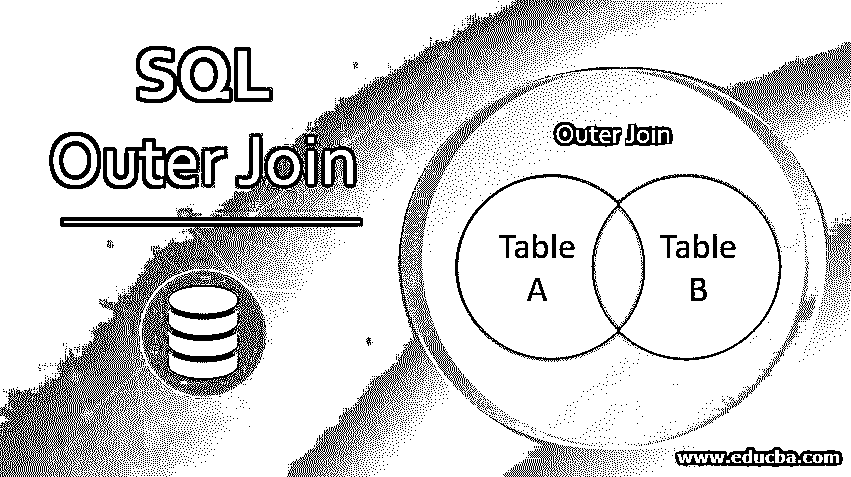
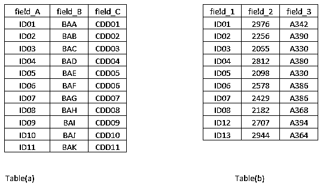
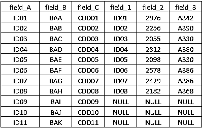
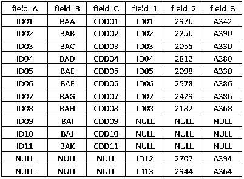

# SQL 外部连接

> 原文：<https://www.educba.com/sql-outer-join/>

## SQL 外部连接简介

在 SQL 中，外部连接指的是这样一个事实，即两个表共有的内容以及不常见的内容被提取出来作为最终输出。两个或多个表之间以这种方式促进数据提取的这种连接被称为外部连接。

### 外部联接的类型

在 SQL 中，我们有三种类型的外部连接。

<small>Hadoop、数据科学、统计学&其他</small>

这些是:

*   左外部联接，
*   右外部联接
*   完全外部联接。

完全外连接基本上像数学中的集合一样工作。下一节将进一步阐述 SQL 外部连接的概念。

**语法**

左外部联接、右外部联接和完全外部联接的语法如下。

#### 1.左外部连接

**语法:**

`SELECT table1.column_a, table1.column_b…., table2.column_a, table2.column_b,….
FROM
table1 LEFT JOIN table2
ON
table1.common_field = table2.common_field`

#### 2.右外部联接

**语法:**

`SELECT table1.column_a, table1.column_b…., table2.column_a, table2.column_b,….
FROM
Table1 RIGHT JOIN table2
ON
table1.common_field = table2.common_field`

#### 3.完全外部连接

**语法:**

`SELECT table1.column_a, table1.column_b…., table2.column_a, table2.column_b,….
FROM
table1 LEFT JOIN table2
ON
table1.common_field = table2.common_field
UNION
SELECT table1.column_a, table1.column_b…., table2.column_a, table2.column_b,….
FROM
Table1 RIGHT JOIN table2
ON
table1.common_field = table2.common_field`

### SQL 外部连接如何工作？

为了理解外部连接的工作原理，我们必须首先理解在什么位置指定了什么表。像在左外连接中一样，输出由表在左侧的位置决定，而在右外连接中，输出由表在右侧的位置决定。

现在，让我们来看一下下面的例子，以便理解连接到底是如何工作的。

我们有两个表表(a)和表(b ),如下所示。

让我们看一下这两个表:

这里，两个表中有一个字段是公共的。它在第一个表中被命名为 field_A，而在第二个表中被命名为 field_1。我们将使用上面的两个表演示左、右和全外连接的工作方式。

让我们看看，当我们在公共字段上执行左外连接时，会得到什么输出。当左外连接应用于两个表时，保持表(a)为左表，则返回左表的所有内容以及右表中同时存在于两个表中的内容。因此，左边的表优先。输出表如下所示。

我们可以看到，对于某些条目，我们得到了空值。这是因为表(b)中没有这些特定的 id。

现在，让我们看看当我们执行正确的外部连接时会发生什么。在这种情况下，右边的表优先。输出表如下所示。

在完全外部连接的情况下，两个表中的内容会放在一起。输出表如下所示。

### SQL 外部连接的示例

我们现在将在 SQL 中实现外部连接。为了便于说明，我们使用了两个表，即。员工和工资。emp_no 是两个表中的公共字段。让我们实现连接，看看在每种情况下查询返回什么输出。

#### 1.左外部连接

**代码:**

`select e.emp_no 'Employee Number', e.first_name 'First Name', e.last_name 'Last Name', s.salary 'Salary'
from employees e
LEFT JOIN salaries s
on
e.emp_no = s.emp_no`

**输出:**

我们在 Salary 列中得到 NULL，因为那些雇员的薪水可能还没有在 sales 表中更新。

#### 2.右外部联接

**代码:**

`select e.emp_no 'Employee Number', e.first_name 'First Name', e.last_name 'Last Name', s.salary 'Salary'
from employees e
RIGHT JOIN salaries s
on
e.emp_no = s.emp_no;`

**输出:**

仔细观察两个输出之间的差异。它将给出一个关于左右外部连接如何工作的概念。

#### 3.完全外部连接

**代码:**

`select e.emp_no 'Employee Number', e.first_name 'First Name', e.last_name 'Last Name', s.salary 'Salary'
from employees e
LEFT JOIN salaries s
on
e.emp_no = s.emp_no
UNION
select e.emp_no 'Employee Number', e.first_name 'First Name', e.last_name 'Last Name', s.salary 'Salary'
from employees e
RIGHT JOIN salaries s
on
e.emp_no = s.emp_no;`

**输出:**

### 结论

在 SQL 中，连接是一个非常有用的概念。这一概念允许根据需要对从多个表中提取数据进行管理。这个概念在涉及大量记录的情况下非常有用，因为必须从这些记录中提取特定的记录。

### 推荐文章

这是一个 SQL 外部连接的指南。在这里，我们讨论 SQL 中外连接的类型以及它是如何工作的，并给出了相应的例子。您也可以看看以下文章，了解更多信息–

1.  [像 SQL 中的查询](https://www.educba.com/like-query-in-sql/)
2.  [SQL 中的 IF ELSE 语句](https://www.educba.com/if-else-statement-in-sql/)
3.  [SQL 删除连接](https://www.educba.com/sql-delete-join/)
4.  [Oracle 中的外部连接](https://www.educba.com/outer-join-in-oracle/)

