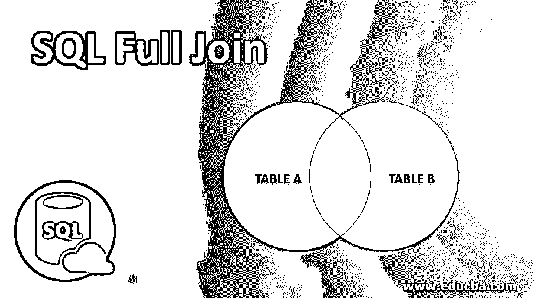
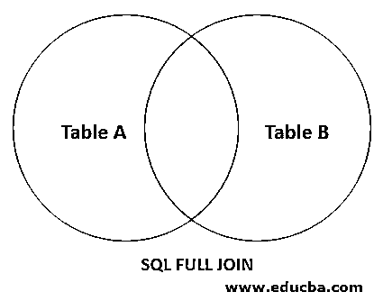
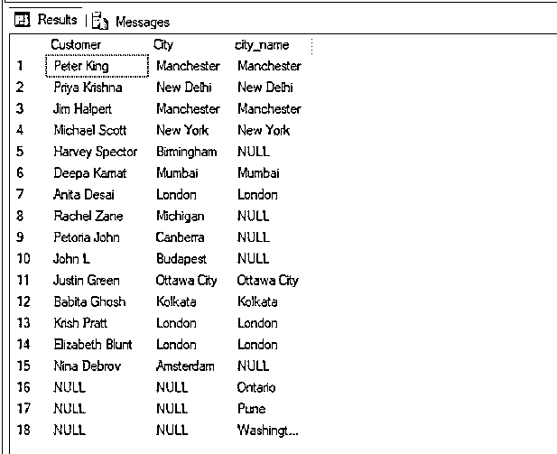
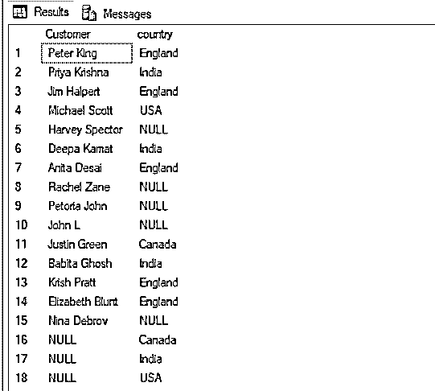
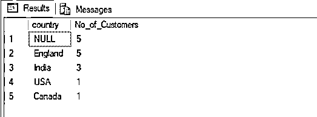
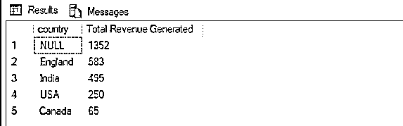
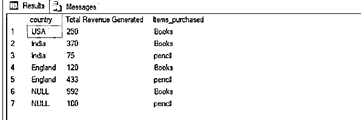

# SQL 完全连接

> 原文：<https://www.educba.com/sql-full-join/>

## SQL 完全连接概述

SQL 完全联接是一种结构化查询语言(SQL)语句，其中当两个表联接在一起时，该语句返回联接表中的所有行，即使所有行都不满足指定的条件，但是，任何表中不匹配的行将显示为空，也就是说，完全联接可以被视为类似于 SQL 中左右联接的组合。

**语法:**

<small>Hadoop、数据科学、统计学&其他</small>

`SELECT column_name(s)
FROM table_name1
FULL JOIN table_name2
ON table_name1.column_name = table_name2.column_name
WHERE condition;</code`

**参数:**

语法中使用的不同参数是:

*   **选择列名:**用于从数据库中选择需要的数据。这里，column_name(s)是连接表中列的名称。
*   **FROM table _ name 1 FULL JOIN table _ name 2:**它用于指定必须从中提取数据的源。这里，table_name1 是左表的名称，table_name2 是右表的名称。当左表或右表记录中存在匹配时，完全连接将获取所有记录。
*   **ON table _ name 1 . column _ name = table _ name 2 . column _ name:**用于指定两个表连接的共同条件。它可以是一对主键和外键。
*   **WHERE condition:** 用于指定记录生成结果记录需要满足的其他条件。

上述参数中，除 WHERE 子句外的所有参数都是强制的。您可以根据需要使用 GROUP BY、ORDER BY 和 HAVING 子句。

### SQL 完全连接是如何工作的？

SQL 完全连接通常用于可视化异常报告或 ETL 或任何其他特殊情况，其中双方都有您试图组合的数据。

下面的文氏图解释了 SQL 完全连接是如何工作的。

接下来，我们将详细讨论上述自连接。

为了有效地演示和解释 SQL 中的完全连接，我们将使用下表。这些表格是为一个电子商务网站制作的。第一个表“customers”包含客户 id、姓名和他们所属的城市。第二个表“城市”包含 id、城市和它们所属的国家。

上面提到的“客户”表的模式是:

记录数量:15 项

| **客户** |
| ID(主键) |
| 顾客 |
| 城市 |

让我们看看客户表中的记录。这样，以后我们就可以理解自加入是多么有用了:

| **ID** | **客户** | **城市** | **物品 _ 已购买** | **已付金额** |
| One | 彼得·金 | 曼彻斯特 | 书 | One hundred and twenty |
| Two | 普里雅·克里希纳 | 新德里 | 围栏 | Fifty |
| Three | 吉姆·哈尔珀特 | 曼彻斯特 | 铅笔 | Forty-three |
| Four | 迈克尔·斯科特 | 纽约 | 书 | Two hundred and fifty |
| Five | 哈维·斯佩克特 | 伯明翰 | 铅笔 | One hundred |
| Six | 迪帕的钱 | 孟买 | 书 | Three hundred and seventy |
| Seven | 安妮塔·德赛 | 伦敦 | 铅笔 | Fifty |
| Eight | 雷切尔·赞 | 密歇根 | 围栏 | Seventy |
| Nine | 比勒陀利亚约翰 | 堪培拉 | 围栏 | One hundred and ninety |
| Ten | 约翰·L | 布达佩斯 | 书 | Five hundred and forty |
| Eleven | 贾斯汀·格林 | 渥太华市 | 围栏 | Sixty-five |
| Twelve | 哈比塔·戈什 | 加尔各答 | 铅笔 | Seventy-five |
| Thirteen | 克里斯·普拉特 | 伦敦 | 橡皮擦 | Thirty |
| Fourteen | 伊丽莎白·布朗特 | 伦敦 | 铅笔 | Three hundred and forty |
| Fifteen | Nina Debrov | 阿姆斯特丹 | 书 | Four hundred and fifty-two |

“城市”表的模式是:

记录数量:10

| **客户** |
| ID(主键) |
| 城市名称 |
| 国家 |

让我们看看城市表中的记录。

| **ID** | **城市名称** | **国家** |
| One | 新德里 | 印度 |
| Two | 孟买 | 印度 |
| Three | 加尔各答 | 印度 |
| Four | 伦敦 | 英格兰 |
| Five | 曼彻斯特 | 英格兰 |
| Six | 渥太华市 | 加拿大 |
| Seven | 安大略 | 加拿大 |
| Eight | 浦那 | 印度 |

### 实现 SQL 完全连接的示例

下面是一些例子:

#### 示例#1

查找城市表中没有其居住城市的客户的姓名。

**代码:**

`SELECT t1.Customer, t1.City, t2.city_name
FROM customers as t1 FULL JOIN cities as t2
ON t1.City = t2.city_name;`

**输出:**

在上面的示例中，我们可以注意到伯明翰、密歇根、堪培拉、布达佩斯和阿姆斯特丹等城市没有出现在城市表中，但它们仍然以空值显示在完全连接中。类似地，像安大略、浦那和华盛顿特区这样的城市不在 customers 中，但在 cities 表中出现过，对于不匹配的记录也显示为空值。

#### 实施例 2

查找客户的姓名以及他们所属的国家。

**代码:**

`SELECT t1.Customer, t2.country
FROM customers as t1 FULL JOIN cities as t2
ON t1.City = t2.city_name;`

**输出:**

#### 实施例 3

查找购买了图书类别中的商品的客户的姓名，以及他们所属的国家。

**代码:**

`SELECT t1.Customer, t2.country
FROM customers as t1 FULL JOIN cities as t2
ON t1.City = t2.city_name
WHERE Items_purchased = 'Books';`

**输出:**

#### 实施例 4

按降序查找每个国家订购的客户数量。

**代码:**

`SELECT t2.country, count(t1.Customer) as No_of_Customers
FROM customers as t1 FULL JOIN cities as t2
ON t1.City = t2.city_name
GROUP BY t2.country
ORDER BY 2 DESC;`

**输出:**

#### 实施例 5

查找电子商务公司在不同国家产生的总收入，从最高到最低排序。

**代码:**

`SELECT t2.country, sum(t1.Amount_paid ) as "Total Revenue Generated"
FROM customers as t1 FULL JOIN cities as t2
ON t1.City = t2.city_name
GROUP BY t2.country
ORDER BY 2 DESC;`

**输出:**

#### 实施例 6

查找电子商务公司在不同国家的图书和铅笔类别中产生的总收入，按从高到低的顺序排列。

**代码:**

`SELECT t2.country, sum(t1.Amount_paid ) as "Total Revenue Generated", t1.Items_purchased
FROM customers as t1 FULL JOIN cities as t2
ON t1.City = t2.city_name
WHERE t1.Items_purchased = 'Books' OR t1.Items_purchased = 'pencil'
GROUP BY t2.country, t1.Items_purchased
ORDER BY 1 DESC;`

**输出:**

当在 SQL 中执行连接时，我们应该总是尝试使用表别名，它是给定表的缩写。这有助于编写漂亮的代码。

### 结论

SQL full join 是一个从两个连接的表中返回所有记录的语句。当我们想要检查数据库中缺失的信息时，我们应该使用它。

### 推荐文章

这是一个 SQL 完全连接的指南。在这里，我们将讨论 SQL 完全连接的介绍及其相应的语法、参数和示例。您也可以浏览我们推荐的其他文章，了解更多信息——

1.  [SQL 右连接](https://www.educba.com/sql-right-join/)
2.  [Tableau 中的自定义 SQL](https://www.educba.com/custom-sql-in-tableau/)
3.  [MySQL 中的 MIN()](https://www.educba.com/min-in-mysql/)
4.  [SQL 子句](https://www.educba.com/sql-clauses/)
5.  [SQL 自连接指南](https://www.educba.com/sql-self-join/)
6.  MySQL 自我加入|如何运作？

