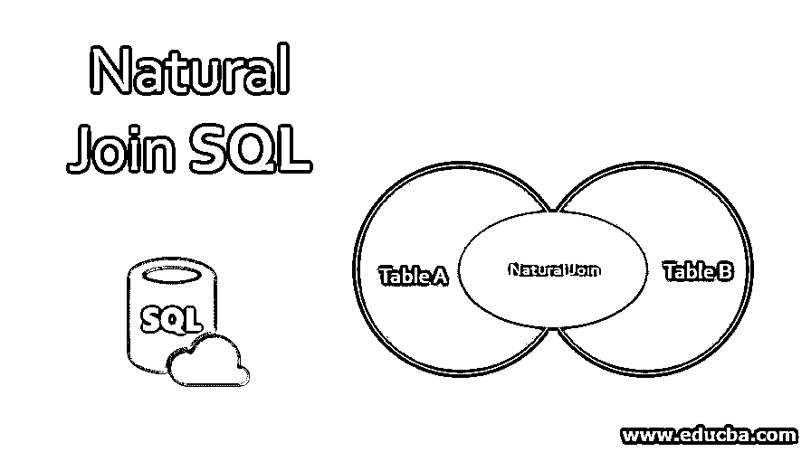
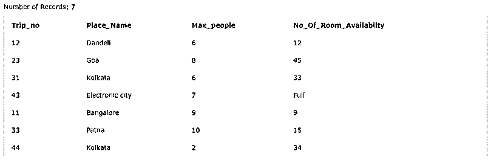
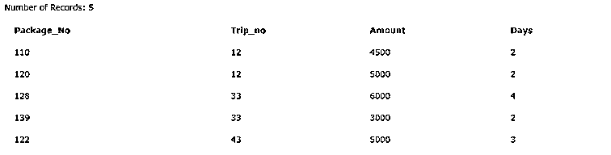
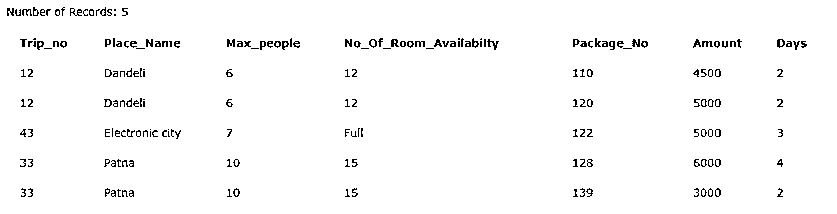
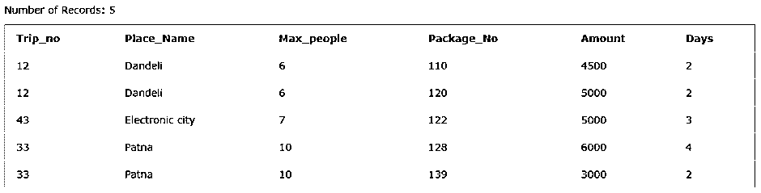
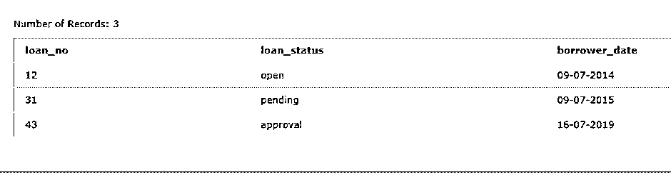
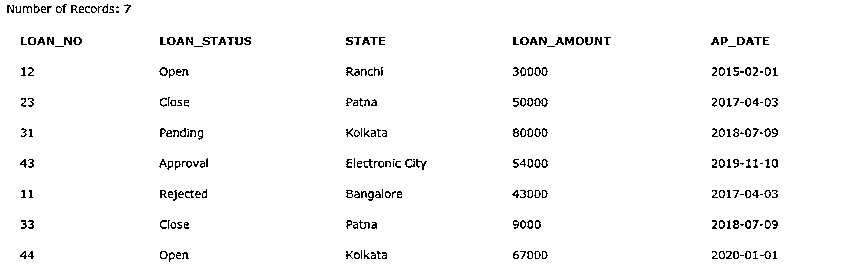
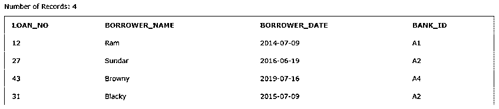

# 自然连接 SQL

> 原文：<https://www.educba.com/natural-join-sql/>

## 自然连接 SQL 简介

自然联接 SQL 是一种类似于等价联接的联接。主要区别在于结果集中返回的列数。

自然连接中需要注意的事项如下:

<small>Hadoop、数据科学、统计学&其他</small>

*   我们在自然连接中不使用 on 子句。
*   我们用于自然连接的表应该有一个或多个相同的列名。
*   相同的列名应该是相同的数据类型。

内部联接和自然联接的主要区别在于结果中的重复列集。下面让我们详细讨论一下。

**语法:**

`Select *
From tablename1
NATURAL JOIN tablename2; - - - - - - - - - - - as mentioned no ‘ON’ condition - - - - -`

### 如何在 SQL 中实现自然连接？

让我们考虑下面的另外两个表，并实现它们之间的自然连接。下面是两个名为“Trip”表和“Package”表的表。

#### 例子

在这里，一旦我们应用了自然连接，我们就获得了两个表之间的公共行。

##### 行程表:

##### 

包表:

查询以获得上述两个表之间的自然连接:

**代码:**

`SELECT *
FROM TRIP
NATURAL JOIN PACKAGE;`

**输出:**

让我们从上面只取几列。

查询以获得上述两个表之间的自然连接:

**代码:**

`SELECT trip_no,place_name, max_people, package_no, amount, days
FROM TRIP
NATURAL JOIN PACKAGE;`

让我们在对它们应用左连接后检查上表的输出。

**输出:**

### 自然连接和内部连接的特征

自然连接和内部连接有一个显著的特点，那就是返回的列数。

#### 1.内部连接

两个表中的所有公共行。而联接时，至少有一列应该是相同的数据类型，并且在表之间是公共的。

**示例:**让我们考虑贷款表和借款人表应用内部连接。

让我们构建一个查询，从两个表中获取 loan_no、status 和借款日期:-

**代码:**

`SELECT L.LOAN_NO, L.LOAN_STATUS, B.BORROWER_DATE
FROM LOAN L INNER JOIN BORROWER B
ON L.LOAN_NO=B.LOAN_NO`

对它们应用内部连接后的上表。

**输出:**

在上面的输出中，我们根据条件“L.LOAN_NO=B.LOAN_NO”获得了两个表的公共行。

#### 2.自然连接

自然联接是在两个表之间组合两个或更多公共列的联接。

**示例:**让我们考虑两个表，并在表上应用自然连接

下面是两个表，贷款表&

**贷款表**:

**借款人表:**

让我们构建一个查询，从两个表中获取 loan_no、status 和借方日期:

**代码:**

`SELECT *
FROM LOAN
NATURAL JOIN BORROWER;`

对它们应用自然连接后的上表。

**输出:**

### 结论

为了获取与客户需求相关的数据，我们可能需要连接表，这将通过连接来实现。如前所述，连接用于从多个表中获取数据。要连接多个表，我们需要两个表中至少有一个公共列。基于指定的条件连接表。

### 推荐文章

这是 SQL 中自然连接的指南。这里我们讨论自然连接 SQL 的介绍，自然连接和内部连接的特点以及各自的例子。您也可以浏览我们推荐的其他文章，了解更多信息——

1.  [SQL 右连接](https://www.educba.com/sql-right-join/)
2.  [SQL 子句](https://www.educba.com/sql-clauses/)
3.  [不在 MySQL 中](https://www.educba.com/not-in-mysql/)
4.  [就像 MySQL 中的](https://www.educba.com/like-in-mysql/)

