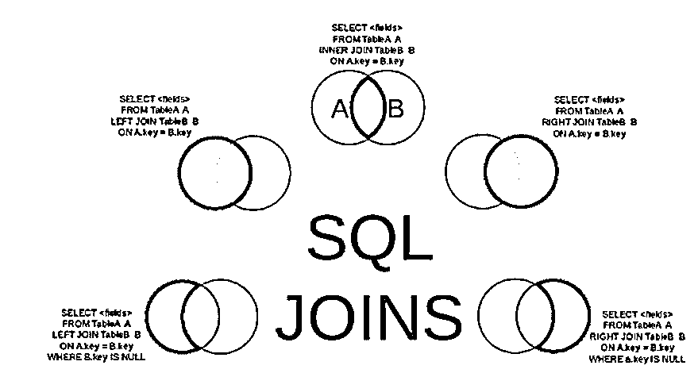
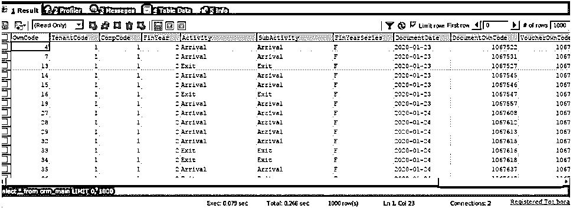
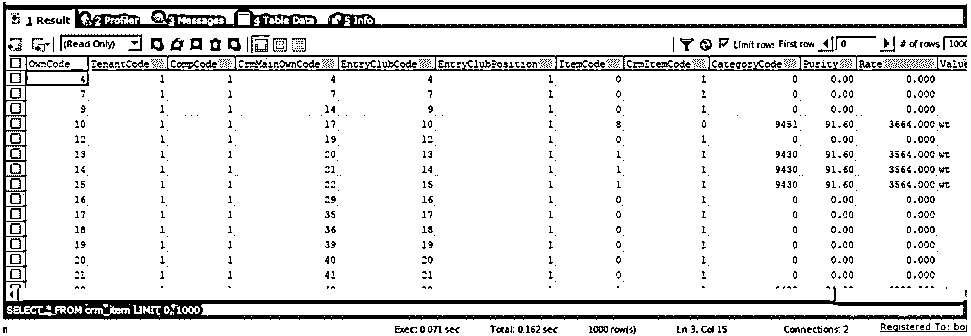
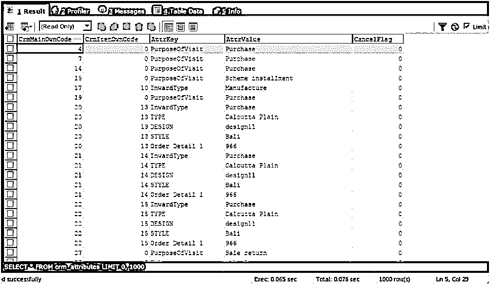
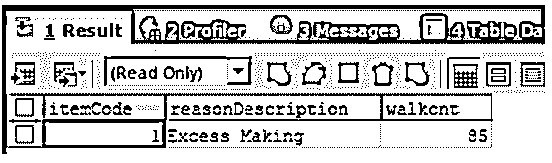

# SQL 多重连接

> 原文：<https://www.educba.com/sql-multiple-join/>

## SQL 多重连接简介

我们可以在特定的查询语句中执行多个连接，通过组合多个表的记录来检索数据。根据我们必须如何检索数据以及在检索和匹配记录时应该有什么行为，我们可以利用 SQL 中可用的各种类型的连接。每当我们在一个查询语句中执行一个以上的不同类型的相同连接时，就说我们在使用多重连接。在本文中，我们将研究多重连接的一般语法，并借助于某个例子来实现它们。

### 连接的类型

有不同类型的联接，如内部联接、外部联接、左内部联接、右内部联接、左外部联接和右外部联接。它们的行为在记录的数量和考虑方面有所不同，这些记录是通过组合右表和左表的记录来检索的。下图演示了联接的类型及其行为。在多重连接中，我们可以根据需要使用其中一种、一些或所有类型的连接。

<small>Hadoop、数据科学、统计学&其他</small>

**多重连接的语法:**

多重连接的语法如下所示

`SELECT table name1.column name1,table name1.column name2,table name2.column name1,....
FROM table name1
(LEFT/RIGHT) JOIN table name2
ON table name1.matching_column name = table name2\. matching_column name
(LEFT/RIGHT) JOIN table name3
ON table name1.matching_column name = table name3\. matching_column name
(LEFT/RIGHT) JOIN table name4
ON table name1.matching_column name = table name4\. matching_column name
...;`

在上面的语法中，没有必要将每个表的连接都应用于第一个表本身。我们可以在三个或更多的表上执行连接，以执行多个连接。联接的类型也可以变化或保持不变，例如，我们可以在表之间执行多个内部联接，或者在表上执行一些作为内部联接的联接，而其他作为左联接，等等。

### SQL 多重连接示例

考虑这样一个例子，我们试图维护一个特定商店的与顾客相关的到达和离开数据，这个商店销售一些具有特定属性的商品。与到达和离开的客户活动相关的数据存储在名为 crm_main 的表中，该表中有许多列，例如 own code，它是分配给客户活动的唯一自动递增的标识符。此外，为了存储租户和公司的详细资料，其租户代码和公司代码以及记录交易的财政年度由 finyearcode 标识。这里存储的主要部分是活动和子活动，它们帮助我们确定客户是已经到达还是已经离开。crm_main 表的内容和结构如以下查询的输出所示

`SELECT * FROM crm_main`

上述查询语句的执行给出了如下所示的输出

顾客已经到达或离开的购买项目的某些细节。客户已经到达的商品详细信息存储在表 crm_item 中。表 crm_main 中自己的代码作为 crmMainOwnCode 存储在表 crmitem 中。每个 crm_item 都分配有一个名为 own code 的唯一标识符列值。表 crm_item 的内容如下所示-

`SELECT * FROM crm_item;`

上述查询语句的执行给出了如下所示的输出

应记录客户活动和客户执行该活动的项目，如访问目的、所需的设计类型、内部类型(无论是订购新项目还是购买现有制造项目)。所有这些都存储在表 crm_attributes 中，如以下查询的输出所示

`SELECT * FROM crm_attributes;`

上述查询语句的执行给出了如下所示的输出

crm_main 表的自有代码存储为 crmMainOwnCode，而 crm_item 表的自有代码存储为 crm_attributes 表中的 crmItemOwnCode。

现在，我们要做的是计算仅退出活动的逐项原因客户退出计数，以识别退出客户的计数。为此，我们将使用下面的查询语句，该语句涉及表 crm_mian、crm_item 和 crm_attributes 上的多个连接，并通过将子活动称为 exit 并将状态称为 1 来指出我们必须找到退出计数的日期范围。此外，我们将通过将 attrKey 指定为“CancellationReason”来从属性中检索用户取消购买商品的原因。使用以下查询语句检索商品代码、取消原因和出口数量

`SELECT
COALESCE(citem.crmItemCode, 0) AS itemCode,
COALESCE(cattr.attrValue, 'No Reason') AS reasonDescription,
COALESCE(COUNT(citem.crmItemCode), 0) AS walkcnt
FROM
crm_main cmain
LEFT JOIN crm_item citem
ON cmain.tenantCode = citem.tenantCode
AND cmain.compCode = citem.compCode
AND cmain.ownCode = citem.crmMainOwnCode
LEFT JOIN crm_attributes cattr
ON cmain.ownCode = cattr.crmMainOwnCode
AND citem.ownCode = cattr.crmItemOwnCode
AND cattr.attrKey = "CancellationReason"
WHERE cmain.tenantCode = 1
AND cmain.compCode = 1
AND cmain.cancelFlag = 0
AND citem.status = 1
AND cmain.subActivity = "Exit"
AND cmain.documentDate BETWEEN "2020-01-01"
AND "2020-06-01"`

上述查询语句的执行给出了如下所示的输出

我们可以观察到，对于物料代码为 1 的物料，原因是超额生产，从输出中可以看到，客户的总退出数为 85。

### 结论

我们可以利用多个连接从多个表中检索数据，并相应地指定约束和关系，尤其是在检索汇总数据时。多重连接的使用包括使用两个以上的表从查询中检索结果集。我们可以使用任何类型的连接，同时使用多个连接，例如内部连接、左连接和右连接。请注意，在特定查询中，连接可以是相同或不同的类型。使用多重连接。

### 推荐文章

这是一个 SQL 多重连接的指南。在这里，我们还讨论了简介和不同类型的连接，以及不同的例子和代码实现。您也可以看看以下文章，了解更多信息–

1.  [SQL 比较字符串](https://www.educba.com/sql-compare-string/)
2.  [SQL 更新触发器](https://www.educba.com/sql-update-trigger/)
3.  [SQL 删除](https://www.educba.com/sql-delete/)
4.  [PostgreSQL 集合](https://www.educba.com/postgresql-set/)

