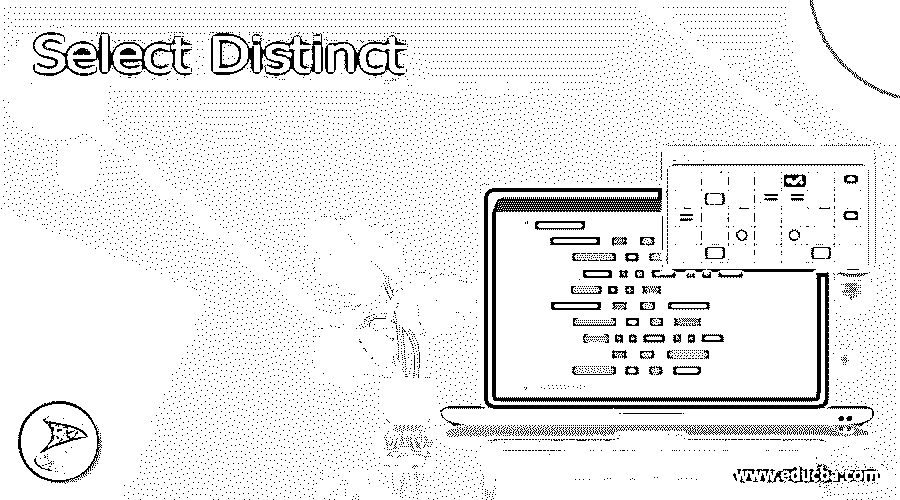

# 选择不同

> 原文：<https://www.educba.com/select-distinct/>




## Select Distinct 的定义

在任何 RDBMS 数据库系统中，SQL select distinct 与 select 语句一起使用。Select distinct 正在从表中检索所有唯一的记录。它将从表中删除所有重复的记录。假设我们的表包含更多的重复记录，当我们使用 SQL 在查询中选择一个不同的关键字时，我们希望获取唯一的记录。

### 选择不同的介绍

*   在任何 RDBMS 系统中，从表中获取唯一的记录都是更有用和更重要的。
*   在 ANSI 标准中，定义为官方 RDBMS 关键字。我们知道，它是一个 SQL select 语句的合取。如果我们想避免来自表或列的重复数据，那么我们使用这个语句。
*   我们可以在指定的列或指定的表上使用关键字。此函数将从函数中删除重复记录。它将在单个列上工作。

### 选择不同的语句

*   它不适用于多列；我们可以对表中的单个列使用相同的方法，从该表中我们已经检索了唯一的记录。
*   我们可以将此语句用于 min、max、avg、count 等聚合。下面是 select distinct 语句的语法。

**语法—**

<small>Hadoop、数据科学、统计学&其他</small>

```
Select DISTINCT name_of_column1, name_of_column2, …., name_of_columnN
```

From name _ of _ table

*   Select DISTINCT name_of_column1，name_of_column2，…，列的名称

```
From name_of_table where condition;
```

*   select DISTINCT name _ of _ column from name _ of _ table order by name _ of _ column；

下面是如下描述语法。

*   **Select-**这是从表中选择指定数据的 SQL 语句。我们可以根据查询中给定的条件选择数据。我们可以使用 select with distinct 语句从表中检索唯一的记录。
*   **列 1 的名称到列 N 的名称—**这是使用不同关键字从表中检索数据的表列。假设我们对指定的列使用了 distinct 语句；它将从表中检索不同的记录。
*   **表名—**这是我们从中检索到唯一记录的表的名称。我们需要在使用语句时定义表名。
*   **Where 条件—**SQL 任何语句中的 Where 条件都将用于选择或检索我们在条件中定义的指定行。其中条件对于通过使用语句检索特定条件的唯一行非常有用。
*   **Order by-**该条件用于按照指定的顺序提取记录。订单的默认条件是升序。假设我们已经给出了显式条件，那么它将按照我们在查询中给出的指定顺序检索数据。
*   当通过 distinct 子句仅使用一个表达式时，我们的查询将从表达式中返回唯一值。
*   假设我们定义了不止一个表达式；我们的 distinct 子句将返回表达式的唯一组合。
*   通过使用语句，我们不能忽略空值；检索数据时；我们的结果将包含不同的 null 值。
*   在下面的示例中，我们可以看到 sql select 语句不会忽略我们使用 distinct 子句的指定列中的空值。

```
Select distinct id, name from sql_distinct;
```

*   通过使用这个语句，我们可以避免数据的冗余。该语句将消除重复数据的出现。
*   以下示例显示语句关键字区分大小写。在第一个示例中，我们使用了大写字母的关键字，而在第二个示例中，我们两次都使用了小写字母的关键字，这将返回相同的结果，不会出现任何错误。

```
select DISTINCT id, name from sql_distinct;
select distinct id, name from sql_distinct;
```

### 例子

*   我们使用来自不同数据库的 sql_distinct 表。我们使用 Postgres 数据库来查看 sql select distinct 的示例。下面是来自 sql_distinct 表的示例数据。

```
Select * from sql_distinct;
```

*   在下面的例子中，我们从 id 列中找到了不同的记录计数。我们可以看到 id 表的唯一记录计数是 4。

```
SELECT COUNT(DISTINCT id) FROM sql_distinct;
```

*   在下面的示例中，我们从 sql_distinct 表中找到了 distinct 记录。此外，我们对 id 列使用 order by 子句，如下所示。

```
select distinct id, name from sql_distinct order by id;
```

*   以下示例显示了 sql select 语句对单个列的使用。在下面的例子中，我们只使用 id 列。

```
Select distinct id from sql_distinct;
```

*   在下面的示例中，我们在 sql select distinct 语句的 order by 子句中使用了两个列名。我们使用 id，name 列，如下所示。

```
Select distinct id, name from sql_distinct order by id, name;
```

*   以下示例显示了带有 where 条件的语句。我们通过使用 sql select distinct 语句对 id 和 name 列使用 where 条件。它将只返回表中的单个值。

```
Select distinct id from sql_distinct where id = 103 and name = 'PQR' order by id;
```

*   以下示例显示了表中的所有列，如下所示。

```
Select distinct id, name from sql_distinct;
```

### 结论

选择 distinct 将从表中删除所有重复的记录。在任何 RDBMS 数据库系统中，它都与 select 语句一起使用。Select distinct 正在从表中检索所有唯一的记录。我们可以在指定的列上使用 SQL select distinct 关键字。

### 推荐文章

这是一个选择不同的指南。在这里，我们讨论定义、介绍、示例以及代码实现和输出。您也可以看看以下文章，了解更多信息–

1.  [吉拉积压](https://www.educba.com/backlog-in-jira/)
2.  [吉拉史诗](https://www.educba.com/jira-epic/)
3.  [冲刺吉拉](https://www.educba.com/sprint-in-jira/)
4.  [吉拉版本](https://www.educba.com/jira-versions/)


