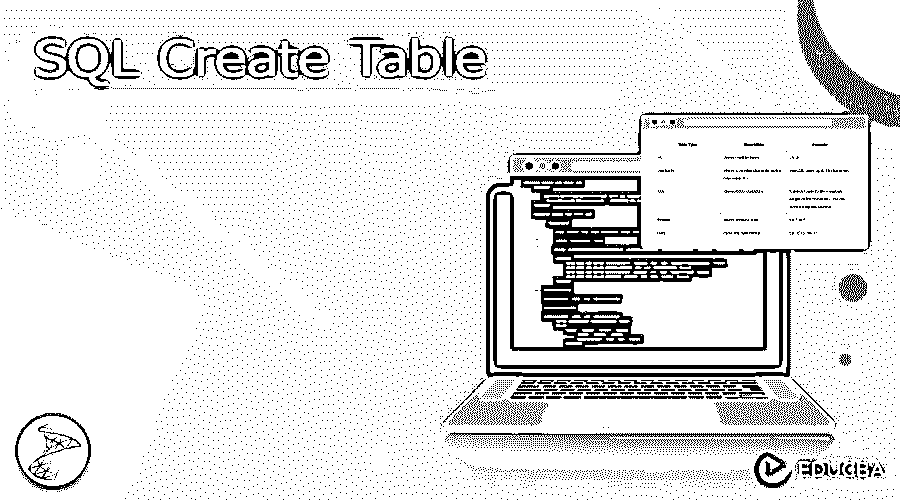
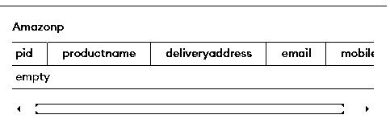
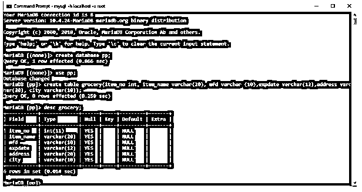

# SQL 创建表

> 原文：<https://www.educba.com/sql-create-table/>




## SQL 创建表简介

在数据库表中，记录作为数据保存。SQL CREATE TABLE 语句用于生成数据库表。例如，关键字告诉数据库系统我们需要创建表。在这种情况下，我们希望制作一个新表。CREATE TABLE 语句后跟表的独特名称或标识符。描述每个表列的数据类型的列表包含在括号中。

### 关键要点

*   CREATE 是一个 DDL 命令，用于定义数据库结构。
*   几乎所有的关系数据库，包括 MySQL、Postgres、SQL Server 和其他数据库，CREATE TABLE 命令都是可用的。
*   数据类型在创建表时起着至关重要的作用。

### SQL 创建表概述

CREATE TABLE 语句和 SELECT 语句可用于复制现有的表。构造表时，每一列都需要一种数据类型。

<small>Hadoop、数据科学、统计学&其他</small>

| ****数据类型**** | ****描述**** | ****例如**** |
| （同 Internationalorganizations）国际组织 | 商店号码类型 | 10, 30 |
| Varchar | 存储最大值为“s”的可变字符 | 约翰(20)占用了多达 10 个字符 |
| 文本 | 存储 6555 个字符 | 它没有指定字符的最大长度。我们可以存储段落内容 |
| 布尔代数学体系的 | 存储二进制类型 | 例句:对还是错 |
| 日期 | 给出日期格式 | 例句:2022-08-23 |

当我们为每一列指定数据类型以及创建新的 SQL 表时，上表非常重要。一旦确立，就要坚持。例如，如果用户指定一个新列具有整数数据类型，用户将不能包含文本、日期或任何其他内容。

### 如何创建 SQL 表？

下面给出了创建表的语法:

**语法:**

```
CREATE TABLE table_name (
  column1 datatype,
  column2 datatype,
  column3 datatype,
  ....
);
```

CREATE TABLE 不是用户定义的；它是一个 SQL 关键字，应该放在语句查询的开头。让我们看一个例子来看看创造的工作原理。CREATE TABLE 语句的基本语法如下所示:

现在让我们使用 SQL lite，我们也可以使用任何其他管理器，并且流程输出在所有工具中都是相同的。获取服务器连接或启动数据库并执行此查询。

**举例:**

**代码:**

```
CREATE TABLE amazonp (
pid int,
product name varchar(50),
delivery address text,
email id varchar(50),
mobile varchar(10)
);
```

在这种情况下，通过 SQL 语句创建了一个名为 amazonp 的数据库。pid、投递地址、手机、列(字段)pid 都在表中。数据类型 int、varchar(25)和 text 表示该字段中可能包含的信息。下面是一些常用数据类型的例子。




### 规则

*   该列的数据用括号括起来。必须用逗号分隔各列。
*   请记住在 SQL 语句后包含分号。
*   表中可以包含的三个重要的额外参数是:Unique、NOT NULL 和 Primary Key，所有这些参数都是可选的。

### 如果创建表中不存在，则使用

创建已经存在的表时出错。我们可以在建立表时添加可选的 IF NOT EXISTS 命令来解决这个问题。例如:

**代码:**

```
CREATE TABLE chinaCustomers
AS (
  SELECT *
  FROM Medicine
  WHERE place = "shelong"
);
```

```
CREATE TABLE IF NOT EXISTS medicine (
  mid int,  mname varchar(50),
  manufacturer text,
  place varchar(50),
  contact int(15)
);
```

**输出:**


利用 Construct TABLE AS 命令，我们还可以使用任何其他现有表中的数据创建一个表。

主键约束为表中的每一项提供了一个特殊的标识。一个数据库只能包含一个主键，而这个主键可以由一列或多列组成。

### SQL 表六列

列和行用于构建表格。每一列都可以看作是每行所代表的记录的一部分。下面的示例创建了一个表。字段名和数据类型如下。

在下面的例子中，我们创建了 6 列，包含 6 种数据类型。

这里给出了 SQL 代码:

**代码:**

```
create table grocery(item_no int, item_name varchar(20), mfd varchar (10),exp date varchar(12),address varchar(20), city varchar(10));
```

要查看代码的结构，我们可以使用 Describe 表名。

**输出:**




### SQL Server 创建表示例

可以使用 Transact-SQL 或 SQL Server Management Studio 创建 SQL Server 中带有主键的表。对应于主键的不同聚集索引是自动生成的，如果给定了非聚集索引，它也会自动生成。

**代码:**

```
CREATE TABLE [Schema name].[tableName](
  [Col_1] [Datatype](Length),
  [Col2] [Datatype](Length) [Constraint_Name] ,
  [Col3] [Datatype](Length),
  …. . . . .
) ON [Group]
```

**举例:**

**代码:**

```
CREATE TABLE [Courses].[Course](
  [COurse_ID] [bigint] IDENTITY(1,1),
  [COurse _code] [varchar](50),
  [COurse _name] [varchar](50),
  [Communication] [varchar](25),
  [City] [varchar](50),
  [EnrollmentDate] [datetime],
) ON [PRIMARY]
```

**创建带有外键的表:**

具有主键的表称为父表，而具有外键的表称为子表。

**代码:**

```
CREATE TABLE bookOrders (
  Order_no int NOT NULL PRIMARY KEY,
  Orderitem int NOT NULL,
  PID int FOREIGN KEY REFERENCES user(userID)
);
```

### 常见问题解答

下面是提到的常见问题:

#### Q1。如何制作主键表？

**答案:**

**代码:**

```
CREATE TABLE marksheet (
  rollno int,
  sname varchar(50),
  sgrade text,
  email varchar(50),
  phone varchar(10),
  PRIMARY KEY (rollno)
)
```

#### Q2。什么是约束？

**答案:**

约束有时可能是特定于数据库的，这意味着不同数据库的关键字可能不同。

#### Q3。编写一条 SQL 语句来创建一个简单的表 India，包括列 state_id、state_name 和 state_regions。

**答案:**

**代码:**

```
Create table india( state_id integer, state_name varchar(10),state_regions(5));
```

#### Q4。“主键”是什么意思？

**答案:**

*   在 SQL 中，唯一标识表中每个条目的一列(或一组列)或一组列称为主键。
*   不允许空值。

### 结论

CREATE TABLE SQL 语句、其语法以及必须设置的列参数都包含在本文中。

### 推荐文章

这是一个 SQL 创建表的指南。这里我们讨论一下入门，如何创建 SQL 表？如果在创建表、示例和常见问题中不存在，则使用。您也可以看看以下文章，了解更多信息–

1.  [SQL 在](https://www.educba.com/sql-between/)之间
2.  [SQL 删除](https://www.educba.com/sql-delete/)
3.  [SQL 模式](https://www.educba.com/sql-schema/)
4.  [sql_plus](https://www.educba.com/sql_plus/)


